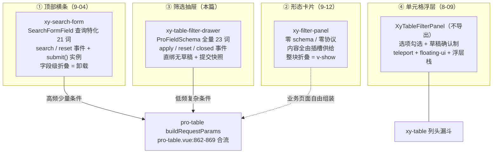
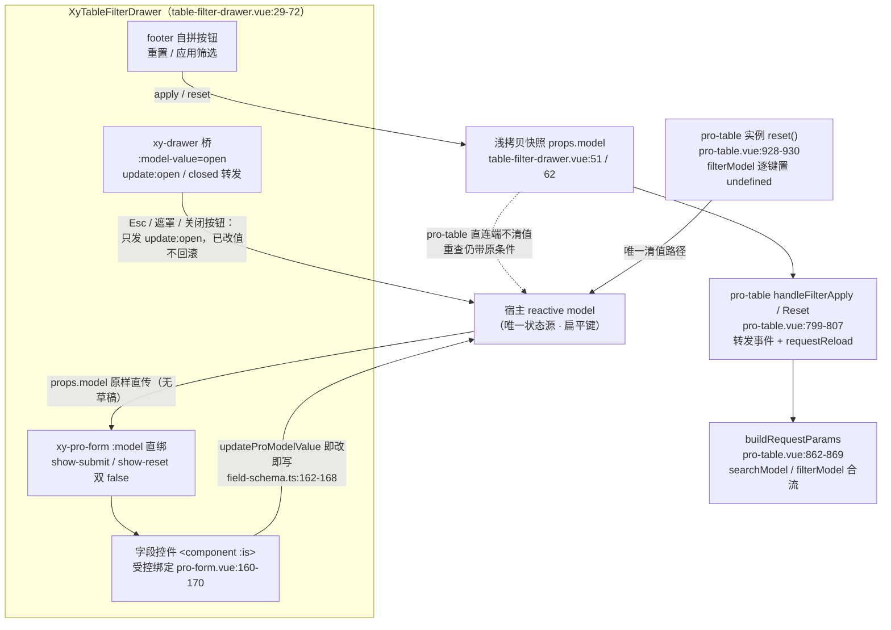

# 9-28 · TableFilterDrawer：筛选抽屉

> 本篇是 9 卷"增强层（pro-components）"的第二十八篇，按大纲（`column/02-分卷大纲.md:182`）回答的核心问题只有一句话——**schema 驱动的复杂筛选**。前置篇有三块：9-03 拆完了 `ProFieldSchema` 的三形态，在"现场 B"预埋了本篇主角的消费链（`table-filter-drawer.ts:4-10` 的 import 段与 `table-filter-drawer.vue:39-44` 的转交段）；9-04 拆了三条筛选路线的第一条（`xy-search-form`，横条 + 查询语义）；9-12 拆了第二条（`xy-filter-panel`，零语义卡片），并在第六节末尾把本篇主角的模板段预演了一遍——那是"生效时机三策略"里的"直绑快照制"。知识点矩阵给本篇的条目是 I28（`column/01-知识点全集矩阵.md:203`）："schema 驱动筛选抽屉（**直绑无草稿** + **四件套筛选家族终表**）"——两个加粗词就是本篇的两张欠条：前者要用实码把"筛选值怎么流"钉死，后者要把 9-04、9-12 分散立起来的版图收成一张终表。下一篇 9-29《ImportResultTable：导入回显》在大纲里排在本篇正后方（`column/02-分卷大纲.md:183`），文末预告。

接到题目先复述目标：`packages/pro-components/table-filter-drawer` 要回答的不是"怎么筛"，而是**当筛选条件复杂到横条放不下、低频到不值得常驻时，筛选交互该住进什么容器、由什么驱动、何时生效**。它的全部源码是增强层里最迷你的样本之一——`src/table-filter-drawer.vue`（72 行）、`src/table-filter-drawer.ts`（10 行）、`index.ts`（12 行）、`__tests__/table-filter-drawer.spec.ts`（36 行）、样式 `packages/theme/src/pro/table-filter-drawer.css`（5 行），合计 135 行；加上文档页 46 行、示例 40 行，全部家当 234 行。5 个 props、4 个事件、0 个插槽、0 行字段解析逻辑——但它却是整个筛选家族里**唯一同时持有 schema 与协议**的成员：`fields` 直接搬 `ProFieldSchema` 全量协议，`apply`/`reset` 两个事件自带提交语义。本篇全部行号逐一核对过当前工作区实态，文末附核对清单。

## 一、出身考据：出生即定型的 72 行

老规矩，先 `git log --follow -- packages/pro-components/table-filter-drawer/src/table-filter-drawer.vue`。它只有两次提交：

```text
dc9ca28 2026-09-14 fix(build): 基础设施依赖治理与产物断链修复
a32e399 2026-03-30 feat: 新增 pro 组件并增强表单与表格能力
```

初版（a32e399）一次成形，72 行定稿；半年后的 dc9ca28 动过它，但 diff 只有一行——`import { XyButton, XyDrawer } from "@xiaoye/components"` 改成 `from "xiaoye-components"`，那是 9 卷反复遇到的"三层依赖边界对齐"基建战役（2-02 讲过构建侧的同款故事），与组件逻辑无关。对照 9-03 考据过的 field-schema 四次提交三次扩容（112 → 148 → 260 行），table-filter-drawer 的演进史是**一条直线**：出生即定型，半行未改。

这不是维护惰性，是**委托式设计的必然**。它的设计空间在出生那天就被三笔委托锁死了：容器语义委托给基础层 `xy-drawer`（7-17），字段语义委托给 `xy-pro-form`（9-05），提交语义自己只留两个事件和两个按钮。可长的部分都长在别人身上，自己就没有长的理由——这个组件是"增强层站位学"（9-01 立的规矩）最极端的样本：别人是用最少代码做一层薄封装，它是用最少代码**做两份委托加一个出口**。

## 二、四件套筛选家族：三条路线的终点站

先兑现第二张欠条。同一个"筛选"问题域，这个仓库里实际住着**四个**当事组件——9-12 收口时是三路线，把基础层表格的内建筛选浮层算进来，就是矩阵点名的四件套：



四个组件按"形态 × 驱动 × 协议 × 生效时机"四个维度切成终表——这张表 9-12 立了骨架、说好留给 9-28 收口，现在补齐第四列和第四行：

| 维度 | search-form（9-04） | filter-panel（9-12） | table-filter-drawer（本篇） | 表格内建 filter-panel（8-09） |
| --- | --- | --- | --- | --- |
| 形态 | 顶部横条（内嵌网格） | 侧边/顶部卡片 | 右侧抽屉 | 列头浮层 |
| 驱动 | `SearchFormField` 特化 21 词 | 无 schema，插槽供给 | `ProFieldSchema` 全量 23 词 | `options` 选项数组 |
| 协议 | `search`/`reset` + `submit()` 实例 | 仅 `update:collapsed`/`toggle` | `apply`/`reset`/`closed` | `select` 单事件 |
| 生效时机 | 载荷深快照，字段变化即查缺席 | 无语义（外包给内容组件） | 模型直绑即改 + 提交浅拷贝快照 | 草稿确认制 |
| 折叠 | 字段级标记制（折叠=卸载） | 整块级开关（v-show） | 无（抽屉本身就是收纳） | 无（浮层随开随关） |
| 消费方 | pro-table / list-page / crud-page | 业务页面 | pro-table 直连 | xy-table 内部 |

分工的产品语义一句话：**简单筛选拼快——横条摆高频字段，搜索即所得；复杂筛选拼全——抽屉收低频字段，schema 全量供给；两者之间的"形态"工作外包给卡片；颗粒度最小的工作下沉到列头浮层**。这个四分法不是设计文档写出来的，是消费关系长出来的：pro-table 只直连横条与抽屉（类型层的判词原文照录，`packages/pro-components/pro-table/src/pro-table.ts:177-185`）：

```ts
// packages/pro-components/pro-table/src/pro-table.ts:177-185
export interface ProTableViewsConfig {
  searchModel?: Record<string, unknown>;
  searchFields?: SearchFormField[];
  savedViews?: ProTableSavedViewItem[];
  activeViewKey?: string;
  filterModel?: Record<string, unknown>;
  filterFields?: ProFieldSchema[];
  filterTitle?: string;
}
```

`searchModel`/`searchFields` 与 `filterModel`/`filterFields` 在同一个配置里并排——`filterFields` 的类型是 `ProFieldSchema[]` 而非查询特化，卡片留给业务页面自由组装，浮层根本不导出。类型层早就判了案：**复杂筛选走主词表**，这一笔是本篇第三节的主角。

pro-table 的直连接线值得整段读一遍，`packages/pro-components/pro-table/src/pro-table.vue:787-807`：

```ts
// packages/pro-components/pro-table/src/pro-table.vue:787-807
function openFilterDrawer() {
  if (!filterFields.value.length) {
    return;
  }

  filterDrawerOpen.value = true;
}

function closeFilterDrawer() {
  filterDrawerOpen.value = false;
}

function handleFilterApply(payload: Record<string, unknown>) {
  emit("filter-apply", payload);
  requestReload("filter");
}

function handleFilterReset(payload: Record<string, unknown>) {
  emit("filter-reset", payload);
  requestReload("reset");
}
```

四个函数两句话讲完：开抽屉前置校验"有字段才开"（788-790 行）；apply 与 reset 的事件处理**形状完全对称**——都只做"向页面层转发 + 触发重查"两件事，**谁都不碰 filterModel 的值**。这不是疏漏，是 9-12 第六节"生效时机策略映射交互隔离需求"那条定律的延长线：抽屉把状态主权完全交给宿主，pro-table 又把清值主权再交给页面层——事件层层上抛，状态原地不动。这条对称性里藏着一个会在第四节展开的实码定论：**抽屉的"重置"按钮并不重置任何东西**。

模板侧的挂载段，`pro-table.vue:1769-1777`：

```html
<!-- packages/pro-components/pro-table/src/pro-table.vue:1769-1777 -->
<xy-table-filter-drawer
  v-if="filterFields.length > 0 && filterModel"
  v-model:open="filterDrawerOpen"
  :title="props.views?.filterTitle ?? '筛选条件'"
  :model="filterModel"
  :fields="filterFields"
  @apply="handleFilterApply"
  @reset="handleFilterReset"
/>
```

触发按钮在工作台上（`pro-table.vue:1545` 的"筛选"文本按钮，显隐由 235 行 `workbench.filter || views?.filterFields?.length` 推导），开合状态收在 207 行的 `filterDrawerOpen`，实例出口还把 `openFilterDrawer`/`closeFilterDrawer` 暴露了出去（1494-1495 行）。`v-if` 的两个条件读一眼就懂但值得点破：**fields 与 model 必须同时在场**——空 schema 的抽屉是一个只有两个按钮的空壳，没有 model 的抽屉是无数主（pro-form 没法直绑）。

## 三、72 行全文展开：一个组件的三重身份

现在正式展开主角。脚本段全文，`packages/pro-components/table-filter-drawer/src/table-filter-drawer.vue:1-27`：

```vue
<!-- packages/pro-components/table-filter-drawer/src/table-filter-drawer.vue:1-27 -->
<script setup lang="ts">
import { XyButton, XyDrawer } from "xiaoye-components";
import { XyProForm } from "../../pro-form";
import type { TableFilterDrawerProps } from "./table-filter-drawer";

defineOptions({
  name: "XyTableFilterDrawer"
});

const props = withDefaults(defineProps<TableFilterDrawerProps>(), {
  open: false,
  title: "筛选条件",
  fields: () => [],
  drawerProps: () => ({})
});

const emit = defineEmits<{
  "update:open": [value: boolean];
  apply: [payload: Record<string, unknown>];
  reset: [payload: Record<string, unknown>];
  closed: [];
}>();

function close() {
  emit("update:open", false);
}
</script>
```

27 行脚本，四个板块各司其职。**props 板（10-15 行）**：5 个成员里 `model` 不设默认——它是唯一必填项（类型层 `model: Record<string, unknown>` 无 `?`），其余四个全部有兜底；`title` 默认值"筛选条件"与 pro-table 挂载段的 `?? '筛选条件'`（1772 行）构成**双重默认**——组件层已经兜过一次，消费方又兜一次，两道保险写的是同一句话，这是"默认值即契约"的小小冗余，无害但读起来要知情。**事件板（17-22 行）**：4 个事件分成两组，`update:open` 是 v-model 桥的接线端，`apply`/`reset`/`closed` 是业务出口；注意 `apply` 与 `reset` 的载荷类型一模一样，都是 `Record<string, unknown>`——**重置与应用在协议层同权**，这个"同权"在第四节会变成一把解剖刀。**close 函数（24-26 行）**：唯一的逻辑函数，一行，发 `update:open`。

模板段全文，`table-filter-drawer.vue:29-72`（9-12 引过一次，本篇按承诺全文展开并逐段归位）：

```vue
<!-- packages/pro-components/table-filter-drawer/src/table-filter-drawer.vue:29-72 -->
<template>
  <xy-drawer
    v-bind="props.drawerProps"
    :model-value="props.open"
    :title="props.title"
    :size="props.drawerProps?.size ?? 420"
    class="xy-table-filter-drawer"
    @update:model-value="emit('update:open', $event)"
    @closed="emit('closed')"
  >
    <xy-pro-form
      :model="props.model"
      :schema="props.fields"
      :show-submit="false"
      :show-reset="false"
    />

    <template #footer>
      <div class="xy-table-filter-drawer__footer">
        <xy-button
          @click="
            () => {
              emit('reset', { ...props.model });
              close();
            }
          "
        >
          重置
        </xy-button>
        <xy-button
          type="primary"
          @click="
            () => {
              emit('apply', { ...props.model });
              close();
            }
          "
        >
          应用筛选
        </xy-button>
      </div>
    </template>
  </xy-drawer>
</template>
```

72 行组件的三重身份，在这 44 行模板里各占一段。**第一重，drawer 的桥（30-38 行）**：`v-model:open` 的语法糖在这里被拆开手写——`:model-value="props.open"` 单向下发，`@update:model-value="emit('update:open', $event)"` 单向上抛；`@closed="emit('closed')"` 把抽屉关闭动画结束的信号再转发一层。**第二重，pro-form 的代理（39-44 行）**：字段区整体委托，四行连 props 名都是代理味的——`:model` 原名直传、`:schema="props.fields"` 换了个名（对外叫 fields，对内叫 schema，因为"字段"在筛选语境里是领域词）。**第三重，动作区的自留地（46-70 行）**：重置、应用两个按钮自己拼，这是全组件唯一"亲自干活"的地方，而它干的活也只是"发事件 + 关抽屉"。

类型文件全文，`table-filter-drawer.ts:1-10`——9-03 考据的 import 段在此全文归位：

```ts
// packages/pro-components/table-filter-drawer/src/table-filter-drawer.ts:1-10
import type { DrawerProps } from "xiaoye-components";
import type { ProFieldSchema } from "../../core";

export interface TableFilterDrawerProps {
  open?: boolean;
  title?: string;
  model: Record<string, unknown>;
  fields?: ProFieldSchema[];
  drawerProps?: Omit<Partial<DrawerProps>, "modelValue" | "title">;
}
```

10 行类型，两个签名式写法。其一，`fields?: ProFieldSchema[]`——第二个 import 只引了 core 的一条款，**类型即宣言**：本组件不做筛选字段特化，主词表全量照单。其二，`drawerProps?: Omit<Partial<DrawerProps>, "modelValue" | "title">`——9-07 在 dialog-form 上讲过的 Omit 派生封装范式（`dialog-form.ts:5` 的 `Omit<OverlayFormProps, "container" | "drawerProps">`）在抽屉上的重演，9-12 收尾时也点了这一笔。Omit 的两个成员挑得极准：`modelValue` 已被 `open` 顶替（避免一物两名），`title` 已被自家 `title` 顶替（避免透传打架）——**透传接口的第一戒律是先划掉自己已经代言的词**。

## 四、schema 驱动：主词表的第三个免费乘客

现在兑现第一张欠条的前半：schema 驱动的实现。9-03 的考据结论先复述一句：`ProFieldSchemaBuiltinComponent` 主词表 23 词（`core.ts:77-100`），`search-form` 从初版起分叉出一份 21 词私有词表（`SearchFormFieldBuiltinComponent`，砍掉 `textarea` 与 `auto-complete`，另加 `collapsible`/`rules` 成员和 `| Component` 开口）——"协议的集中与裂缝"是 9-03 第七节的标题级话题。那么 table-filter-drawer 站哪边？`table-filter-drawer.ts:2` 的 `import type { ProFieldSchema } from "../../core"` 已经作答：**第三个消费者，走主词表，零分叉**。它签下的协议原文照录，`packages/pro-components/core.ts:106-124`：

```ts
// packages/pro-components/core.ts:106-124
export interface ProFieldSchema {
  prop: string;
  label: string;
  component?: ProFieldSchemaBuiltinComponent;
  valueType?: ProDisplayValueType;
  componentProps?: Record<string, unknown>;
  options?: ProFieldSchemaOption[];
  formatter?: ProDisplayFormatter<Record<string, unknown>, ProFieldSchema>;
  render?: ProDisplayRenderer<Record<string, unknown>, ProFieldSchema>;
  renderHTML?: ProDisplayHtmlRenderer<Record<string, unknown>, ProFieldSchema>;
  emptyValue?: string;
  slot?: string;
  span?: number;
  hidden?: boolean | ((model: Record<string, unknown>) => boolean);
  disabled?: boolean | ((model: Record<string, unknown>) => boolean);
  required?: boolean;
  help?: string;
  placeholder?: string;
}
```

一份协议、17 个成员、零个筛选专属词——`hidden`/`disabled` 的函数式联动、`slot` 逃生门、`span` 栅格跨列全部在内，筛选抽屉照单全收，一个成员都没有砍。

实现的全部秘密就是那四行转交（`table-filter-drawer.vue:39-44`）：

```vue
<!-- packages/pro-components/table-filter-drawer/src/table-filter-drawer.vue:39-44 -->
<xy-pro-form
  :model="props.model"
  :schema="props.fields"
  :show-submit="false"
  :show-reset="false"
/>
```

四行里最值得停下的是 **`show-submit`/`show-reset` 双 false**。pro-form 自己的动作区（`pro-form.vue:193-213`）是这样一套结构：

```vue
<!-- packages/pro-components/pro-form/src/pro-form.vue:193-213 -->
<div v-if="props.showReset || props.showSubmit || $slots.actions" class="xy-pro-form__footer">
  <slot
    name="actions"
    :model="props.model"
    :submit="submit"
    :reset="reset"
    :submitting="props.submitting"
  >
    <xy-button v-if="props.showReset && !props.readonly" @click="reset()">
      {{ props.resetText }}
    </xy-button>
    <xy-button
      v-if="props.showSubmit && !props.readonly"
      type="primary"
      :loading="props.submitting"
      @click="submit"
    >
      {{ props.submitText }}
    </xy-button>
  </slot>
</div>
```

双 false 之后，这个 `v-if` 三个条件全灭，pro-form 的动作区整块消失。为什么？因为**提交语义不是表单语义的一部分**——pro-form 的 submit 走"校验 → cloneProValue 快照 → emit"的编辑表单流程，而筛选抽屉要的提交是"apply 快照 + 关抽屉 +（宿主）重查"，两者的事件名、载荷、后续动作全不同。TableFilterDrawer 的选择是把 pro-form 的动作区整体关掉，在抽屉的 `#footer` 里自拼一套——**字段语义借 pro-form 的手，提交语义自己执笔**。这也回答了一个设计题：为什么不像 9-08 的 drawer-form 那样基于 overlay-form 组装？因为 overlay-form 家族的提交语义（validate 门 + submit/cancel 双按钮）是编辑表单的，筛选要的是另一套——同一个"抽屉里装表单"的需求，编辑语义与查询语义在提交协议上分道扬镳，这正是 9 卷反复出现的"形态相似不等于语义同族"。

复用的红利清单摆出来才知道这份委托有多重。pro-form 内部的渲染管道在 `<component :is>` 一处收口（9-03 引过大半，本篇补齐受控绑定段，`pro-form.vue:160-170`）：

```vue
<!-- packages/pro-components/pro-form/src/pro-form.vue:160-170 -->
<component
  :is="resolveProFieldComponent(field)"
  v-else
  v-bind="{
    ...resolveProFieldProps(field),
    modelValue: props.model[field.prop],
    disabled: resolveProFieldDisabled(field, props.model),
    'onUpdate:modelValue': (value: unknown) =>
      updateProModelValue(props.model, field.prop, value)
  }"
/>
```

这一个节点接入了 field-schema 编辑法域的五道解析：组件查表兜底 XyInput（`field-schema.ts:97-103`）、占位文案三级优先与"请选择/请输入"分词（105-124 行）、options 自动注入与 textarea/radio-button 伪词预设（126-152 行）、span 钳制（154-160 行）、hidden/disabled 联动求值（83-95 行）——再加上 slot 逃生门与 readonly 只读切态，**这些 TableFilterDrawer 一行都没写，一行都不用写**。注意 165 行的 `modelValue: props.model[field.prop]`，括号访问加字面量键——这行会在下一节变成筛选值结构的定论证据。对照 9-03 给 search-form 记的并行成本账（本地 selectLike 4 词 vs 全局 5 词、options 注入名单少 auto-complete、placeholder 逻辑两份副本可能漂移），抽屉路线的账本干净得多。

官方示例全文，`apps/docs/examples/pro/table-filter-drawer/basic.vue`（40 行，9-03 引过 11-27 的字段声明段，本篇全文归位）：

```vue
<!-- apps/docs/examples/pro/table-filter-drawer/basic.vue -->
<script setup lang="ts">
import { reactive, ref } from "vue";
import type { ProFieldSchema } from "@xiaoye/pro-components";

const open = ref(false);
const filterModel = reactive({
  owner: "",
  status: "processing"
});

const fields: ProFieldSchema[] = [
  {
    prop: "owner",
    label: "负责人",
    component: "input"
  },
  {
    prop: "status",
    label: "状态",
    component: "select",
    options: [
      { label: "处理中", value: "processing" },
      { label: "待处理", value: "pending" },
      { label: "已完成", value: "done" }
    ]
  }
];
</script>

<template>
  <div class="xy-pro-demo-stack">
    <xy-button type="primary" @click="open = true">打开高级筛选</xy-button>

    <xy-table-filter-drawer
      v-model:open="open"
      :model="filterModel"
      :fields="fields"
    />
  </div>
</template>
```

40 行示例里藏着一个此前各篇没点破的细节：**`apply`/`reset` 事件在示例里一个都没监听**。抽屉开了、字段改了、按钮点了，示例页面没有任何响应——因为组件把"点了之后干什么"完全外包给宿主，示例选择什么都不干。这个"沉默的示例"反过来印证了组件的站位：它只负责把筛选值**送出**抽屉，至于送出去之后是触发请求、写 URL、还是存草稿，都是宿主的事。文档页把这条边界写得很白（`apps/docs/pro-components/table-filter-drawer.md:24-25`）："当前不处理筛选字段的远程配置和条件持久化""真正的筛选协议和表格刷新仍由页面层接管"。

## 五、筛选值结构：扁平键、直绑无草稿、半程快照

进入本篇核心。三个问题依次定论：筛选值长什么结构？改动何时生效？提交时送出去的是什么？

**第一问，结构：扁平键。** `model` 的类型是 `Record<string, unknown>`，而 pro-form 编辑态的读写两端是这样一对函数，`packages/pro-components/field-schema.ts:162-181`：

```ts
// packages/pro-components/field-schema.ts:162-181
export function updateProModelValue(
  model: Record<string, unknown>,
  prop: string,
  value: unknown
) {
  model[prop] = value;
}

export function readProFieldValue(
  model: Record<string, unknown>,
  prop: string
) {
  return prop.split(".").reduce<unknown>((value, segment) => {
    if (value && typeof value === "object" && segment in (value as Record<string, unknown>)) {
      return (value as Record<string, unknown>)[segment];
    }

    return undefined;
  }, model);
}
```

一对邻居，两种世界观。**写端** `updateProModelValue` 是一行直赋值——`model[prop] = value`，prop 作为**字面量键**落进扁平对象；**读端** `readProFieldValue` 却支持 `a.b.c` 点路径逐层下钻。这个读写不对称的后果对筛选抽屉是实质性的：schema 里写 `prop: "owner.name"`，在详情态（`resolveProDescriptionsItems` 走读端）能正确取到嵌套值，但在抽屉的编辑态，`pro-form.vue:165` 的 `modelValue: props.model[field.prop]` 同样是字面量键访问——控件绑定的是 `model["owner.name"]` 这个**带点的键名**，不是 `model.owner.name` 这个嵌套位置。搜索表单的 `updateModelValue`（`search-form.vue:138-140`）是同一行直赋值，两个查询场景一致地扁平。**定论：筛选值结构是扁平键值对；点路径是展示域的专利，不是编辑域的**。复杂筛选的"复杂"因此不体现在值结构上，而体现在字段数量、控件种类与联动关系上——这一笔值得记进"schema 驱动"的设计语义：schema 可以复杂，协议保持扁平，把嵌套的复杂度留给后端参数组装（pro-table 的 `buildRequestParams` 也是一层扁平 spread）。

**第二问，生效时机：直绑无草稿。** 抽屉把宿主的响应式对象原样递给 pro-form（`table-filter-drawer.vue:40`），pro-form 再原样递给内层 xy-form（`pro-form.vue:132` 的 `:model="props.model"`），全程无克隆、无草稿；控件更新走 `updateProModelValue(props.model, field.prop, value)`——**每次输入都直接写进宿主的 model，抽屉内部不存在任何草稿副本**。对照三策略：表格内建筛选浮层的"草稿确认制"（勾选进 `draftSelectedValues`，点确定才 `emit("select", [...draft])`）、9-12 卡片的"无语义外包制"、本篇的"直绑快照制"——9-12 第六节说好的展开在此兑现。为什么抽屉敢直绑？草稿制的存在理由是**隔离主界面**：浮层悬在表格上方，勾选若即时生效，底下表格的数据会跟着每次点击抖动，所以必须隔离。抽屉里没有这个问题——抽屉是模态空间，宿主模型虽然即时在变，但请求参数以 apply 快照为准，主界面的数据在用户点"应用筛选"之前纹丝不动。**模型即时生效，请求按快照提交，两层时钟分离，互不越界**——这就是"直绑无草稿"的完整含义：不需要草稿，因为真正要隔离的不是模型，是请求。

改动在抽屉里即时可见、点应用才请求，这给用户的**心理感受**是"抽屉里在暂存"——但这感受是 UI 幻觉：模型从来没有暂存过，用户在抽屉里改了"状态"字段，点右上角 × 直接关掉抽屉，改动**留在宿主模型里，不回滚**。下次打开抽屉，看到的是上次改了一半的值。直绑的真实代价就在这里：半途而废的编辑无处安放。这个代价被什么对冲？对冲它的恰好是"重置"按钮——但这里要引出本篇最刺眼的一处实码定论。

**第三问，提交语义：浅拷贝快照，且重置不清值。** 两个按钮的处理器长在同一张脸上：`emit('reset', { ...props.model })` 与 `emit('apply', { ...props.model })`（51、62 行），载荷是 model 的**浅拷贝**。两个决定各有分量。

先说浅拷贝本身的成色。增强层有一条"事件载荷一律快照"的全局纪律（4-08 立、9-04 在查询语义下执行）：search-form 的提交载荷是 `cloneModelValue` 深快照（`search-form.vue:128-136`，toRaw + structuredClone，与 field-schema 的 `cloneProValue` 几乎逐字相同），pro-form 的 submit 载荷同样是 `cloneProValue(props.model)`（`pro-form.vue:92`）。两份"标准答案"的原文摆在一起，`packages/pro-components/field-schema.ts:72-81`：

```ts
// packages/pro-components/field-schema.ts:72-81
export function cloneProValue<T>(value: T): T {
  const rawValue =
    value !== null && typeof value === "object" ? (toRaw(value) as T) : value;

  if (typeof globalThis.structuredClone === "function") {
    return globalThis.structuredClone(rawValue);
  }

  return JSON.parse(JSON.stringify(rawValue)) as T;
}
```

search-form 的同名实现与后续的扁平写入，`packages/pro-components/search-form/src/search-form.vue:130-140`：

```ts
// packages/pro-components/search-form/src/search-form.vue:130-140
function cloneModelValue(value: Record<string, unknown>) {
  const rawValue = toRaw(value);

  if (typeof globalThis.structuredClone === "function") {
    return globalThis.structuredClone(rawValue);
  }

  return JSON.parse(JSON.stringify(rawValue)) as Record<string, unknown>;
}

function updateModelValue(prop: string, value: unknown) {
  const model = props.model as Record<string, unknown>;
  model[prop] = value;
}
```

而抽屉的 `{ ...props.model }` 只拷贝第一层——顶层字符串、数字、布尔确实切断了引用，但**嵌套对象与数组仍是共享引用**。筛选值里什么时候会有嵌套值？`date-picker` 的区间值是数组、`cascader` 的值是多级路径数组、`transfer` 的值是键数组——这些数组在浅拷贝后仍与宿主 model 里的同一个数组共享内存。宿主若在 apply 之后的异步请求期间再改这个字段，"已提交的筛选条件"会被静默改写——9-04 那句"竞态与归因全都说不清"的风险在这里复活了一半。**定论：抽屉的快照纪律只执行了顶层这一程，是"半程快照"**。为什么这样写？善意推测是筛选值绝大多数是标量，浅拷贝够用且省一次深克隆；严格说这是全局纪律的一个未对齐点——修复方向也是现成的：换成从 field-schema 导出的 `cloneProValue` 一行即可（它就住在同一个包里）。如实记账，按"实现取舍"而非"事故"定性。

再说"重置不清值"。顺着事件流追到 pro-table 直连端（前面引过的 799-807 行）：`handleFilterReset` 只转发 + 重查，不清 `filterModel`。全文件检索 `filterModel` 的写操作，唯一一处清值代码在**实例 reset 动作**里，`pro-table.vue:928-930`：

```ts
// packages/pro-components/pro-table/src/pro-table.vue:928-930
if (filterModel.value) {
  Object.keys(filterModel.value).forEach((key) => {
    filterModel.value![key] = undefined;
  });
}
```

把整条链合起来，筛选值的流转全景如下：



这张图上有两条最容易读错的线。虚线那条：**用户点抽屉里的"重置"→ pro-table 用原条件重查一次**——payload 里带着的旧条件没有被任何环节消费成"清空"，直觉里的"重置 = 条件清空 = 列表回默认"这条链路，在当前实码中是不成立的；成立的只有"重置 = 关抽屉 + 重发请求"。另一条是右下角：**Esc、遮罩、关闭按钮这三条关闭路径只走 update:open**，对筛选值零操作。组件文档其实没有说谎（`apps/docs/pro-components/table-filter-drawer.md:45` 只承诺"点击「重置」时派发，携带当前 model 的浅拷贝，随后自动关闭抽屉"），但"重置"这个词背负的日常直觉与实码之间的落差，是读这个组件最值得带回的认知——**在这个组件的语义里，重置与应用是同一对动作的两个方向：都是"把当前模型快照交给宿主 + 关抽屉"，唯一的差别是事件名**。清值执行权、以及"重置后查什么"，全部留给宿主表达。

## 六、暂存 vs 即时，复用 vs 特化：两把尺子

上一节把实码钉死了，这一节把决策讲透。第一个权衡：**为什么抽屉路线选直绑即时，而不是抽屉内暂存**？

抽屉内暂存（进抽屉时复制一份草稿，apply 时回写）的收益很具体：取消不污染（Esc 关闭即弃）、重置语义自洽（草稿重置回进抽屉时的初值）。它要付的代价是：一份草稿状态、草稿与宿主模型的同步策略（宿主在抽屉打开期间改了 model 怎么办）、以及 9-12 说过的"折叠黑盒不可动"同款复杂度。直绑即时放弃了"取消不污染"，换来了三样更贵的东西：**实现量趋近于零**（72 行里没有一行状态管理）；**多入口一致性**（宿主在抽屉外改 model——比如实例 reset、保存视图回填——抽屉里的表单自动跟上，因为它们本来就是同一份数据；暂存制要额外处理"抽屉开着时外面改了值"的同步竞态）；**与 9-27 保存视图的协议兼容**（`activeViewKey` 走的是模型层快照，抽屉若自持草稿，视图切换时抽屉内显示值会与实际请求参数脱节）。一句话：**低频复杂筛选的"取消成本"远低于同步成本，直绑是把账算在了正确的一边**。而"取消不污染"的真实需求若出现，宿主自己拿 `apply`/`reset` 都没发生的时机做回滚即可——主权在外，永有后手。

第二个权衡：**schema 复用 vs 特化**。search-form 特化出了 21 词协议，理由充分（查询语义需要 collapsible 与 rules，不需要展示五件套）；table-filter-drawer 面对同样的问题域，却连一个成员都没特化——`fields?: ProFieldSchema[]` 照单全收。这不是设计偷懒，是**复杂筛选的定义使然**：横条筛选的字段集是收敛的（input/select 两三个词就覆盖了绝大多数查询场景），特化的边际收益高；抽屉筛选的字段集是发散的（23 词里每个词都可能在某个业务的高级筛选里出现——date-picker 查时间窗、cascader 查组织树、transfer 查多对多关系），任何"筛选特化词表"都会在某个业务面前破防，而砍掉的展示成员（valueType/formatter/render）恰恰是只读回显要用的——schema 的三形态（9-03 第四节）在这类组件上是整体资产，不是按场景裁剪的清单。**特化的收益与字段集的收敛度成正比，与协议的复用面成反比**——两条路线在同一个包里给出了两个方向相反的正确答案，尺子是同一把。

## 七、消费 Drawer：透传 + 兜底的接线工艺

抽屉容器本身（7-17）有 38 个 props、13 个事件、4 个插槽，本组件如何接住它？答案分三笔。

第一笔，**透传白名单**。`drawerProps` 的类型把 `DrawerProps` 全量 `Partial` 化再 Omit 两员，模板第一行就是 `v-bind="props.drawerProps"`（31 行）——placement、closeOnOverlay、destroyOnClose、beforeClose、resizable 等 30 多个能力一概白得。但注意 v-bind 的**位置**：它排在所有显式绑定之前，Vue 的规则是后写的绑定覆盖先写的，所以 `:model-value`、`:title`、`:size`、class 与两个监听器不可能被透传对象劫持——透传在前，主权在后，这个顺序本身就是防线的画法。类型层的 Omit 拦下 `modelValue`/`title` 两员，运行层的绑定顺序拦下其余冲突，**类型与模板各守一道闸**。

第二笔，**关键值兜底**。`:size="props.drawerProps?.size ?? 420"`（34 行）——420 这个数字正是基础层 drawer 的默认值（`drawer.vue:30` 的 `size: 420`）。组件层明知底层会兜底，还要自己再兜一次，图什么？图的是**契约显式化**：抽屉的合理宽度是筛选场景的产品决策（420px 恰好容纳两列表单网格，pro-form 默认 `columns: 2`，`pro-form.vue:36`），不该寄存在"底层默认恰好如此"的巧合里——将来 drawer 的默认值若变，筛选抽屉的形态不变。这是"透传 + 关键值兜底"姿势的完整语义：**透传给自由，兜底给立场**。基础层 drawer 的属性默认段值得整段一读，看它给了本组件多大的白得面，`packages/components/drawer/src/drawer.vue:27-57`：

```ts
// packages/components/drawer/src/drawer.vue:27-57
const props = withDefaults(defineProps<DrawerProps>(), {
  modelValue: false,
  title: "",
  size: 420,
  placement: "right",
  closeOnOverlay: true,
  closeOnClickModal: true,
  closeOnEsc: true,
  destroyOnClose: false,
  showClose: true,
  lockScroll: true,
  withHeader: true,
  appendToBody: true,
  appendTo: "body",
  modal: true,
  modalClass: "",
  modalPenetrable: false,
  openDelay: 0,
  closeDelay: 0,
  resizable: false,
  customClass: "",
  headerClass: "",
  bodyClass: "",
  footerClass: "",
  zIndex: undefined,
  headerAriaLevel: 2,
  modalFade: true,
  closeIcon: "mdi:close",
  fullscreen: false,
  transition: undefined
})
```

31 个默认值里，筛选抽屉直接受益的是一整排交互语义：`placement: "right"`（筛选抽屉的行业惯例位）、`closeOnEsc`/`closeOnOverlay` 双开（模态空间的逃生门）、`lockScroll`（背后列表不许滚）、`destroyOnClose: false`（关了再开，字段值还在——与直绑模型双保险）、焦点陷阱与 `restoreFocus`（4-07 讲过的焦点治理全套）。**这些无一写进 TableFilterDrawer 的代码，却无一不在为它工作**——委托式设计的第二重收益在此：容器升级，乘客免费升级。

第三笔，**footer 的存在性执法与类名落地**。基础层 drawer 的 footer 段（`drawer.vue:513-521`）：

```vue
<!-- packages/components/drawer/src/drawer.vue:513-521 -->
<template v-if="contentRendered">
  <div :id="bodyId" :class="bodyClasses">
    <slot />
  </div>
  <footer v-if="slots.footer" :class="footerClasses">
    <slot name="footer" />
  </footer>
</template>
```

`v-if="slots.footer"` 的存在性执法（5-10 立的槽约定）决定了：TableFilterDrawer 自拼的 footer 按钮区一旦缺席，抽屉底部自然收拢，不会留一条空 footer。本组件自己的样式只有 5 行，全文照录，`packages/theme/src/pro/table-filter-drawer.css:1-5`：

```css
/* packages/theme/src/pro/table-filter-drawer.css:1-5 */
.xy-table-filter-drawer__footer {
  display: flex;
  justify-content: flex-end;
  gap: 12px;
}
```

5 行只做一件事：把两个按钮排到右边、隔开 12px。对照 9-12 的 filter-panel.css（40 行，视觉全外包给 Card）——抽屉路线更彻底，**连排布都只剩一行 flex**：标题归 drawer 的 header、字段归 pro-form 的表单网格、分隔线与内边距归 drawer 的 body/footer 样式，自己只剩动作区的横排。还有一处极易漏看的接线：35 行的静态 `class="xy-table-filter-drawer"` 写在 `xy-drawer` 标签上，而基础层 drawer 是 `inheritAttrs: false`（23-25 行）加手工分拣 attrs 的实现——**这个类最终落在抽屉的面板 `aside` 上，而不是 teleport 根节点上**。分拣的原文在 `packages/components/drawer/src/drawer.vue:284-296`：

```ts
// packages/components/drawer/src/drawer.vue:284-296
const panelAttrs = computed(() => {
  const { class: _class, style: _style, ...rest } = attrs
  return rest
})

const panelClasses = computed(() => [
  `${ns.base.value}__panel`,
  resolvedDirection.value,
  ns.is("fullscreen", props.fullscreen),
  props.customClass,
  attrs.class,
  ns.is("dragging", isResizing.value)
])
```

`panelAttrs` 先把 class/style 从透传链里剔出（284-287 行），`panelClasses` 再把 `attrs.class` 拼回面板类组（289-296 行）——若 drawer 没有这道手工分拣，这个类会消失在 teleport 的包裹层里，5 行 CSS 全部空转。增强层写一行 class、基础层接一行 class，跨组件的样式契约就这样无声闭合。

## 八、生态对照：EP 的手工活与本库的封口

Element Plus 侧没有这套东西的任何一件。el-drawer 只给容器（`size` 默认还是百分比 `30%`，不是定宽），schema 字段协议不存在，每个筛选项都要手写 `el-form-item` 加具体控件，"打开抽屉 → 填表单 → 点应用 → 关抽屉 → 触发请求"这一整套接线是 EP 中后台项目里每天都在重复的手工活——本篇第五节引的 footer 自拼按钮，EP 用户与它的区别只在于：EP 用户每次都要拼，本组件拼了一次。单元格级筛选上，EP 的 el-table 内建了 column filters（`filters` + `filter-change` 事件，浮层形态），与本库表格内建的 filter-panel 浮层（8-09）是同一生态位的两份实现；但"横条/卡片/抽屉"三容器路线，EP 一条都不设。antd 的 ProComponents 把另一极走穿：QueryFilter 把 schema、折叠、已选条件 chips、查询按钮焊进一个横条组件，能力强但形态焊死——想要抽屉形态，得另寻他法。本库的位置在两极之间：**语义拆给两个控件（按字段集收敛度分协议），形态留给一个容器（按摆位自由），颗粒度最小的工作下沉表格内建**——组合自由度最高，代价是 9-12 提过的 chips 悬空。本篇如实确认：即便在本组件这个"有 schema 的容器"里，chips（已选条件可视化）也还没有做——schema 在手（label 与 options 俱全），做 chips 的原料其实是够的，它属于这个组件最顺理成章的增强方向。

## 九、测试与守卫：36 行钉住了什么

测试文件全文，`packages/pro-components/table-filter-drawer/__tests__/table-filter-drawer.spec.ts:1-36`：

```ts
// packages/pro-components/table-filter-drawer/__tests__/table-filter-drawer.spec.ts:1-36
import { mount } from "@vue/test-utils";
import { defineComponent, h, nextTick } from "vue";
import { afterEach, describe, expect, it, vi } from "vitest";
import { XyTableFilterDrawer } from "@xiaoye/pro-components";

afterEach(() => {
  document.body.innerHTML = "";
});

describe("XyTableFilterDrawer", () => {
  it("支持渲染标题并应用筛选", async () => {
    const wrapper = mount(XyTableFilterDrawer, {
      attachTo: document.body,
      props: {
        open: true,
        title: "表格筛选",
        model: {
          keyword: "账单"
        },
        drawerProps: {
          appendToBody: false
        }
      }
    });

    expect(wrapper.text()).toContain("表格筛选");

    await wrapper.get(".xy-button--primary").trigger("click");
    await nextTick();

    expect(wrapper.emitted("apply")?.[0]?.[0]).toEqual({
      keyword: "账单"
    });
    expect(wrapper.emitted("update:open")?.at(-1)?.[0]).toBe(false);
  });
});
```

一个用例 25 行，钉了四件事：teleport 挂载下的标题渲染（`attachTo: document.body` + `appendToBody: false` 的组合是浮层组件测试的标准姿势）；点击主按钮触发 apply；**apply 载荷等于 model 的浅拷贝**（31-33 行，`toEqual` 深度相等——注意它恰好无法区分浅拷贝与深克隆，半程快照与全量快照在这个断言下表现一致，这也解释了为什么浅拷贝能存活至今：测试网眼的密度刚好放过了它）；点击后 `update:open` 收到 false（34 行）。

对照 9-12 给 filter-panel 记的"测试行数是语义面的镜子"：本组件语义面比卡片大（有协议、有快照、有开合桥），但 36 行的覆盖仍有三处诚实缺口——`reset` 事件从未被断言（两个按钮里只有一个进了测试）、`closed` 转发没有覆盖、`drawerProps` 的透传与 size 兜底没有覆盖。风险敞口评估：reset 与 apply 的处理器是同构模板（49-54 与 60-65 行只差事件名），apply 被钉住即同构侧大概率无恙；closed 是一行转发；真正的裸奔地带是 34 行的 `?? 420` 与 v-bind 顺序——它们恰恰是本篇第七节花了一整节讲的接线工艺，**测试没钉的部分，靠的是读码与这行代码的稳定性**。类型侧的守卫先看安装入口全文，`packages/pro-components/table-filter-drawer/index.ts:1-12`：

```ts
// packages/pro-components/table-filter-drawer/index.ts:1-12
import TableFilterDrawer from "./src/table-filter-drawer.vue";
import type { TableFilterDrawerProps } from "./src/table-filter-drawer";
import { withInstall } from "xiaoye-primitives";

export type { TableFilterDrawerProps };

export const XyTableFilterDrawer = withInstall(
  TableFilterDrawer,
  "xy-table-filter-drawer"
);

export default XyTableFilterDrawer;
```

值导出与类型导出各一条，幂等注册收口在 `withInstall`（4-02 的老朋友）；再往包根走，值导出与类型导出分别在 `exports.ts:20`、`index.ts:87`（pro 层根入口），夹具侧声明一份最小用法，`tests/types/fixtures/table-filter-drawer.ts:1-11`：

```ts
// tests/types/fixtures/table-filter-drawer.ts:1-11
import type { TableFilterDrawerProps } from "@xiaoye/pro-components";

const props: TableFilterDrawerProps = {
  open: true,
  title: "筛选条件",
  model: {
    keyword: "账单"
  }
};

void props;
```

聚合样式在 `style.css:21`，清单登记在 `component-manifest.json:155-160`——9-01 讲过的双重守卫四件套，一样不少。

## 十、收束：抽屉里的第三条路线

把全篇收成三句话。**结构**：筛选值是扁平键的 `Record<string, unknown>`，点路径只是展示域的读法，编辑域读写一律字面量键——schema 可以复杂，协议保持扁平。**时机**：直绑无草稿，模型即改即生效，请求以提交快照为准，两层时钟分离；代价是 Esc 关闭不回滚、重置不清值（pro-table 直连端唯一清值路径是实例 reset，928-930 行），"重置"在这个组件里只是"换个事件名的提交"。**驱动**：fields 走 `ProFieldSchema` 主词表零分叉，字段语义全权委托 pro-form，容器语义全权委托 xy-drawer，自留的只有"快照 + 关抽屉"两个出口——72 行的组件，干的是 72 行的活，多余的 160 行（四件套里它的理论复杂度）分别长在了别人的身体里。三路线加浮层的四件套终表已立在第二节，9-12 欠的账本篇还清。

下一篇 9-29《ImportResultTable：导入回显》离开筛选域，进入数据导入的闭环末段：`packages/pro-components/import-result-table` 要回答的核心问题是"结果表格的成功/失败汇总"（`column/02-分卷大纲.md:183`，前置 9-24）——批量导入之后，哪些行成功、哪些行失败、失败原因怎么摆出来让人修正重传，是这个组件的全部命题。它大概率会大量复用 8-09 表格的列模型与 7-10 Result 的场景语义，而它与本篇共享同一条底层逻辑：**复杂的结果集，先给结构（schema/列配置），再给出口（事件/动作）**——筛选是这样，导入回显也是这样。

---

**考据与行号核对说明**：本文所有路径与行号均按当前工作区实态核对。`packages/pro-components/table-filter-drawer/src/table-filter-drawer.vue` 实测 72 行（script 1-27、template 29-72，51/62 行为两处 `{ ...props.model }` 载荷）、`table-filter-drawer.ts` 10 行、`index.ts` 12 行、`__tests__/table-filter-drawer.spec.ts` 36 行、`packages/theme/src/pro/table-filter-drawer.css` 5 行、文档页 `apps/docs/pro-components/table-filter-drawer.md` 46 行、示例 `apps/docs/examples/pro/table-filter-drawer/basic.vue` 40 行，合计 234 行。git 考据：`git log --follow` 仅 a32e399（2026-03-30 初版）与 dc9ca28（2026-09-14，仅将 `@xiaoye/components` import 改为 `xiaoye-components` 一行）两笔。消费方核对：`rg` 确认增强层内唯一组件消费方为 pro-table（pro-table.vue:36 导入、207/235/251-254/787-807/862-869/928-930/1494-1495/1545/1769-1777 行），list-page 与 crud-page 均未消费。基础层 `drawer.vue` 527 行（默认值 27-57、onClosed 225-229、attrs 分拣 284-296、footer 513-521）、`pro-form.vue` 215 行、`field-schema.ts` 260 行、`core.ts` 中 `ProFieldSchema` 106-124 行（17 成员）、`search-form.vue` 默认值 50-56 行与 `cloneModelValue` 128-136 行，均与引用一致。类型夹具 `tests/types/fixtures/table-filter-drawer.ts` 11 行；`component-manifest.json:155-160`、`exports.ts:20`、`index.ts:87`、`style.css:21` 四处登记核对无误。
