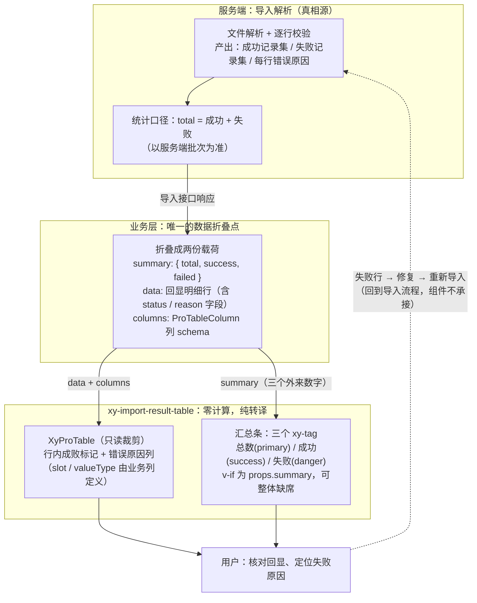
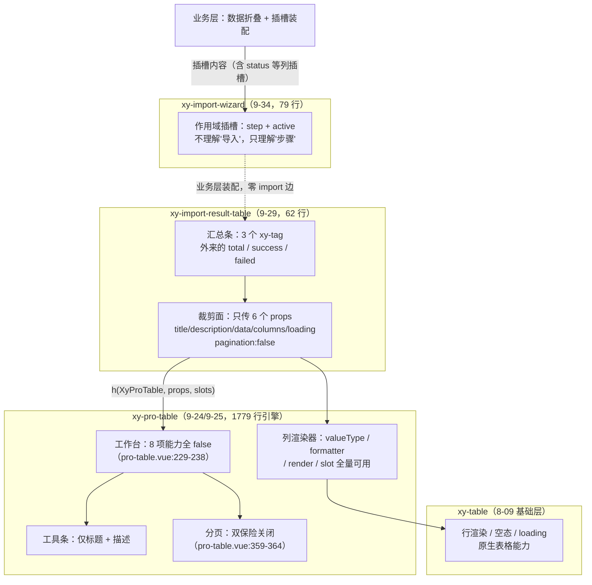

# 9-29 · ImportResultTable：导入回显

先报实态核对结果。大纲给这篇的核心问题是"结果表格的成功/失败汇总"，而实测的第一组事实有三条，条条都值得在动笔前立住。第一条：`packages/pro-components/import-result-table/src/` 下两个文件合计 62 行——`import-result-table.vue` 48 行、`import-result-table.ts` 14 行——**全文件检索之后确认，组件里没有一行汇总计算**。没有 `reduce`，没有 `filter`，没有 `computed(() => data.filter(...))`，没有"从数据里数出成功几条失败几条"的任何代码。一个负责"成功/失败汇总"的组件，自己一个数字都不算。这不是偷懒，是本篇第一个需要立住的结论，知识点矩阵把它记作"summary 外置零派生"（`column/01-知识点全集矩阵.md:204`）。第二条：大纲预设"import-wizard 的第三步结果页消费 import-result-table"，而实码定论恰恰相反——在 `packages/pro-components/import-wizard/` 全目录检索 `import-result-table`、`ImportResultTable`、`import_result`，**零命中**；两者之间没有任何 import 边，组合靠的是插槽协商。第三条：它消费的也不是 8-09 的基础层 `xy-table`，而是隔了一层的 `XyProTable`（9-24/9-25）——一张 1779 行引擎驱动的增强表格，被六个 props 裁剪成静态只读预览。围绕这三条事实，本篇要讲清四个问题：三个数字的产品语义与"零派生"的得失；部分成功的 UX 为什么收敛成"一条汇总条 + 一张全量表"；插槽协商式组合的代价与收益；以及全功能表格被裁剪时，哪些是运行时裁掉的、哪些只是类型上还活着的"死字段"。

## 一、62 行的全部家当：协议与实现

先看协议层。`packages/pro-components/import-result-table/src/import-result-table.ts` 全文 14 行：

```ts
import type { ProTableColumn } from "../../pro-table";

export interface ImportResultSummary {
  total: number;
  success: number;
  failed: number;
}

export interface ImportResultTableProps<T = Record<string, unknown>> {
  data: T[];
  columns: ProTableColumn<T>[];
  summary?: ImportResultSummary;
  loading?: boolean;
}
```

（`packages/pro-components/import-result-table/src/import-result-table.ts:1-14`）

14 行、两个接口、六个字段，没有任何运行时代码——与 9-02 立下的"薄组件协议层"惯例一致。但这份协议的信息密度比它的行数高得多，有三个否定式事实值得逐个掂量。

其一，`ImportResultSummary` 只有三个 `number`。没有 `failedItems`（失败明细数组），没有 `errorFileUrl`（错误明细下载地址），没有 `partial`（部分成功标志位），甚至连 `success + failed === total` 的守恒性都不约束——三个数字之间的关系，协议上一个字都没说。其二，`summary` 是可选的（12 行的 `?`），不传就没有汇总条，组件退化为一张纯表格。其三，`data` 与 `columns` 的类型直接复用 `ProTableColumn<T>`（1 行 import），导入回显没有发明自己的列协议——这是第三个设计决策的伏笔，第四节展开。

再看实现层全文。`import-result-table.vue` 共 48 行，script 段 37 行 + template 段 10 行，一次贴完：

```vue
<script setup lang="ts">
import { defineComponent, h, useSlots } from "vue";
import { XyTag } from "xiaoye-components";
import { XyProTable } from "../../pro-table";
import type { ImportResultTableProps } from "./import-result-table";

defineOptions({
  name: "XyImportResultTable"
});

const props = withDefaults(defineProps<ImportResultTableProps<any>>(), {
  data: () => [],
  columns: () => [],
  summary: undefined,
  loading: false
});

const slots = useSlots() as Record<string, ((payload?: unknown) => unknown) | undefined>;
const ProTableRenderer = defineComponent({
  name: "XyImportResultTableRenderer",
  setup() {
    return () =>
      h(
        XyProTable,
        {
          title: "导入结果",
          description: "导入结束后用统一表格承接成功、失败和原因信息。",
          data: props.data,
          columns: props.columns,
          loading: props.loading,
          pagination: false
        },
        slots
      );
  }
});
</script>

<template>
  <div class="xy-import-result-table">
    <div v-if="props.summary" class="xy-import-result-table__summary">
      <xy-tag status="primary">总数 {{ props.summary.total }}</xy-tag>
      <xy-tag status="success">成功 {{ props.summary.success }}</xy-tag>
      <xy-tag status="danger">失败 {{ props.summary.failed }}</xy-tag>
    </div>
    <pro-table-renderer />
  </div>
</template>
```

（`packages/pro-components/import-result-table/src/import-result-table.vue:1-48`）

48 行里有两个"非常规"写法，值得先拆开。第一个是 11 行的 `ImportResultTableProps<any>`：对外的协议是泛型的（`ImportResultTableProps<T = Record<string, unknown>>`），到了运行时 props 声明里泛型被抹成 `any`——这是 Vue 运行时 props 不支持泛型的老问题，公开类型层的 `T` 由调用方在 `columns` 与 `data` 上分别标注，运行时层不校验。第二个是 19-36 行的 `ProTableRenderer`：在一个 `<script setup>` 组件内部，又用 `defineComponent` 定义了一个渲染函数组件。为什么不直接在模板里写 `<xy-pro-table>`？因为**插槽透传**。模板里把"调用方传进来的全部插槽"原样交给子组件，需要 `v-for` 遍历 `$slots` 的样板代码；而渲染函数里 `h(XyProTable, {...}, slots)` 第三个参数直接把整个插槽对象递过去（33 行），一行完成透传，包括动态命名的插槽。外层之所以还需要一个模板，是因为汇总区是模板里最好写的布局（41-45 行），于是这个 SFC 内部形成了分工：**模板管布局（汇总条 + 渲染器占位），渲染函数管插槽协议**。

顺带一个考据细节：18 行的插槽类型强转 `useSlots() as Record<string, ((payload?: unknown) => unknown) | undefined>`，与 `pro-table.vue:195` 的一字不差——增强层的插槽透传链上有统一签名，从 9-24/9-25 的 ProTable 到这里的包装层用的是同一句惯用法。

template 段只有三个关注点。40 行的根节点绑定了 `xy-import-result-table` 类名——记住这个，第六节讲样式时要回来确认它不是孤儿。41 行 `v-if="props.summary"` 把汇总条做成纯可选件。42-44 行三个 `xy-tag`，`status` 分别是 `primary`、`success`、`danger`——这是基础层 tag 的语义状态协议（`packages/components/tag/src/tag.vue:11` 的 `status?: ComponentStatus`），三个数字的视觉权重靠语义色板表达：总数中性偏主色、成功绿、失败红。

## 二、汇总区：三个数字与"零派生"的产品语义

现在正面回答核心问题："成功/失败汇总"到底汇总了什么、由谁汇总。

先画出导入结果的完整数据流，把"谁在哪个环节折叠数据"标清楚：



这张图的关键是中段：**数据折叠只发生在业务层**。组件拿到手的已经是"三个数字 + 一批明细行"，它做的是转译（数字→语义色标签，明细→表格行），不是计算。这是本篇第一个设计权衡：**汇总零派生**。理由有三层。

第一层是**真相归属**。导入是谁做的？服务端。哪一行成功、哪一行失败、为什么失败，服务端在逐行校验时就已经知道了。如果前端组件自己从 `data` 里数一遍——比如 `computed(() => data.filter(row => row.status === "成功").length)`——就引入了第二套统计口径：前端数出来的数要依赖明细行里某个业务字段的取值约定（叫 `status` 还是 `ok`？值是 `"成功"` 还是 `true`？），而这个约定服务端不背书。导入回显是强审计语境的界面，两个数字对不上比没有数字更糟。零派生的第一层含义是：**统计口径只有一个主人，就是返回导入结果的那次接口调用**。

第二层是**两个集合本来就不是同一个集合**。`summary.total` 统计的是"导入批次"，`data` 展示的是"回显明细"。这两者可以不相等，而且相等反而是产品决策：一万条导入、失败五十条，全部一万行都回显吗？多数产品不会——要么只回显失败明细（成功的不用看），要么回显采样。`ImportResultSummary` 与 `data` 在协议上是两个独立字段，没有类型上的任何关联（没有 `data: FailedItem[]` 之类的耦合），正是为了让"汇总的口径"与"展示的口径"可以自由错开。若组件内置派生，`total` 永远等于 `data.length`，这个自由就没了。

第三层是**部分成功的产品语义没有标准答案**。考据清单里问的"成功/失败分栏还是 tab 切换、错误行定位（行号回显？下载错误明细？）"，实码的答案是：这些产品级选择全部不在组件里。组件给出的形态只有一种——一条汇总条 + 一张全量表（42-44 行 + 46 行），成功行和失败行混排在同一张表里，靠业务层在列 schema 里定义的标记列区分（官方示例用 `slot: "status"` + 红绿 tag，`basic.vue:18`）。为什么不做分栏/tab？因为"怎么组织失败信息"随数据规模剧烈变化：失败几十条时同表混排足够；失败几千条时要下载错误明细离线修复；失败行需要"修正后单行重导"时又要动作列。组件把汇总条钉死（三个数字是导入回显的公共不变量），把明细的组织方式完全让渡给 `columns`——这是"公共部分收敛、差异部分外放"的典型裁剪。

代价也要直说。零派生意味着**零守恒检查**：调用方完全可能传出自相矛盾的 summary（`total: 100, success: 80, failed: 10`，加起来不是 100），组件照单全收、照单渲染，测试里也确实这么传过（`spec.ts:22-26` 传的是 `total: 1, success: 1, failed: 0`，这个是守恒的；但协议不强制）。三个数字的守恒性、`summary` 与 `data` 的一致性，都是业务层的不可让渡责任——组件层的 `v-if` 甚至允许"没有汇总条的导入回显"这种中间态存在。信任边界画在 props 上，这是薄组件路线一贯的取舍。

这里放上 Element Plus 对照。EP 全家没有"导入结果表格"组件，社区的标准拼装是三件套：`el-upload` 的 `on-success`/`on-error` 回调拿到响应、`el-alert` 手工拼一条"N 条成功，M 条失败"的汇总文案、`el-table` 手写模板渲染明细。若要更"结果页"一点的观感，会再叠一个 `el-result`（状态图标 + 标题 + 额外内容插槽）。对比之下差异有两处。其一，`el-result` 的主语是**状态**（成功图标还是失败图标），适合"全成全败"的粗粒度结果；而导入回显最常见的真相是**部分成功**——`el-result` 表达不了 80/20 这种中间态，本组件用三个数字 + 明细行把部分成功做成一等公民。其二，EP 没有增强表格层，回显的列渲染（红绿标签、错误原因排版）每个页面手写一遍 template；本库借 ProTable 的列 schema，"结果列"的表达有 `slot`/`valueType` 的出口（第四节展开），同一套列定义可以在导入回显与普通列表之间复用。代价同样存在：EP 三件套拼起来每一段都看得见、改得动，本组件把汇总条固化成三个 tag 的死格式——想换成"成功 98%，失败 2 条"的进度条式汇总，没有出口，只能不传 `summary` 自己在业务层画。

## 三、组合链考据：插槽协商与 1779 行引擎的裁剪

两个大纲考据点在这一节用实码定论。

**考据一：import-wizard 消费 import-result-table 吗？不消费。**`packages/pro-components/import-wizard/` 四个文件（index.ts、import-wizard.vue 79 行、import-wizard.ts 12 行、测试）里检索 `import-result-table` 零命中；反向检索 `import-wizard` 在 import-result-table 里也是零命中。import-wizard 的主体结构长这样：

```vue
<template>
  <xy-card class="xy-import-wizard" :header="props.title">
    <xy-steps :active="activeBridge">
      <xy-step
        v-for="step in props.steps"
        :key="step.key"
        :title="step.title"
        :description="step.description"
      />
    </xy-steps>
    <div class="xy-import-wizard__body">
      <slot :step="currentStep" :active="activeBridge" />
    </div>
    <div class="xy-import-wizard__footer">
      <xy-button
        :disabled="activeBridge === 0"
        @click="
          () => {
            const prevIndex = activeBridge - 1;
            updateActive(prevIndex);
            emit('prev', prevIndex);
          }
        "
      >
        上一步
      </xy-button>
```

（`packages/pro-components/import-wizard/src/import-wizard.vue:37-62`）

47-49 行是关键：向导的主体是**一个作用域插槽**，把当前步骤对象和激活索引交给外界，自己只管步骤条与前进后退。第三步"结果页"里放什么，向导一无所知。文档页那句"它通常放在导入向导的最后一步"（`apps/docs/pro-components/import-result-table.md:13`）是**建议用法，不是代码事实**；import-wizard 的官方示例与文档也没有任何一处演示这个组合。于是"导入流程的终点"这个叙事要修正为：上传（6-19）→ import-wizard（9-34）→ import-result-table（9-29）是一条**文档叙事上的流程线**，代码层只有 upload 到 wizard 之外，wizard 与 result-table 之间靠业务层用插槽装配。

这是本篇第二个设计权衡：**插槽协商 vs 代码级硬接线**。假设另一种设计——import-wizard 内置"结果步骤"协议，比如 `ImportWizardStep` 多一个 `type: "result"`，命中时自动渲染内置的结果组件并吃进 `ImportResultSummary`。收益是开箱即用，代价有三个：两个组件从此锁死 import 依赖（打包与心智都双向耦合）；"上传→校验→结果"的步骤数被协议固化，两步向导、四步向导（上传→字段映射→校验→结果）都要绕协议；结果步骤的形态被一个组件垄断，业务想放个 `el-result` 风格的大图标或自定义统计卡就没门了。插槽协商让向导保持 79 行的纯粹（它只理解"步骤"这个抽象，不理解"导入"这个业务），也让 import-result-table 保持独立可用——文档明说它可以"作为单独结果页的主内容"（`import-result-table.md:13`）。代价是官方没有给出 wizard + result 的组合示例，装配胶水（按 `active` 切换渲染、在 finish 事件里收结果）要业务层自己写。下面这段**示意代码**（非仓库实码）就是这份胶水的最小形态：

```vue
<!-- 示意代码：import-wizard 第三步装配 import-result-table 的参考写法，非仓库实码。 -->
<script setup lang="ts">
import { ref } from "vue";
import type { ImportResultSummary } from "@xiaoye/pro-components";

interface ImportRow {
  id: number;
  name: string;
  status: "成功" | "失败";
  reason: string;
}

// 向导外的结果载荷：由上传接口的响应折叠而来
// （汇总与明细都来自服务端，业务层零加工）
const summary = ref<ImportResultSummary>();
const rows = ref<ImportRow[]>([]);
const active = ref<number>();

function handleFinish() {
  // 完成后的去向：关闭弹层 / 跳转列表 / 清空载荷，全归业务层
  summary.value = undefined;
  rows.value = [];
}
</script>

<template>
  <xy-import-wizard
    :steps="[
      { key: 'upload', title: '上传文件' },
      { key: 'check', title: '校验预览' },
      { key: 'result', title: '导入结果' }
    ]"
    :active="active"
    @update:active="active = $event"
    @finish="handleFinish"
  >
    <template #default="{ step }">
      <!-- 第一步、第二步的业务内容省略 -->
      <xy-import-result-table
        v-if="step?.key === 'result'"
        :data="rows"
        :columns="[
          { prop: 'name', label: '记录名称', minWidth: 180 },
          { prop: 'reason', label: '失败原因', minWidth: 220 }
        ]"
        :summary="summary"
      />
    </template>
  </xy-import-wizard>
</template>
```

注意这段示意里 `:summary="summary"` 的初始值是 `undefined`——前两步还没导入结果时，`v-if="props.summary"` 让汇总条整体缺席，表格拿到空数组只渲染表头与空态。插槽协商的另一面是**时序**：结果组件在向导第一步就已经挂载（只是被 `v-if` 挡住内容），它的 loading 态正好可以承接"第三步点击完成前的导入请求中"——`loading` prop（协议第 13 行）在这个场景不是摆设。

**考据二：消费基础层 table（8-09）还是自建简化列表？都不是——消费的是中间层 ProTable。**import-result-table.vue 的 import 区（3-4 行）只有两个组件依赖：基础层的 `XyTag` 和增强层的 `XyProTable`。那张只读预览表是 1779 行的 `pro-table.vue` 驱动的。裁剪发生在传参面：六个 props 之外什么都没传。我们逐项核对这份"裁剪账单"在引擎侧的效果。工作台的默认收敛逻辑：

```ts
const resolvedWorkbench = computed(() => ({
  refresh: Boolean(props.workbench.refresh || props.request),
  density: Boolean(props.workbench.density),
  columnSetting: Boolean(props.workbench.columnSetting),
  fullscreen: Boolean(props.workbench.fullscreen),
  treeToggle: Boolean(props.workbench.treeToggle),
  filter: Boolean(props.workbench.filter || props.views?.filterFields?.length),
  export: Boolean(props.workbench.export || props.exportOptions),
  print: Boolean(props.workbench.print || props.printOptions)
}));
```

（`packages/pro-components/pro-table/src/pro-table.vue:229-238`）

import-result-table 不传 `workbench`（默认 `{}`，`pro-table.vue:93`）、不传 `request`、不传 `views`、不传 `exportOptions`、不传 `printOptions`——八个工作台能力全部落空。工具条的显隐判据：

```ts
const hasToolbar = computed(
  () =>
    Boolean(props.title) ||
    Boolean(props.description) ||
    visibleToolbarActions.value.length > 0 ||
    Boolean(slots["toolbar-main"]) ||
    Boolean(slots["toolbar-left"]) ||
    Boolean(slots["toolbar-right"]) ||
    resolvedWorkbench.value.refresh ||
    resolvedWorkbench.value.density ||
    resolvedWorkbench.value.columnSetting ||
    resolvedWorkbench.value.fullscreen ||
    resolvedWorkbench.value.treeToggle ||
    resolvedWorkbench.value.filter ||
    resolvedWorkbench.value.export ||
    resolvedWorkbench.value.print
);
```

（`packages/pro-components/pro-table/src/pro-table.vue:258-274`）

八个工作台项全 false、没有 toolbarActions、没有工具条插槽，`hasToolbar` 只剩前两项——**title 与 description 恒真**（import-result-table 写死了"导入结果"和那句描述文案），所以工具条渲染，但上面除了标题什么都没有（1508-1511 行就是这两个 `<h3>/<p>`）。分页侧：

```ts
const paginationBindings = computed(() => {
  const merged: Partial<PaginationProps> = {
    ...props.paginationProps,
    currentPage: currentPageState.value,
    pageSize: pageSizeState.value,
    defaultCurrentPage: props.defaultCurrentPage,
    defaultPageSize: props.defaultPageSize,
    total: resolvedPaginationTotal.value,
    pageSizes: props.pageSizes,
    layout: props.pageLayout,
    hideOnSinglePage: props.hideOnSinglePage
  };

  return merged;
});
const showPagination = computed(
  () =>
    props.pagination &&
    (typeof paginationBindings.value.total === "number" ||
      typeof paginationBindings.value.pageCount === "number")
);
```

（`packages/pro-components/pro-table/src/pro-table.vue:344-364`）

import-result-table 显式传了 `pagination: false`（31 行），第一项即 false；即便漏传，ProTableProps 的默认值是 `pagination: true`（`pro-table.vue:83`），但 `showPagination` 还有第二道闸——`total` 必须是 number（359-364 行），而导入回显不传 `total`、没有 `request`（`requestTotal` 无来源），分页同样不出现。**双保险把"静态全量回显"钉死**：导入结果是一次性集合，分页会把"失败明细"切碎，用户核对时要在页与页之间往返——这里的产品语义与列表页相反，全量平铺才对。

把整条组合链画出来，每一层标注"加了什么、裁了什么"：



这条链是本篇第三个设计权衡——**全功能委托 vs 自建简化列表**——的答案：全功能委托 + 参数裁剪，而不是自建简化列表。自建一张轻量回显列表（几十行的 ul/table）当然更省，但它会同时失去三样东西：列 schema 的表达力（`valueType: "tag"` 一行顶一段模板）、插槽生态（loading/empty/footer-meta 直接复用 ProTable 的）、以及与普通列表页共享列定义的可能——导入回显的列和导入前预览的列，业务层可以维护同一份 `ProTableColumn[]`。委托的代价是：一张静态只读表背着 1779 行引擎的运行时（尽管工作台、分页、请求管线全部闲置），以及下一节要讲的"类型面没有跟着裁"的瑕疵。

还有一处固化的产品语义值得记录：26-27 行写死的 `title: "导入结果"` 与 `description: "导入结束后用统一表格承接成功、失败和原因信息。"` 没有任何 props 出口。想换文案，唯一的通道是 ProTable 的 `toolbar-main` 具名插槽（`pro-table.vue:1507-1512`，插槽内容会整体顶掉标题与描述）——由于 33 行的插槽透传，调用方传 `#toolbar-main` 是可达的。这是"固化默认叙述、留插槽逃生口"的折中：导入回显的标题在多数产品里就是"导入结果"，固化省掉了每个调用点重复配置；真要定制的人有逃生口，虽然要付出"连描述一起重写"的粒度代价。

## 四、插槽透传与列 schema：错误展示的表达权

失败行的错误展示长什么样？协议层的答案已经在第一节点过：**没有专有协议**。`ImportResultTableProps` 没有 `statusField`、没有 `reasonField`、没有 `errorFormatter`——哪一列显示成败、哪一列显示原因，全靠业务层在 `columns` 里声明。列协议直接复用 ProTable 的 `ProTableColumn`，把它的完整定义贴出来（`packages/pro-components/pro-table/src/pro-table.ts:103-156`）：

```ts
export interface ProTableColumn<T = ProTableRow> extends TableColumnProps<T> {
  key?: string;
  children?: ProTableColumn<T>[];
  slot?: string;
  headerSlot?: string;
  hidden?: boolean;
  valueType?:
    | "text"
    | "select"
    | "radio"
    | "checkbox"
    | "tag"
    | "progress"
    | "link"
    | "image"
    | "avatar"
    | "money"
    | "date"
    | "datetime"
    | "code"
    | "copy";
  formatter?: (
    row: T,
    column: TableResolvedColumn<T>,
    value: unknown,
    rowIndex: number
  ) => unknown;
  render?: (
    value: unknown,
    context: {
      row: T;
      column: ProTableColumn<T>;
      rowIndex: number;
    }
  ) => VNodeChild;
  renderHTML?: (
    value: unknown,
    context: {
      row: T;
      column: ProTableColumn<T>;
      rowIndex: number;
    }
  ) => string;
  emptyValue?: string;
  editable?: boolean | ((row: T, rowIndex: number) => boolean);
  editor?: ProFieldSchemaBuiltinComponent | Component;
  editorProps?: Record<string, unknown> | ((row: T) => Record<string, unknown>);
  editorSlot?: string;
  options?:
    | Array<ProTableDisplayOption | ProTableDisplayOptionGroup>
    | ((row: T) => Array<ProTableDisplayOption | ProTableDisplayOptionGroup>);
  exportable?: boolean;
  printable?: boolean;
}
```

（`packages/pro-components/pro-table/src/pro-table.ts:103-156`）

这份 54 行的协议在导入回显场景的真实可用面，值得逐格清点。**可达**：`slot`/`headerSlot`（106-107 行）——插槽经 33 行的透传链一路到基础层；`valueType`（109-123 行）——想用 `"code"` 展示错误码、`"copy"` 给错误明细加一键复制，都是引擎内置；`formatter`/`render`/`renderHTML`/`emptyValue`（124-146 行）；以及 147-150 行的 `editable`/`editor`/`editorSlot`。**不可达**：列级的 `exportable`/`printable`（154-155 行）需要 ProTable 的 `exportOptions`/`printOptions` 配置开启，而 import-result-table 没有透传出口——写了也不生效。**半可达的瑕疵**：`editable` 字段在类型上完全合法，但 ProTable 的编辑态需要 `ProTableProps.editable` 配置开启，import-result-table 同样没有出口——**类型上活着、运行时上死了**。这是"参数裁剪"路线的结构性代价：运行时的裁剪靠 props 出口的缺失实现，类型面却原样暴露完整的 `ProTableColumn`。业务写下 `editable: true` 不会得到任何报错，只会得到一张不会编辑的表。要修可以把导入回显的列协议收窄成 `Omit<ProTableColumn<T>, "editable" | "editor" | ...>`，但那又会失去"导入回显列 = 普通列表列"的类型等价性（示例代码 `basic.vue:2` 从包根 import 的就是完整的 `ProTableColumn`）——收窄类型等于宣告两套列协议，复用叙事就断了。两头不可兼得，仓库选择了保复用、容瑕疵。

错误展示的表达权下放，官方示例是范本。`apps/docs/examples/pro/import-result-table/basic.vue` 全文 35 行：

```vue
<script setup lang="ts">
import type { ProTableColumn } from "@xiaoye/pro-components";

interface ImportRow {
  id: number;
  name: string;
  status: "成功" | "失败";
  reason: string;
}

const rows: ImportRow[] = [
  { id: 1, name: "杭州分部", status: "成功", reason: "-" },
  { id: 2, name: "上海分部", status: "失败", reason: "负责人字段缺失" }
];

const columns: ProTableColumn<ImportRow>[] = [
  { prop: "name", label: "记录名称", minWidth: 180 },
  { prop: "status", label: "结果", slot: "status", minWidth: 120 },
  { prop: "reason", label: "说明", minWidth: 200 }
];
</script>

<template>
  <xy-import-result-table
    :data="rows"
    :columns="columns"
    :summary="{ total: 2, success: 1, failed: 1 }"
  >
    <template #status="{ row }">
      <xy-tag :status="row.status === '成功' ? 'success' : 'danger'">
        {{ row.status }}
      </xy-tag>
    </template>
  </xy-import-result-table>
</template>
```

（`apps/docs/examples/pro/import-result-table/basic.vue:1-35`）

三个细节构成一份完整的"表达权下放"说明。其一，第 2 行从**包根** import `ProTableColumn`（`packages/pro-components/index.ts:60` 在白名单内导出），列协议是公开词汇。其二，18 行的 `slot: "status"` 与 29-33 行的 `#status` 插槽是一对：列 schema 只声明"这列由插槽渲染"，插槽内容（红绿 tag 的三元判定）由调用方提供——插槽对象经 `h(XyProTable, ..., slots)` 透传进 ProTable，再由列渲染器按 `getSlotName`（`pro-table.vue:422` 的 `column.slot ?? column.prop ?? column.key`）分发给对应单元格。33 行那个裸传 `slots` 的写法在这里兑现了价值：调用方传的 `#status` 不是 import-result-table 的具名插槽，而是**穿透两层**直达基础层单元格的。其三，示例的数据是部分成功的最小集（2 条中 1 成功 1 失败，`reason: "负责人字段缺失"`），汇总 `{ total: 2, success: 1, failed: 1 }` 由调用方手写——示例本身就在演示"汇总外置"。

错误原因的展示形态（第 19 行 `reason` 列）在示例里是最朴素的纯文本。真实产品里的升级路径都在列协议内：加 `valueType: "code"` 展示错误码列、错误原因用 `render` 拼装"原因 + 修复建议"、行级动作（单行重导）用 `slot` 列塞按钮。至于考据清单里问的"下载错误明细"——组件零内置，但这不是协议的漏洞而是分工：错误明细下载是"把失败行序列化成文件"的业务动作，数据（`data`）本来就在业务层手里，组件拦不住也没有必要参与。

## 五、测试、入口链与一块活着的样式

测试文件 34 行、一个用例，全文贴出：

```ts
import { mount } from "@vue/test-utils";
import { defineComponent, h } from "vue";
import { describe, expect, it, vi } from "vitest";
import { XyImportResultTable } from "@xiaoye/pro-components";

describe("XyImportResultTable", () => {
  it("支持渲染汇总信息和表格内容", () => {
    const wrapper = mount(XyImportResultTable, {
      props: {
        data: [
          {
            id: 1,
            name: "导入结果"
          }
        ],
        columns: [
          {
            prop: "name",
            label: "名称"
          }
        ],
        summary: {
          total: 1,
          success: 1,
          failed: 0
        }
      }
    });

    expect(wrapper.text()).toContain("总数 1");
    expect(wrapper.text()).toContain("成功 1");
    expect(wrapper.find(".xy-pro-table").exists()).toBe(true);
  });
});
```

（`packages/pro-components/import-result-table/__tests__/import-result-table.spec.ts:1-34`）

三条断言各管一件事：30-31 行锁汇总条的文案拼装（"总数 1"、"成功 1"——数字是模板插值进 tag 的），32 行锁**委托关系本身**——`.xy-pro-table` 类名存在，意味着 import-result-table 真的渲染出了 ProTable，而不是自己画了个假表。这个断言看似薄弱，实则钉住了本组件唯一的架构承诺：回显表的渲染主体是 ProTable，ProTable 的全部行为（列 schema、空态、loading）因此间接被背书。但覆盖面的缺口照例直言，而且比前几篇都大：**失败路径零覆盖**——没有任何用例传 `failed > 0` 的 summary、没有 `summary` 缺省时的渲染（`v-if` 分支）、没有插槽透传的验证（传一个 `#status` 看单元格是否吃到）、没有 `loading` 态、没有"失败"标签的 danger 语义断言。34 行测试守住的只是"汇总条 + 委托"这半张地图，另一半（插槽链与可选性）目前只存在于源码阅读者的脑子里。头部 import 的 `defineComponent, h, vi`（2-3 行）在用例体里都没有用到，是测试骨架的残迹——无害，但提示这份测试大概率是从模板复制后只填了一个用例。

入口链过一遍。组件安装入口 `packages/pro-components/import-result-table/index.ts` 全文 15 行：`withInstall` 挂载（10-13 行，注册名 `xy-import-result-table`）+ 两个类型导出（8 行），无运行时逻辑。导出边界各就各位：组件值出口 `packages/pro-components/exports.ts:21`；类型白名单出口 `packages/pro-components/index.ts:88-91`（只放行 `ImportResultSummary` 与 `ImportResultTableProps` 两个主类型——按 9-01 立下的根入口纪律，不往根上抬任何细节类型）；守卫脚本 `scripts/check-pro-components.mjs:41` 的白名单 `"import-result-table": ["ImportResultSummary", "ImportResultTableProps"]`；manifest 注册 `packages/pro-components/component-manifest.json:162-169`（`docsGroup: "data"`、安装断言 `xy-import-result-table`、样式项 `import-result-table`）；聚合样式 `packages/pro-components/style.css:22` 的 `@import`。类型夹具 `tests/types/fixtures/import-result-table.ts` 全文 34 行：

```ts
import type {
  ImportResultSummary,
  ImportResultTableProps
} from "@xiaoye/pro-components";

interface Row {
  id: number;
  name: string;
}

const summary: ImportResultSummary = {
  total: 1,
  success: 1,
  failed: 0
};

const props: ImportResultTableProps<Row> = {
  data: [
    {
      id: 1,
      name: "导入结果"
    }
  ],
  columns: [
    {
      prop: "name",
      label: "名称"
    }
  ],
  summary
};

void summary;
void props;
```

（`tests/types/fixtures/import-result-table.ts:1-34`）

夹具把三件事锁进类型检查：`ImportResultSummary` 三个字段的必填性（11-15 行少一个都编译失败）、`ImportResultTableProps<Row>` 的泛型标注（17 行——泛型在调用侧是真实的）、`summary` 的可选与可传。聚合侧 `tests/types/fixtures/xiaoye-pro-components.ts` 另有三处独立断言：15 行的 `XyImportResultTable` 值导入、51 行的类型导入、296-300 行的 `importSummary` 常量与 427 行的 `void XyImportResultTable` 安装哨兵。

最后是样式。`packages/theme/src/pro/import-result-table.css` 全文 11 行：

```css
.xy-import-result-table {
  display: flex;
  flex-direction: column;
  gap: 16px;
}

.xy-import-result-table__summary {
  display: inline-flex;
  gap: 12px;
  flex-wrap: wrap;
}
```

（`packages/theme/src/pro/import-result-table.css:1-11`）

上一篇 9-27 在 saved-view-tabs.css 里发现了一块"没有宿主"的孤儿样式，这篇要报一个好消息：**这对样式是活的**。逐格核对——`xy-import-result-table` 命中模板根节点（`import-result-table.vue:40`），`xy-import-result-table__summary` 命中汇总条容器（41 行，`v-if="props.summary"` 的那个 div）。11 行样式做两件事：容器纵向布局并把汇总条与表格拉开 16px；汇总条横向排列、12px 间距、**允许换行**（`flex-wrap: wrap`）。换行这半行样式是三个 tag 在窄容器里的唯一防线——导入结果常常渲染在弹层或向导的第三步里，容器宽度不可控，三个标签 + 数字放不下一行时会折行而不是溢出。样式规模与组件规模相称（11 行配 62 行），没有一处越界去管 ProTable 内部的间距——那归 ProTable 自己的样式管。

## 六、收束：终点站的形态

收束全篇。ImportResultTable 用 62 行回答了"导入回显"这个流程终点站该怎么建：**汇总条收敛、明细外放、委托渲染、零计算**。汇总收敛成三个外来的数字（`total/success/failed`），因为统计口径只能有一个主人（服务端批次）；明细完全外放给 `ProTableColumn` 列协议，因为部分成功的组织方式（混排、分栏、下载明细、行级重导）没有标准答案；渲染委托给被裁剪的 ProTable（工作台八项全关、分页双保险关闭），因为回显表值得复用列 schema 与插槽生态，代价是 `editable` 这类"类型活着、运行时死了"的瑕疵字段；零计算则把业务层推到数据折叠的唯一位置——组件连 `success + failed === total` 都不校验，信任边界画死在 props 上。与 import-wizard 的关系也在此定论：文档叙事里的流程终点，代码实态里是一次插槽协商，两个组件零 import 边——向导不理解导入，结果表不理解向导，理解导入流程的是业务层的那几十行装配胶水。

下一篇 9-30《AuditTimeline：审计流》走出导入域，走进时间线的业务特化：200 行的 audit-timeline（协议 31 行 + 实现 169 行）如何用五档 `AuditTimelineStatus` 驱动节点语义、`attachments` 附件列表的渲染边界、以及它和基础层 timeline 的分工——审计流要的是"谁在什么时候做了什么"的不可抵赖性，时间线组件给的却只是视觉的先后秩序，这中间的差距由谁补。

---

**考据与行号核对说明**：本文所有路径与行号均按当前工作区实态核对。`import-result-table.vue` 实测 48 行、`import-result-table.ts` 14 行、组件 `index.ts` 15 行、`import-result-table.spec.ts` 34 行（1 个用例）、`packages/theme/src/pro/import-result-table.css` 11 行、文档示例 `basic.vue` 35 行、类型夹具 34 行；`import-wizard.vue` 79 行、`import-wizard.ts` 12 行；`pro-table.vue` 1779 行、`pro-table.ts` 381 行。全仓检索确认 `import-wizard` 目录内无任何对 import-result-table 的引用，`packages/theme/src/pro/import-result-table.css` 的两个类名均有模板宿主（非孤儿样式）。`column/01-知识点全集矩阵.md:204`（I29 条目）、`column/02-分卷大纲.md:183-184`（9-29 与 9-30 条目）与正文引用一致。
