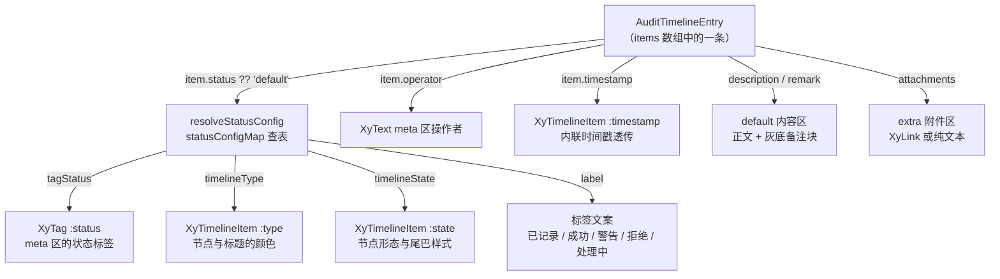
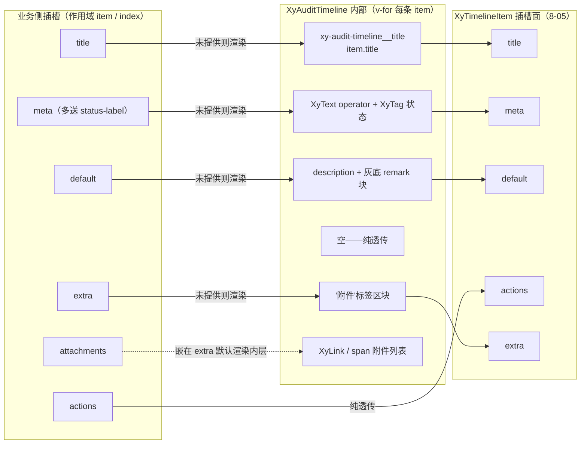
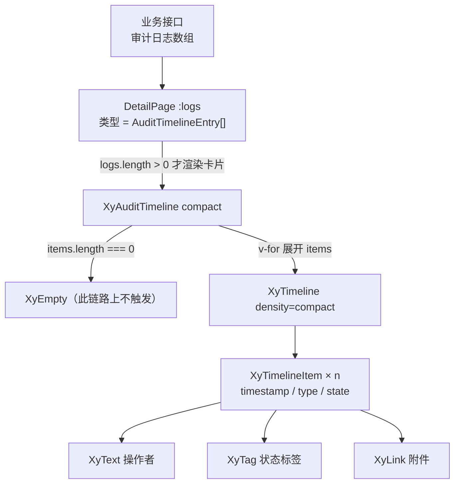

# 9-30 · AuditTimeline：审计流

8-05 解剖基础层 Timeline 时留过一句交接话：`xy-timeline` 用 slot 扫描和 `cloneVNode` 把"最后一项判定"做成了通用能力，但业务里真正高频出现的不是手写 `xy-timeline-item`，而是"给我一组审计日志，帮我渲染成时间线"——数据在接口里，语义在业务侧，谁来把这两样东西翻译成 timeline 的插槽语言？这篇的主角就是答案：`XyAuditTimeline`（`packages/pro-components/audit-timeline/`）。核心问题只有一个：**时间线的业务特化**——当一个通用展示组件（timeline）遇上一个具体业务场景（审计流），特化层应该做多厚、做多薄、哪些事坚决不做。

先给体量一个直观感受：`src/audit-timeline.vue` 169 行、`src/audit-timeline.ts` 31 行、`index.ts` 17 行，样式 `packages/theme/src/pro/audit-timeline.css` 68 行，测试 `__tests__/audit-timeline.spec.ts` 58 行两条用例，文档示例 `apps/docs/examples/pro/audit-timeline/basic.vue` 69 行。全组件加起来不到 350 行，是增强层里最小的特化样本之一——但它同时消费了 `XyEmpty`（7-07 点名的八处下游之一）、`XyLink`（5-03）、`XyTag`（5-21）、`XyText`（5-05）和整套 `XyTimeline`/`XyTimelineItem`（8-05），是增强层"组装密度"的典型样本。7-07 写 Empty 时已经把 `XyAuditTimeline` 列为空态下游，5-21 写 Tag 时梳理过 `ComponentStatus` 的消费链，这两笔债都在这篇还。

照例先给结论：audit-timeline 的特化路线是"**items 数组驱动 + 五插槽全桥接 + 状态翻译表**"三件事。它不自绘时间线——渲染完全委托给 8-05 的 `XyTimeline`；它不格式化时间——`timestamp` 是原样透传的字符串；它不定义新的颜色体系——业务状态全部翻译成 5-21 的 `ComponentStatus` 和 timeline 的 `TimelineItemState`。下面逐段拆。

## 一、31 行类型层：审计记录的字段审计

一切从数据结构开始。`audit-timeline.ts` 全文 31 行：

```ts
// packages/pro-components/audit-timeline/src/audit-timeline.ts（全文，共 31 行）
export const auditTimelineStatuses = [
  "default",
  "success",
  "warning",
  "danger",
  "processing"
] as const;

export type AuditTimelineStatus = (typeof auditTimelineStatuses)[number];

export interface AuditTimelineAttachment {
  label: string;
  href?: string;
}

export interface AuditTimelineEntry {
  id: string | number;
  title: string;
  operator?: string;
  timestamp?: string;
  status?: AuditTimelineStatus;
  description?: string;
  remark?: string;
  attachments?: AuditTimelineAttachment[];
}

export interface AuditTimelineProps {
  items: AuditTimelineEntry[];
  emptyText?: string;
  compact?: boolean;
}
```

八个字段，逐个过一遍"它们各自是谁的影子"：

- **`id: string | number`** 是唯一的必填字段。它不只是 Vue 的 `key`——后面会看到 `attachmentKey` 用它和附件 label 拼复合 key（`audit-timeline.vue:70-72`），`id` 的稳定性直接决定列表复用是否正确。
- **`title: string`** 也是必填。这是审计语义和通用时间线最大的分野：通用 timeline-item 的 `timestamp` 可以独立成行，而审计记录的标题（"审批发起""驳回申请"）是不可省略的锚点。值得注意的是，**没有 `action` 字段**——动作语义被拆进了 `title`（做了什么）和 `status`（结果如何）两个字段里，这是刻意的拆分：`action` 倾向于机器语义（`approve`/`reject`），而审计时间线是给人看的，`title` 允许业务写"审批发起"这种自然语言。
- **`operator?: string`** 操作者。这里要先纠一个可能的预期：它就是一个人名字符串，组件内部用 `XyText` 渲染成纯文本（`audit-timeline.vue:105-112`），**没有消费 `XyAvatar`**，也没有"头像 + 姓名"的组合形态。5-07 讲头像组时没有把 audit-timeline 列进消费下游，实码也证实了这层关系不存在。为什么不放头像？因为审计记录的操作者常常是系统账号、定时任务、"管理员"这类没有头像实体的主体，头像会退化成一个灰色占位圆；而真要头像的业务，走 `#meta` 插槽自己拼 `XyAvatar` 就够了——meta 插槽把默认渲染整个让出来，这是第四节要展开的桥接设计。
- **`timestamp?: string`** 直接是字符串而非 `number | Date`。对比 8-02 countdown 的入参（`value: number | Date | Dayjs`），这是一个鲜明的取舍，第五节专门讲。
- **`status?: AuditTimelineStatus`** 五个业务态：`default / success / warning / danger / processing`。注意它和 5-21 的 `ComponentStatus`（`neutral | primary | success | warning | danger`，定义在 `packages/xiaoye-primitives/src/utils/types/common.ts:1`）**形似而不等**：审计态多了 `processing`、少了 `primary`，`default` 和 `neutral` 同义不同名。这个错位不是疏忽——审计域的词汇表是"已记录/成功/警告/拒绝/处理中"，直接暴露 `ComponentStatus` 会让业务在 `primary`（主色）和 `processing`（处理中）之间产生误用，第二节的状态翻译表就是为消除这个错位而存在的。
- **`description?: string`** 与 **`remark?: string`** 是两个层级的内容：description 是这条记录的正文描述，remark 是"备注"——样式层给 remark 单独做了一个灰色圆角块（`audit-timeline.css:36-43`），视觉上是"引用感"，语义上是"审核意见、驳回原因"这类需要被突出但不属于正文的补充。
- **`attachments?: AuditTimelineAttachment[]`** 附件列表，`label` 必填、`href` 可选。`href` 的有无在渲染层走出两条分支（147-155 的链接分支和 156-158 的纯文本分支），第四节展开。

`AuditTimelineProps` 只有三个 prop：`items`（数据本体）、`emptyText`（空态描述，默认"暂时还没有审计记录"）、`compact`（紧凑密度透传）。没有 `mode`、没有 `reverse`、没有 `reverse` 之外的排序参数——审计流的方向语义（正序 = 时间正序）由数据本身决定，组件不做重排。

## 二、statusConfigMap：一张五元映射表，三处消费终点

`audit-timeline.vue` 的 script 段（73 行）里，真正的逻辑只有一张表加三个小函数：

```ts
// packages/pro-components/audit-timeline/src/audit-timeline.vue（全文上半，1-73 行）
<script setup lang="ts">
import { XyEmpty, XyLink, XyTag, XyText, XyTimeline, XyTimelineItem } from "xiaoye-components";
import type { ComponentStatus } from "xiaoye-primitives";
import type {
  AuditTimelineAttachment,
  AuditTimelineEntry,
  AuditTimelineProps,
  AuditTimelineStatus
} from "./audit-timeline";

defineOptions({
  name: "XyAuditTimeline"
});

const props = withDefaults(defineProps<AuditTimelineProps>(), {
  items: () => [],
  emptyText: "暂时还没有审计记录",
  compact: false
});

const statusConfigMap: Record<
  AuditTimelineStatus,
  {
    label: string;
    tagStatus: ComponentStatus;
    timelineType: "" | ComponentStatus;
    timelineState: "default" | "done" | "current" | "blocked" | "pending";
  }
> = {
  default: {
    label: "已记录",
    tagStatus: "neutral",
    timelineType: "neutral",
    timelineState: "default"
  },
  success: {
    label: "成功",
    tagStatus: "success",
    timelineType: "success",
    timelineState: "done"
  },
  warning: {
    label: "警告",
    tagStatus: "warning",
    timelineType: "warning",
    timelineState: "current"
  },
  danger: {
    label: "拒绝",
    tagStatus: "danger",
    timelineType: "danger",
    timelineState: "blocked"
  },
  processing: {
    label: "处理中",
    tagStatus: "primary",
    timelineType: "primary",
    timelineState: "pending"
  }
};

function resolveStatusConfig(status?: AuditTimelineStatus) {
  return statusConfigMap[status ?? "default"];
}

function hasAttachments(item: AuditTimelineEntry) {
  return Boolean(item.attachments && item.attachments.length > 0);
}

function attachmentKey(item: AuditTimelineEntry, attachment: AuditTimelineAttachment, index: number) {
  return `${item.id}-${attachment.label}-${index}`;
}
</script>
```

`statusConfigMap` 是整个组件的心脏。一条审计业务态要同时喂饱**三个展示终点**，每个终点要的词汇不一样：

| 业务态 | 中文 label | tagStatus（→ XyTag） | timelineType（→ 节点/标题色） | timelineState（→ 节点形态） |
| --- | --- | --- | --- | --- |
| default | 已记录 | neutral | neutral | default |
| success | 成功 | success | success | done |
| warning | 警告 | warning | warning | current |
| danger | 拒绝 | danger | danger | blocked |
| processing | 处理中 | primary | primary | pending |

三个终点的语义各不相同，用一个数据流图把它们连起来：



三个终点里最值得展开的是 `timelineState`。8-05 讲 timeline 时对 `TimelineItemState`（`"default" | "done" | "current" | "pending" | "blocked"`，定义在 `packages/components/timeline/src/timeline-item.ts:11-15`）只捎带了一句，它的视觉语义在 `packages/theme/src/components/timeline.css:220-279` 有完整实现：`done` 是尾巴颜色被节点色稀释（进度已走过的淡出感）；`current` 是节点放大 1.05 倍加两层光环（"正在此处"）；`pending` 是节点变虚线边框、尾巴变成 `repeating-linear-gradient` 的虚线（"还没到来"）；`blocked` 最重——节点套红色光环之外，**内容区和附件区被加上 3px 的红色左边条和淡红底色**（`timeline.css:273-279`）。也就是说，一条 `status: "danger"` 的审计记录（比如"驳回申请"），它的正文和备注会整体被"红条 + 红底"包裹——这不是 audit-timeline 自己画的，而是它把 `blocked` 这个 state 传下去之后，基础层自动长出来的。**业务组件只传语义，视觉由基础层兑现**，这就是组合深度带来的红利：audit-timeline 的 68 行 CSS 里没有一个字提到红色。

第二个值得展开的是 `processing → primary + pending` 的映射。直觉上"处理中"容易映射到 `warning`（黄色=进行中），但这里选了 `primary`（主色蓝）配 `pending`（虚线节点）。理由藏在两处实码里：`pending` 的视觉是"虚线尾巴指向未来"，和"处理中"的时间语义（该记录已发生、但流程尚未走完）精确对齐；而 `warning` 映射的是 `current`（节点放大 + 光环），那是"需要你注意的当前步骤"的语义——在审批流里，warning 是"法务复核要求补充说明"（文档示例 `basic.vue:14-21` 的用法），是**人的动作**，processing 是"系统正在处理"，是**流程的状态**。两者的视觉锚点一个是"你看这里"、一个是"还没完"，不能混。

`resolveStatusConfig` 里还有一个防御性细节：`statusConfigMap[status ?? "default"]`——`status` 在类型上是可选的，缺省回退到 `default`（"已记录"）。审计数据来自后端，新版本的接口完全可能带来旧组件不认识的 status 值（前端枚举落后于后端是常态），这个 `?? "default"` 保证未知值不至于让整个时间线崩掉——虽然严格说一个越界的字符串仍会命中 `undefined`（TS 层面 `Record` 类型挡不住运行时脏数据），但"缺省回退"已经把最常见的缺失场景兜住了，未知值的兜底属于消费方数据清洗的责任边界。

## 三、消费而非自绘：数据驱动与插槽驱动的合流

现在看 template 段。先看骨架（169 行中的 75-90 行）：

```vue
<!-- packages/pro-components/audit-timeline/src/audit-timeline.vue（75-90 行） -->
<template>
  <div class="xy-audit-timeline">
    <xy-empty
      v-if="props.items.length === 0"
      title="暂无记录"
      :description="props.emptyText"
    />

    <xy-timeline v-else :density="props.compact ? 'compact' : 'default'">
      <xy-timeline-item
        v-for="(item, index) in props.items"
        :key="item.id"
        :timestamp="item.timestamp"
        :type="resolveStatusConfig(item.status).timelineType"
        :state="resolveStatusConfig(item.status).timelineState"
      >
```

这里藏着本篇的第一个设计权衡：**数据驱动 vs 插槽驱动**。

8-05 给基础层 timeline 定下的消费方式是插槽驱动——业务在模板里手写一排 `xy-timeline-item`，父组件用 slot 扫描拿到 vnode 快照，数出总数、标出最后一项。这个模式对"节点结构各不相同"的场景是合理的：每条时间线的节点内容天差地别，插槽给业务的自由度最大。但审计流不是这个形状：**审计记录是同构的**。一条记录无非是标题、操作者、状态、描述、备注、附件六个槽位，第 1 条和第 100 条的结构完全一样，变的只是数据和状态色。让业务为同构数据手写 100 遍插槽模板，是把接口返回的数组手工展开成模板——这活儿机器干得比人好。

所以 audit-timeline 的选择是：对外收 `items` 数组（数据驱动），对内 `v-for` 展开、逐条消费 `xy-timeline-item`（插槽驱动）。两种驱动方式在这 15 行里完成合流——`v-for` 的每一轮迭代里，它就是 8-05 里那个"手写 timeline-item 的业务"，只不过写模板的手换成了组件自己。slot 扫描、`isLast` 判定、`cloneVNode` 注入那套管线一行都没改，audit-timeline 只是往 `flattenTimelineChildren` 的快照里塞了 n 个规整的 item vnode。

第二个权衡藏在 `xy-timeline-item` 的消费深度里。先看完整结构——把 90 行之后的所有桥接段一次看全：

```vue
<!-- packages/pro-components/audit-timeline/src/audit-timeline.vue（91-130 行） -->
        <template #title>
          <slot name="title" :item="item" :index="index">
            <div class="xy-audit-timeline__title">{{ item.title }}</div>
          </slot>
        </template>

        <template #meta>
          <slot
            name="meta"
            :item="item"
            :index="index"
            :status-label="resolveStatusConfig(item.status).label"
          >
            <div class="xy-audit-timeline__meta">
              <xy-text
                v-if="item.operator"
                class="xy-audit-timeline__operator"
                type="default"
                size="sm"
              >
                {{ item.operator }}
              </xy-text>
              <xy-tag size="sm" :status="resolveStatusConfig(item.status).tagStatus">
                {{ resolveStatusConfig(item.status).label }}
              </xy-tag>
            </div>
          </slot>
        </template>

        <slot :item="item" :index="index">
          <div v-if="item.description || item.remark" class="xy-audit-timeline__content">
            <p v-if="item.description" class="xy-audit-timeline__description">
              {{ item.description }}
            </p>
            <div v-if="item.remark" class="xy-audit-timeline__remark">
              <span class="xy-audit-timeline__remark-label">备注</span>
              <p>{{ item.remark }}</p>
            </div>
          </div>
        </slot>

        <template #actions>
          <slot name="actions" :item="item" :index="index" />
        </template>
```

对照 8-05 里的 `timeline-item.vue:123-145`，基础层 item 的内容面一共五个插槽：`title`、`meta`、`default`、`actions`、`extra`。audit-timeline 的做法是**五个插槽逐一桥接，一个不落**——每个位置都是同一个模式：`<slot name="X" :item :index>默认渲染</slot>`，业务不插槽就渲染数据字段，插了插槽就让业务整个接管。这个"包一层就完事"的判断里有三个精度点：

1. **作用域不止 `{ item, index }`**。`meta` 插槽多送了一个 `status-label`（97-103 行）——业务若要自定义 meta 区，中文状态文案（"已记录/成功/警告/拒绝/处理中"）不用自己再查一遍映射表。这是"插槽作用域 = 业务可能需要的全部中间产物"的原则：翻译表的产物（label）既然算出来了，就顺手交给插槽。
2. **`attachments` 是嵌在 `extra` 里的二段插槽**（144 行，下一段代码里）。`extra` 插槽的默认渲染是"附件区块"（带"附件"二字标签的那层），而附件**列表本身**又开了一层 `attachments` 插槽。两层的关系是：想改附件怎么渲染 → 用 `attachments`；想把整个 extra 区换成别的东西（比如操作按钮）→ 用 `extra`。一层插槽管一个粒度，不逼业务在"只换个链接样式"和"重写整个区域"之间二选一。
3. **`actions` 是纯透传**（132-134 行）——audit-timeline 的数据模型里没有和"操作"对应的字段（审计记录是只读的历史，不该有内建操作），但基础层的 actions 槽位被原样让了出来。数据模型里没有的，插槽里也不造；数据模型挡住的业务诉求，插槽里全放开。

这三个精度点合起来，就是本篇第二个权衡的结论：**与 timeline 的组合深度，深的不是渲染，而是插槽协议的逐一对齐**。偷懒的做法是只桥接 default 插槽、把标题和 meta 拼进一段 HTML 里塞过去——那会让业务失去对 title/meta/actions 的独立控制权。audit-timeline 用 5 组桥接代码（约 40 行）换来了"数据驱动的默认形态 + 插槽驱动的完全体"两个形态共存，而基础层对此毫不知情——`timeline-item.vue` 里没有任何一行知道"有个业务组件正在消费我"。

把插槽桥接的完整拓扑画出来：



## 四、空态、附件与链接：三个下游消费的展开

第一节到第三节把骨架讲完了，这一节还 7-07 和 5-03 两笔债，外加一个 key 策略。

**空态：77-81 行。** 7-07 写 Empty 时把 `XyAuditTimeline` 列为空态的八处下游之一，当时的消费段就是这五行：

```vue
<!-- packages/pro-components/audit-timeline/src/audit-timeline.vue（76-82 行） -->
    <div class="xy-audit-timeline">
      <xy-empty
        v-if="props.items.length === 0"
        title="暂无记录"
        :description="props.emptyText"
      />
```

`title="暂无记录"` 是组件写死的，`description` 让给 `emptyText` prop（默认"暂时还没有审计记录"）。这个分配方式在 7-07 归纳的"两层文案回退"里属于第三种接入模式：**宿主组件固定标题、把可变的那一层开放成 prop**。审计流的空态标题永远是"暂无记录"，但描述常常要业务化——"暂无历史"（测试里的用法）、"该成员暂无操作记录"——所以组件只开放描述层。消费决策发生在渲染前（`v-if`），空态出现时整个 `xy-timeline` 子树根本不挂载，8-05 那套 slot 扫描对一个空 slot 也不会有任何负担。

**附件与链接：147-155 行。** 5-03 写 Link 时划过"链接与按钮的边界"：跳转用链接、动作用按钮。附件正处在边界上——它有 `href` 时是跳转（新窗口打开的文件或页面），没有 `href` 时只是个文件名。audit-timeline 的默认渲染把这两种形态都覆盖了：

```vue
<!-- packages/pro-components/audit-timeline/src/audit-timeline.vue（144-161 行） -->
                  <slot name="attachments" :item="item" :index="index">
                    <div class="xy-audit-timeline__attachments-list">
                      <template v-for="(attachment, attachmentIndex) in item.attachments" :key="attachmentKey(item, attachment, attachmentIndex)">
                        <xy-link
                          v-if="attachment.href"
                          type="primary"
                          underline="hover"
                          :href="attachment.href"
                          target="_blank"
                        >
                          {{ attachment.label }}
                        </xy-link>
                        <span v-else class="xy-audit-timeline__attachment-text">
                          {{ attachment.label }}
                        </span>
                      </template>
                    </div>
                  </slot>
```

五个属性全是 5-03 词汇表里的标准答案：`type="primary"` 主色标识可点击，`underline="hover"` 悬停才现下划线（附件列表通常三五条连排，常驻下划线会连成一片横线），`target="_blank"` 新窗口打开——审计附件是"查阅"语义，不能把用户正在浏览的审计流页面顶掉。`v-else` 分支退化成 `xy-audit-timeline__attachment-text` 的灰色 span（样式 `audit-timeline.css:66-68` 只有 `color: var(--xy-text-secondary)` 一行）：没有 href 的附件名不值得伪装成可点击的样子，5-03 的边界纪律在"链接"和"纯文本"之间同样成立。

`attachmentKey`（70-72 行）值得单独立一段。key 由三段拼成：`${item.id}-${attachment.label}-${index}`。`item.id` 保证跨记录唯一，`index` 保证同一条记录里同名附件（两条都叫"审批截图.png"是真实场景）不撞 key，`label` 保证同一数组内 append 时 key 稳定。三个粒度叠满，代价是函数签名要同时收三个参数——对比直接用 `attachmentIndex` 做 key 的偷懒写法，多出来的两段防的是列表中间插入时 Vue 的原位复用把第 3 条的链接状态复用给第 2 条。附件虽然没有内部状态，但 `xy-link` 的 hover 伪类渲染是真实的 DOM 状态，key 抖动会造成悬停高亮跳位。

## 五、timestamp 不格式化：时间格式化的归属之争

本篇第三个权衡：**时间格式化到底归谁管**。

对比 8-02 的 countdown。countdown 把格式化做成了组件能力：`format` prop 收 `"HH:mm:ss"` 这类 token 模板，内部 `packages/components/countdown/src/utils.ts:27-45` 实现了一台 token 替换引擎——`TIME_UNITS` 表从年到秒逐级做除法和取余，正则 `Y+(?![^\[\]]*\])` 处理转义段，`padStart(match.length, "0")` 按模板里 token 的位数补零：

```ts
// packages/components/countdown/src/utils.ts（27-45 行）
export function formatCountdownTime(timestamp: number, format: string) {
  let timeLeft = Math.max(0, Math.floor(timestamp));
  const escapeRegex = /\[([^\]]*)]/g;

  const replacedText = TIME_UNITS.reduce((current, [name, unit]) => {
    const replaceRegex = new RegExp(`${name}+(?![^\\[\\]]*\\])`, "g");

    if (!replaceRegex.test(current)) {
      return current;
    }

    const value = Math.floor(timeLeft / unit);
    timeLeft -= value * unit;

    return current.replace(replaceRegex, (match) => String(value).padStart(match.length, "0"));
  }, format);

  return replacedText.replace(escapeRegex, "$1");
}
```

countdown 必须这么做，因为它的输入是**裸时间量**（剩余毫秒数），不格式化就没有任何展示形态可言——格式化是 countdown 的本体能力。

audit-timeline 面对的选择完全不同：`AuditTimelineEntry.timestamp` 是 `string | undefined`，组件拿到的已经是格式化好的成品（示例里是 `"2026-03-21 09:10"`），渲染时 `:timestamp="item.timestamp"`（88 行）一个字不改地透传给 `xy-timeline-item`。为什么不让组件收 `Date | number` 再内置一个格式化器？三个理由，按分量排：

1. **审计时间在生产端已经定形。** 审计日志是合规数据，"2026-03-21 09:10" 这个形态是后端/数据库的既成事实，前端再格式化一遍要么得到同样的结果（白做），要么得到不一致的结果（事故）。时间线组件的时间格式化需求如果真存在，属于数据清洗层（接口适配器）的职责，不是展示组件的。
2. **免掉解析成本与依赖。** 收 `Date | number` 意味着组件内部要 `new Date()` 解析或引入 dayjs——8-02 里 countdown 依赖 dayjs 是因为倒计时必须做时间运算；audit-timeline 没有任何时间运算，为透传引入解析器和依赖是纯负债。
3. **透传保住了通用时间线的所有形态。** `xy-timeline-item` 的 `timestamp` 本来就是 string（`timeline-item.vue:20` 的默认 `""`），内联置顶、`alternate` 模式的对侧时间戳、`center` 居中展示，全部形态对字符串直接可用。中间加一层格式化不会增加任何一个形态，只会增加一个出错点。

这是增强层的一条可复用的判断式：**输入是"量"的组件，格式化是本体能力（countdown、statistic 的 precision）；输入是"成品"的组件，格式化是越权（audit-timeline、detail-page 的展示字段）。** 判断标准只有一个：组件内部要不要做时间运算。

## 六、68 行样式：remark 块与"零颜色"的纪律

`packages/theme/src/pro/audit-timeline.css` 全文 68 行：

```css
/* packages/theme/src/pro/audit-timeline.css（全文，共 68 行） */
.xy-audit-timeline {
  display: flex;
  flex-direction: column;
  gap: 16px;
}

.xy-audit-timeline__title {
  font-weight: var(--xy-font-weight-semibold);
  color: var(--xy-text-primary);
}

.xy-audit-timeline__meta {
  display: inline-flex;
  align-items: center;
  gap: 10px;
  flex-wrap: wrap;
}

.xy-audit-timeline__operator {
  letter-spacing: 0.01em;
}

.xy-audit-timeline__content {
  display: flex;
  flex-direction: column;
  gap: 10px;
}

.xy-audit-timeline__description,
.xy-audit-timeline__remark p {
  margin: 0;
  line-height: 1.7;
  color: var(--xy-text-secondary);
}

.xy-audit-timeline__remark {
  display: flex;
  flex-direction: column;
  gap: 6px;
  padding: 12px 14px;
  border-radius: var(--xy-radius-md);
  background: color-mix(in srgb, var(--xy-bg-muted) 82%, var(--xy-mix-light));
}

.xy-audit-timeline__remark-label,
.xy-audit-timeline__attachments-label {
  font-size: var(--xy-font-size-sm);
  font-weight: var(--xy-font-weight-semibold);
  color: var(--xy-text-primary);
}

.xy-audit-timeline__extra,
.xy-audit-timeline__attachments {
  display: flex;
  flex-direction: column;
  gap: 10px;
}

.xy-audit-timeline__attachments-list {
  display: inline-flex;
  align-items: center;
  gap: 12px;
  flex-wrap: wrap;
}

.xy-audit-timeline__attachment-text {
  color: var(--xy-text-secondary);
}
```

值得看的只有三处，其余是布局胶水。第一处是根选择器的 `gap: 16px`——根节点其实是"empty 或 timeline 二选一"的容器，gap 在单子元素时永远不生效，写在这里是给未来可能的顶部插槽留的冗余，属于无害的防御。第二处是 remark 块的底色 `color-mix(in srgb, var(--xy-bg-muted) 82%, var(--xy-mix-light))`——82% 的 muted 底掺 18% 的 `--xy-mix-light`，3-03 讲过的双主题反转技巧在这里的用途是：亮色主题下 remark 块比页面底色略浅、暗色主题下略深，两种主题里都保持"比正文区退后半步"的引用感，而不用写两套值。第三处是全文的**零语义色纪律**：68 行里没有一个 success、danger、warning——所有颜色语义（状态标签的红绿黄蓝、blocked 记录的红色左边条、节点光环）全部由消费的组件（tag/timeline）和传入的 state 兑现。审计流的样式特化只做"排版语义"（remark 块、附件行、meta 间距），不做"状态语义"——后者一旦写死，主题切换和状态映射调整就要改两个地方。

顺带把第 2 节欠的视觉闭环补上：一条 `status: "danger"` 的记录，最终渲染链是 `statusConfigMap.danger.timelineState = "blocked"` → `xy-timeline-item` 的 `rootKls` 拼出 `xy-timeline-item--state-blocked`（`timeline-item.vue:81`）→ `timeline.css:259-279` 的三段规则兑现红光环与内容区左边条。pro 层从头到尾只说了一句"这条是 danger"。

## 七、测试与消费实证

测试全文 58 行，两条用例：

```ts
// packages/pro-components/audit-timeline/__tests__/audit-timeline.spec.ts（全文，共 58 行）
import { mount } from "@vue/test-utils";
import { describe, expect, it } from "vitest";
import { XyAuditTimeline } from "@xiaoye/pro-components";

describe("XyAuditTimeline", () => {
  it("支持状态映射、备注和附件插槽", () => {
    const wrapper = mount(XyAuditTimeline, {
      props: {
        items: [
          {
            id: "audit-1",
            title: "发起审批",
            operator: "小叶",
            timestamp: "2026-03-21 09:10",
            status: "success",
            description: "已发起审批流程。"
          },
          {
            id: "audit-2",
            title: "驳回申请",
            operator: "审核人",
            timestamp: "2026-03-21 10:10",
            status: "danger",
            remark: "缺少补充截图。",
            attachments: [
              {
                label: "审批截图.png"
              }
            ]
          }
        ]
      },
      slots: {
        attachments: ({ item }: { item: { attachments?: Array<{ label: string }> } }) => {
          return item.attachments?.map((attachment) => attachment.label).join(" / ");
        }
      }
    });

    expect(wrapper.text()).toContain("发起审批");
    expect(wrapper.text()).toContain("小叶");
    expect(wrapper.text()).toContain("缺少补充截图");
    expect(wrapper.text()).toContain("审批截图.png");
    expect(wrapper.find(".xy-timeline-item--success").exists()).toBe(true);
    expect(wrapper.find(".xy-timeline-item--danger").exists()).toBe(true);
  });

  it("items 为空时展示空态", () => {
    const wrapper = mount(XyAuditTimeline, {
      props: {
        items: [],
        emptyText: "暂无历史"
      }
    });

    expect(wrapper.text()).toContain("暂无历史");
  });
});
```

第一条用例是一次"全链路断言"：数据字段的四个落点（title/operator/remark/附件 label）逐个 `toContain`，最后两行断言的是**翻译表的下游产物**——`.xy-timeline-item--success` 和 `.xy-timeline-item--danger` 这两个类名是基础层 `timeline-item.vue:75` 拼的 `--${props.type || "neutral"}`，audit-timeline 的测试在验证"我传下去的 state/type 真的在基础层变成了类名"。这正是组合深度测试的正确姿势：不测自己画的视觉（它没画），测自己传的语义（它传了）。值得注意附件的断言路径：用例给第二条记录的附件只有 `label` 没有 `href`，同时用 `attachments` 插槽把它接管成纯文本拼接——插槽覆盖与默认渲染两条分支在同一条用例里各验证了一半（插槽侧验证了自定义渲染生效；`href` 分支的 `xy-link` 渲染没有直接断言，是这段测试的一个留白）。第二条用例验证空态，断言的是 `emptyText` prop 的透传——7-07 那句"宿主固定标题、开放描述"的契约被双向锁定。

消费实证有两处。第一处是文档示例 `apps/docs/examples/pro/audit-timeline/basic.vue`（69 行）：四条记录串成一条完整的审批流（发起 → 补充说明 → 附件提交 → 审批完成），status 依次是 `success / warning / processing / success`，恰好把翻译表的三个非平凡行各点亮一次；示例同时用 `#attachments` 插槽覆盖了默认渲染，把两个附件统一渲染成 `xy-link`（61 行内判断 `attachment.href ? '_blank' : undefined`，链接与纯文本在业务侧的另一种分法）。第二处也是更重的实证：**detail-page（9-32 的主角）把 audit-timeline 当内嵌件用**——`packages/pro-components/detail-page/src/detail-page.ts:1` 和 `:56` 声明 `logs?: AuditTimelineEntry[]`（类型直接从 `../../audit-timeline` 导入，pro 组件之间的类型复用不经过包根白名单），`detail-page.vue:187-189` 渲染：

```vue
<!-- packages/pro-components/detail-page/src/detail-page.vue（187-189 行） -->
        <xy-card v-if="props.logs.length > 0" class="xy-detail-page__logs" header="操作日志">
          <xy-audit-timeline :items="props.logs" compact />
        </xy-card>
```

三个细节构成一条消费链：空数组时 `v-if` 连卡片都不渲染（空态由 detail-page 的粒度控制，audit-timeline 自己的 xy-empty 空态在这条链上永远不触发——两层空态防御各管各的粒度）；`compact` 密度透传给 `xy-timeline`（83 行的三元式），详情页侧栏空间紧，紧凑密度的行高把记录密度提上去；`AuditTimelineEntry[]` 作为 detail-page 的 prop 类型，意味着 detail-page 的消费方（比如 9-32 要讲的详情浮层）拿到的类型契约里就写着"logs 是审计记录"——业务特化组件的类型即文档。这条链画出来：



## 八、EP 对照：特化层的"有"与"无"

Element Plus 没有审计时间线组件。EP 的 `el-timeline` / `el-timeline-item` 是纯展示件：`timestamp`、`type`（primary/success/warning/danger/info）、`hollow` 空心点、`placement` 时间戳位置，业务要审计流就得自己在 `el-timeline-item` 的 default 插槽里拼标题、拼操作者、自己用 `el-tag` 表达状态、自己写空态分支、自己处理附件链接——每个业务项目重做一遍。EP 的哲学是"给足原语，组装归你"；本库的增强层是另一个回答：**同构数据的高频组装模式，值得沉淀成带业务词汇表的特化组件**。两者的分界不是能力，是维护责任的转移——EP 模式下"驳回记录要不要红左边条"由每个业务项目自己决定，audit-timeline 模式下这个决定被 `statusConfigMap` 收编成一处实现。

但对照的另一面同样要看到：audit-timeline 的"薄"是刻意的。它没有做分组（按天/按操作者聚合）、没有做分页或虚拟滚动（审计流通常几十条，`v-for` 全量渲染够用）、没有做时间轴反向（`reverse` 没透传——审计语义是正序史书）、没有内建筛选。特化层最危险的倾向是"顺手多做一个"：一旦开始内置筛选，`items` 数组驱动就要让位给数据源 prop，插槽桥接就要为筛选器重排——特化组件会朝着长歪的 crud-page 滑过去。9-12 FilterPanel 和 9-24 起的 ProTable 才是"重特化"的住址，audit-timeline 守住的边界是：**特化的是词汇与默认形态，不是交互能力**。

把这三篇（8-05 → 本篇 → 9-32）的关系收个束：8-05 交付了"插槽驱动的通用时间线"；本篇在它之上交付了"数据驱动的审计词汇表"，两者之间的接口是五个插槽和三个 state/type 词——一个都没有为对方破例修改；9-32 的 DetailPanel 会再一次消费它，把"详情 + 变更对比 + 审计流"装进同一个浮层。下一讲就是它：**9-31 · DetailPanel：详情浮层**——详情页的浮层化不只换个容器，`describe`/`changes`/`logs` 三段数据如何在一个抽屉里排队、async-state-container 如何在浮层里接管加载与错误，我们届时逐行拆。

---
*本篇源码行号均核对自当前工作区实态：`packages/pro-components/audit-timeline/`（vue 169 行 / ts 31 行 / index 17 行 / 测试 58 行）、`packages/theme/src/pro/audit-timeline.css` 68 行、`packages/theme/src/components/timeline.css` 220-279 行、`apps/docs/examples/pro/audit-timeline/basic.vue` 69 行、`packages/pro-components/detail-page/`（vue 192 行 / ts 中 logs 定义 56 行）、`packages/components/countdown/src/utils.ts` 45 行。*
