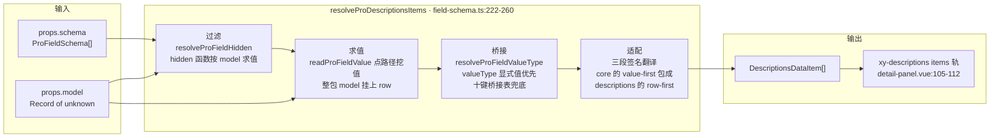
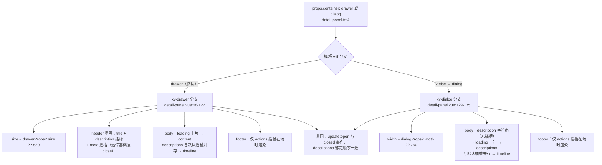

# 9-31 · DetailPanel：详情浮层

> 本篇是 9 卷"增强层（pro-components）"的第 31 篇。大纲给本篇的核心问题只有一行——**schema → descriptions 的转换**——但这一行站在三条旧考据的交点上：9-03 把 `field-schema.ts` 讲成"一份 schema 三形态"，其中详情态的承运者 `resolveProDescriptionsItems` 只服务 descriptions 系消费方，本篇展开它的主消费方；9-22 在 crud-page 的详情段引用过 `detail-panel.vue` 的 104-114 与 145-155 两段，并立案了"detail 插槽与 descriptions **并存追加（不互斥）**"的结论，本篇把这份协议从组件本体展开；8-07 把基础层 `xy-descriptions` 讲成"schema 化渲染"，本篇的 detail-panel 就住在那套 `DescriptionsDataItem` 协议的正上方一层。本篇全部结论以当前工作区实码为准，行号逐一核对，测试实跑通过。

接到题目先复述一遍目标，防止写偏。后台系统里"查看详情"是一种和"编辑"平级的交互心智：用户在列表里点"查看"，浮层打开，只读陈列这条记录的关键字段，可能挂一段历史记录、一排操作按钮。这件事传统做法是业务自己拼——`<el-drawer>` 套 `<el-descriptions>` 再逐字段写 `<el-descriptions-item>`，或者干脆手写一排 `label: value` 的 div。detail-panel 的回答是把这摊事收进一个组件：`container="drawer" | "dialog"` 一个 prop 切换容器形态；`schema + model` 两个 prop 把"展示哪些字段、值从哪来"声明成数据；`description / meta / timeline / actions` 四个面板级插槽承接描述列表表达不了的部分。它自己不渲染任何业务字段——字段的 DOM 全部由基础层 `xy-descriptions` 按翻译后的条目渲染，detail-panel 只做三件事：**翻译 schema、选容器、排内容**。核心问题按大纲是 schema → descriptions 的转换，但这句话里至少藏着四道题：转换管线长什么样、转换层为什么住在 field-schema.ts 而不是组件私有、容器双分支怎么实现（与 9-06 overlay-form 的多态是同型还是同款）、以及插槽与 descriptions 并存的语义从哪来。本篇逐一给实码定论。

## 一、体量与导出链路：一只标准组合组件的四件套

先交代体量，给全文一个标尺：`packages/pro-components/detail-panel/` 四件套——`index.ts` 12 行（安装入口）、`src/detail-panel.ts` 21 行（纯类型）、`src/detail-panel.vue` 176 行（视图 + 转换调用）、`__tests__/detail-panel.spec.ts` 78 行（3 个用例）；外加 `packages/theme/src/pro/detail-panel.css` 91 行样式。合计 378 行——与 9-06 数过的 overlay-form 411 行同一量级，是增强层里"多态容器"组件的标准身位。

导出链路是 manifest 驱动的标准三段。`packages/pro-components/component-manifest.json:179-184` 登记 `name: "detail-panel"`、`installExports: ["XyDetailPanel"]`、`installChecks: [{ kind: "component", name: "xy-detail-panel" }]`、`styleImports: ["detail-panel"]`；`packages/pro-components/exports.ts:23` 显式导出组件值 `export { XyDetailPanel } from "./detail-panel"`（9-01 讲过这行白名单不许用 `export *`）；根入口 `packages/pro-components/index.ts:97-100` 只抬两个类型——`DetailPanelInstance` 和 `DetailPanelProps`。注意类型面有多克制：`DetailPanelContainer`（`"drawer" | "dialog"`）没有进根入口，按 AGENTS.md 的增强层导出规则，这类 props 字面量联合默认留在组件子入口。对比 9-06 的 overlay-form（其 `OverlayFormContainer` 同样未上根入口），两个多态容器在类型边界的纪律完全一致。

## 二、类型层：21 行里的一处词汇裂缝

`src/detail-panel.ts` 全文 21 行，9-02 引过它第 2 行的那条 import（只用 `ProFieldSchema` 一条 core 条款），本篇把它全文摊开：

```ts
// packages/pro-components/detail-panel/src/detail-panel.ts:1-21
import type { DescriptionsProps, DialogProps, DrawerProps } from "xiaoye-components";
import type { ProFieldSchema } from "../../core";

export type DetailPanelContainer = "drawer" | "dialog";

export interface DetailPanelProps {
  open?: boolean;
  title?: string;
  description?: string;
  loading?: boolean;
  container?: DetailPanelContainer;
  model?: Record<string, unknown>;
  schema?: ProFieldSchema[];
  descriptionsProps?: Omit<DescriptionsProps, "items" | "title" | "extra">;
  drawerProps?: Omit<Partial<DrawerProps>, "modelValue" | "title">;
  dialogProps?: Omit<Partial<DialogProps>, "modelValue" | "title">;
}

export interface DetailPanelInstance {
  close: () => void;
}
```

18 个成员分四组，逐条过。**容器组**（`open`/`container`/`title`）与**内容组**（`model`/`schema`/`descriptionsProps`）是多态共享面；**状态组**（`description`/`loading`）是容器无关的呈现闸门；**透传组**（`drawerProps`/`dialogProps`）是逃生舱。

第一处值得停下的是容器词表：`DetailPanelContainer = "drawer" | "dialog"`——用的是**组件词**。9-06 考据过，overlay-form 的同类枚举是 `OverlayFormContainer = "drawer" | "modal"`，用的是**形态词**，当时的定论是"OverlayForm 说的是浮层形态，不是组件名"。同一个仓库、两个同构组件，`container` 的第二个取值一个叫 `modal` 一个叫 `dialog`，这不是笔误，是两种立场并存：overlay-form 的容器选择语义是"这条编辑链路走哪种浮层形态"；detail-panel 的容器选择语义更接近"用哪个基础组件装这份详情"——毕竟它对容器只做开合托管，不做表单那种 footer 编排。但从使用者的视角，这是文档可见的 API 不一致：从 overlay-form 切到 detail-panel，`container` 的取值得换词。裂缝还有下游回声——crud-page 的顶层 props 里，`formType?: "drawer" | "modal"`（`crud-page.ts:19`，形态词，喂 overlay-form）与 `detailType?: "drawer" | "dialog" | "none"`（`crud-page.ts:22`，组件词，喂 detail-panel）在同一份接口里并存。诚实评级：这是本仓库增强层里最显眼的一处词汇不统一，功能无损，但值得在某次破坏性版本里拉齐。

第二处是 `descriptionsProps` 的三个 `Omit`——`Omit<DescriptionsProps, "items" | "title" | "extra">`。挖掉 `items` 的理由是所有权：**items 由 schema 翻译而来，不是调用方手填的**——这正是本篇核心问题的类型化表达，`schema → descriptions` 的转换权在组件手里，`items` 这个直通口必须在类型层焊死。挖掉 `title`/`extra` 的理由同样是所有权：面板头部由 `props.title`/`description` 插槽管理，descriptions 内部不该再有第二个标题。`drawerProps`/`dialogProps` 挖掉 `modelValue` 与 `title`，与 overlay-form 的逃生舱（9-06 引过的 65-71 行）逐字同型——开合归 `open`（`v-model:open`）、标题归顶层 `title`，`Omit` 在这里不是防御性编程，是把"谁拥有什么"写进类型签名。

第三处是 `DetailPanelInstance` 只有一个 `close()`——与 overlay-form 暴露 `validate/submit/close` 三件相比，详情面板没有校验与提交，实例句柄收窄到"程序化关闭"一件事。这个 `close` 的实现路径第四节看，它不是简单 `emit`，而是委托给基础层容器。

## 三、核心管线：schema → descriptions 的转换

现在进入本篇正题。先看组件的 script 段全文——`detail-panel.vue:1-64`，心脏在第 45 行：

```vue
<!-- packages/pro-components/detail-panel/src/detail-panel.vue:1-65 -->
<script setup lang="ts">
import { computed, ref, useSlots } from "vue";
import { useNamespace } from "xiaoye-primitives";
import { XyDescriptions, XyDialog, XyDrawer } from "xiaoye-components";
import type {
  DialogCloseReason,
  DialogInstance,
  DrawerCloseReason,
  DrawerInstance
} from "xiaoye-components";
import { resolveProDescriptionsItems } from "../../field-schema";
import type { DetailPanelProps } from "./detail-panel";

defineOptions({
  name: "XyDetailPanel"
});

const props = withDefaults(defineProps<DetailPanelProps>(), {
  open: false,
  title: "详情信息",
  description: "",
  loading: false,
  container: "drawer",
  model: () => ({}),
  schema: () => [],
  descriptionsProps: () => ({}),
  drawerProps: () => ({}),
  dialogProps: () => ({})
});

const emit = defineEmits<{
  "update:open": [value: boolean];
  closed: [];
}>();

const slots = useSlots() as Record<string, ((payload?: unknown) => unknown) | undefined>;
const ns = useNamespace("detail-panel");
const drawerRef = ref<DrawerInstance | null>(null);
const dialogRef = ref<DialogInstance | null>(null);

const resolvedTitle = computed(() => props.title || "详情信息");
const hasDescription = computed(() => Boolean(props.description) || Boolean(slots.description));
const hasTimeline = computed(() => Boolean(slots.timeline));
const hasActions = computed(() => Boolean(slots.actions));
const detailItems = computed(() => resolveProDescriptionsItems(props.schema, props.model));
const hasDetailItems = computed(() => detailItems.value.length > 0);

function requestClose(reason: DrawerCloseReason | DialogCloseReason = "programmatic") {
  if (props.container === "drawer" && drawerRef.value) {
    drawerRef.value.handleClose(reason as DrawerCloseReason);
    return;
  }

  if (props.container === "dialog" && dialogRef.value) {
    dialogRef.value.handleClose(reason as DialogCloseReason);
    return;
  }

  emit("update:open", false);
}

defineExpose({
  close: () => requestClose("programmatic")
});
</script>
```

整段脚本 64 行，没有一行业务渲染逻辑。`detail-panel.vue:45` 是全组件的心脏：

```ts
const detailItems = computed(() => resolveProDescriptionsItems(props.schema, props.model));
```

一行 `computed`，两个 props 进、一份 `DescriptionsDataItem[]` 出。9-05 引过它的 import（11 行）与调用（45 行），9-03 把它立为详情态通道的出口函数。`rg 'resolveProDescriptionsItems'` 在当前工作区的全部落点只有六处：定义在 `field-schema.ts:222`，消费在 `detail-panel.vue:11/45`、`detail-page.vue:5/45`、`pro-form.vue:8/68`——**三个消费方、全部服务"只读陈列"**，这就是 9-03 考据"该函数只服务 descriptions 系消费方"的完整名单。三个消费方里，detail-panel 是唯一**天生只读**的：pro-form 的调用挂在 `readonly` 可切换分支上（有 schema 就有编辑态，只读是例外态），detail-page 是多区块组装者（每个 section 各调一次），只有 detail-panel 从出生起就没有编辑分支、只调这一条管线——它是"schema 翻译成详情"这条心智的代表消费者。

翻译函数本体在 `packages/pro-components/field-schema.ts`，9-03 引过全文，本篇按"消费方视角"补看两段。先是两个求值依赖（170-193 行）：

```ts
// packages/pro-components/field-schema.ts:170-193
export function readProFieldValue(
  model: Record<string, unknown>,
  prop: string
) {
  return prop.split(".").reduce<unknown>((value, segment) => {
    if (value && typeof value === "object" && segment in (value as Record<string, unknown>)) {
      return (value as Record<string, unknown>)[segment];
    }

    return undefined;
  }, model);
}

export function resolveProFieldValueType(field: ProFieldSchema): ProDisplayValueType | undefined {
  if (field.valueType) {
    return field.valueType;
  }

  if (!field.component) {
    return undefined;
  }

  return componentDisplayValueTypeMap[field.component];
}
```

然后是出口函数全文（222-260 行）：

```ts
// packages/pro-components/field-schema.ts:222-260
export function resolveProDescriptionsItems(
  schema: ProFieldSchema[],
  model: Record<string, unknown>,
  _rowIndex = 0
): DescriptionsDataItem[] {
  return schema
    .filter((field) => !resolveProFieldHidden(field, model))
    .map((field) => ({
      label: field.label,
      value: readProFieldValue(model, field.prop),
      row: model,
      valueType: resolveProFieldValueType(field),
      options: field.options,
      formatter: field.formatter
        ? (_row, _column, value, nextRowIndex) =>
            field.formatter?.(value, createProFieldDisplayContext(model, field, nextRowIndex))
        : undefined,
      render: field.render
        ? (value, context) =>
            field.render?.(
              value,
              createProFieldDisplayContext(context.row, field, context.rowIndex)
            )
        : undefined,
      renderHTML: field.renderHTML
        ? (value, context) =>
            field.renderHTML?.(
              value,
              createProFieldDisplayContext(context.row, field, context.rowIndex)
            ) ?? ""
        : undefined,
      emptyValue: field.emptyValue,
      span: field.span,
      defaultSlot: field.slot,
      className: undefined,
      labelClassName: undefined,
      contentClassName: undefined
    }));
}
```

四个动作一次完成，管线画成图：



**过滤**：`hidden` 支持布尔或按 `model` 求值的函数（`core.ts:119`），详情字段可以随数据动态裁剪——比如审批未通过时不渲染"审批意见"行。**求值**：`readProFieldValue` 用点路径从 model 挖值，schema 的 `prop` 可以写 `owner.name` 这类嵌套键；找不到返回 `undefined`，交给基础层的 `emptyValue` 或默认占位。**桥接**：`resolveProFieldValueType` 先看显式 `valueType`，没有就查 `componentDisplayValueTypeMap` 十键桥接表（`field-schema.ts:57-70`）从表单组件名反推展示值类型——`component: "select"` 的字段在详情态自动获得 `valueType: "select"` 的字典回显，而不是裸的原始 value。**适配**：core 协议的渲染器签名是"值优先"的 `(value, context)`，基础层 descriptions 的约定是"行优先"的 `(row, column, value, rowIndex)`，转换层逐个包 lambda 翻译，`renderHTML` 还多兜一层 `?? ""` 防止 `undefined` 进 `innerHTML`（9-03:496 点破过的三段适配，此处不赘）。

这一节重点补 9-03 没来得及展开的**两处消费侧边界**，都是实码可证的：

**边界一：span 在详情态没有上限钳制。** 8-07 曾立结论"上限钳制被放到了 pro 层"（`resolveProFieldSpan` 的 `Math.max(1, Math.min(columns, Math.floor(field.span)))`，`field-schema.ts:154-160`）。但注意那个函数服务的是**表单态**网格；详情态管线 254 行只是 `span: field.span` **原样透传**，而基础层 `packages/components/descriptions/src/descriptions-item.vue:37` 只有 `Math.max(props.span, 1)` 的下限钳制。推论：detail schema 里写 `span: 5` 而 descriptions 的 `column` 是 2，CSS Grid 会横跨五条轨道并撑出隐式轨道，等分布局被破坏——8-07 的"pro 层兜底"承诺在详情态**不成立**。文档示例 `apps/docs/examples/pro/detail-panel/containers.vue:96-100` 的 `span: 2` 恰好等于默认 `column: 2` 所以安全，但这是示例没踩到，不是管线有保护。修复方向也很直白：转换管线里对 span 做同样的双向钳制，或者在文档标注"详情态 span 请自守上界"。

**边界二：`slot` 成员在详情浮层里没有落点。** 转换管线 255 行把 `field.slot` 映射为 `defaultSlot`，这是基础层描述列表的字段级插槽逃生口（8-07 讲过 `descriptions.vue:153-154` 的 `slots[item.defaultSlot]` 查找）。但插槽要能命中，宿主必须给 `xy-descriptions` 传具名插槽——pro-form 的只读分支有这个转发循环（`pro-form.vue:188-190` 的 `descriptionSlots` 动态模板），而 detail-panel 的两处 `xy-descriptions` 都是**自闭合标签**，一个插槽都不传。推论：schema 字段声明 `slot: "xxx"` 在 detail-panel 中翻译出 `defaultSlot: "xxx"`，却永远找不到宿主插槽，渲染为空。详情浮层里字段级的"血肉注入"只有 `render`/`renderHTML` 两条函数路可走，插槽路是死的。这与下一节的面板级插槽（`meta`/`timeline`/`actions`）是两套体系——前者给单个字段换渲染，后者给整个面板加区块，detail-panel 只保留了后者。

**这里落本篇第一个设计权衡：转换层为什么住在 field-schema.ts。** 候选位置有三个。第一，塞进基础层 `xy-descriptions`，让它直接吃 `ProFieldSchema`——否决，这会让基础层认识"表单/展示共用的 pro 协议"，分层倒灌（基础层不知道 `component` 词表、`hidden` 函数这些编辑态概念，8-07 的分层决策就是为了让基础层保持纯粹）。第二，做成 detail-panel 的私有函数——否决，`resolveProDescriptionsItems` 的三个消费方（pro-form 只读态、detail-panel、detail-page）会各自持有一份拷贝，而这份代码里最容易漂移的恰恰是三段签名适配：任何一侧的 lambda 写法分叉，同一个 schema 在三处的渲染行为就悄悄不一致。第三，共享翻译官——被实码采纳：一份实现、三处调用、行为由一个函数保证收敛。代价也真实：`ProFieldSchema` 的表达力从此被 `DescriptionsDataItem` 的字段面封顶，管线里那三个显式置 `undefined` 的 `className/labelClassName/contentClassName`（257-259 行）就是封顶的可见证据——表单协议没有这三个口子，详情态就丢掉条目级样式定制。9-03:581 的判词在此复验：归属决策没有对错，只有"谁替谁承担翻译成本"的分配。

## 四、容器形态：drawer/dialog 双分支的实码定论

转换后的条目要装进容器。detail-panel 的模板是两个平行分支，先看 drawer 分支全文——`detail-panel.vue:67-127`：

```vue
<!-- packages/pro-components/detail-panel/src/detail-panel.vue:67-176 -->
<template>
  <xy-drawer
    v-if="props.container === 'drawer'"
    ref="drawerRef"
    v-bind="props.drawerProps"
    :model-value="props.open"
    :title="resolvedTitle"
    :size="props.drawerProps?.size ?? 520"
    class="xy-detail-panel xy-detail-panel--drawer"
    @update:model-value="emit('update:open', $event)"
    @closed="emit('closed')"
  >
    <template #header="{ close, titleId, titleClass }">
      <div class="xy-detail-panel__header">
        <div class="xy-detail-panel__heading">
          <h3 :id="titleId" :class="[titleClass, 'xy-detail-panel__title']">
            {{ resolvedTitle }}
          </h3>
          <div v-if="hasDescription" class="xy-detail-panel__description">
            <slot name="description">
              {{ props.description }}
            </slot>
          </div>
        </div>
        <div v-if="slots.meta" class="xy-detail-panel__meta">
          <slot name="meta" :close="close" />
        </div>
      </div>
    </template>

    <div :class="ns.base.value">
      <div v-if="props.loading" class="xy-detail-panel__loading">
        <strong>正在装载详情内容</strong>
        <span>数据返回后会展示信息卡片与历史记录。</span>
      </div>

      <template v-else>
        <div class="xy-detail-panel__content">
          <xy-descriptions
            v-if="hasDetailItems"
            class="xy-detail-panel__descriptions"
            border
            :column="props.descriptionsProps?.column ?? 2"
            v-bind="props.descriptionsProps"
            :items="detailItems"
          />
          <slot />
        </div>

        <div v-if="hasTimeline" class="xy-detail-panel__timeline">
          <slot name="timeline" />
        </div>
      </template>
    </div>

    <template v-if="hasActions" #footer>
      <div class="xy-detail-panel__footer">
        <slot name="actions" :close="requestClose" />
      </div>
    </template>
  </xy-drawer>

  <xy-dialog
    v-else
    ref="dialogRef"
    v-bind="props.dialogProps"
    :model-value="props.open"
    :title="props.title"
    :width="props.dialogProps?.width ?? 760"
    class="xy-detail-panel xy-detail-panel--dialog"
    @update:model-value="emit('update:open', $event)"
    @closed="emit('closed')"
  >
    <div class="xy-detail-panel__body">
      <p v-if="props.description" class="xy-detail-panel__description">{{ props.description }}</p>
      <div v-if="props.loading" class="xy-detail-panel__loading">正在加载详情内容</div>
      <template v-else>
        <div class="xy-detail-panel__body-content">
          <div v-if="$slots.default" class="xy-detail-panel__content">
            <xy-descriptions
              v-if="hasDetailItems"
              class="xy-detail-panel__descriptions"
              border
              :column="props.descriptionsProps?.column ?? 2"
              v-bind="props.descriptionsProps"
              :items="detailItems"
            />
            <slot />
          </div>
          <xy-descriptions
            v-else-if="hasDetailItems"
            class="xy-detail-panel__descriptions"
            border
            :column="props.descriptionsProps?.column ?? 2"
            v-bind="props.descriptionsProps"
            :items="detailItems"
          />
          <div v-if="$slots.timeline" class="xy-detail-panel__timeline">
            <slot name="timeline" />
          </div>
        </div>
      </template>
    </div>
    <template v-if="$slots.actions" #footer>
      <div class="xy-detail-panel__footer">
        <slot name="actions" :close="requestClose" />
      </div>
    </template>
  </xy-dialog>
</template>
```

分支结构画成图：



9-06 拆 overlay-form 时立过一个定论：**分支只发生在模板层，脚本层没有任何分岔**。detail-panel 是同一决策的第二次落地，而且分叉程度更浅——overlay-form 的两分支各要编排 footer 按钮组，detail-panel 的 footer 是同一个插槽写两遍；脚本层共享 `detailItems`、`requestClose` 与两个 ref（38-39 行），没有任何按容器分叉的函数。用 9-06 的三笔账复核一遍"为什么是条件分支不是动态组件"：第一，props 面不相交（drawer 的 `size` vs dialog 的 `width`），条件分支让每处绑定对着具体组件做模板编译期检查；第二，插槽面不相交且 detail-panel 分歧更大——drawer 分支重写了 `#header`（79-95 行，拿到基础层的 `close/titleId/titleClass` 做无障碍接线），dialog 分支没有头部插槽可用；第三，实例类型不相交——`drawerRef: DrawerInstance` 与 `dialogRef: DialogInstance` 各自带类型，`requestClose` 的分派（48-60 行）是类型安全的。与 9-05 唯一一次 `<component :is>`（pro-form 的 23 词同类分发）对照：drawer 与 dialog 是协议不兼容的**异类**，异类分叉，分叉比归一诚实——detail-panel 与 overlay-form 用两份 400 行级的组件把这个立场钉了两遍。

对照表把两个多态容器摆在一起看差异：

| 维度 | overlay-form（9-06） | detail-panel（本篇） |
| --- | --- | --- |
| container 词表 | `"drawer" \| "modal"`（形态词） | `"drawer" \| "dialog"`（组件词） |
| 抽屉默认宽 | 560 | 520 |
| 弹窗默认宽 | 720 | 760 |
| 脚本分岔 | 无（单份 submit/close） | 无（单份 requestClose） |
| loading 呈现 | 双行卡片，两分支同款 | drawer 双行卡片 / dialog 一行文案 |
| 标题绑定 | 两分支同用 `resolvedTitle` | drawer 用 `resolvedTitle`，dialog 用 `props.title` |
| footer | 内建取消/提交按钮组 | 无内建按钮，actions 插槽在场才渲染 |

三处差异值得逐条消化。**默认尺寸**（520/760 vs 560/720）不是拍脑袋：详情是"读"，表单是"填"。抽屉读详情不需要表单标签对齐，520 比 560 更收敛；弹窗读详情吃双列 descriptions 网格的红利，760 比 720 更开。差异被吸收进组件默认值后，使用方换容器不改一行业务代码——这与 9-06 的"默认值抹平"工序同型。**loading 的不对称**（98-101 行双行卡片 vs 142 行一行文案）与**标题的不对称**（73 行 `resolvedTitle` vs 134 行 `props.title`）是实码可见的粗糙处：`resolvedTitle` 的意义在于显式传 `title=""` 时回落"详情信息"，dialog 分支绕过了它——因 `withDefaults` 的默认值兜底，常规用法无感，但两个分支的防御纵深不同。另一个细节：drawer 分支根上的 `class="xy-detail-panel xy-detail-panel--drawer"`（75 行）与内部 `:class="ns.base.value"`（97 行）绑了**同一个类名**（`ns.base.value` 就是 `"xy-detail-panel"`），样式里 `.xy-detail-panel { display: flex; flex-direction: column; gap: 20px; }` 因此同时命中抽屉面板与内容容器两层；dialog 分支则完全没用 `useNamespace`。这是增强层里 `useNamespace` 使用纪律最松的一次（对比 overlay-form 的 `:class="[ns.base.value, ns.is('loading', ...)]"`，overlay-form.vue:200）。

再看 descriptions 的绑定顺序，两分支完全一致——`border` 硬编码在前、`:column` 显式绑定在中、`v-bind="props.descriptionsProps"` 在后、`:items="detailItems"` 垫底。Vue 的绑定合并规则是后写者胜，于是：`descriptionsProps` 里的 `column` 能覆盖默认的 `?? 2`，`border: false` 能关掉硬编码的边框，而 `items` 因为垫底**不可被透传覆盖**——类型层 `Omit<DescriptionsProps, "items">`（detail-panel.ts:14）焊死一次，绑定顺序再焊一次。双重保护下，`schema → items` 的转换结果没有任何直通口可以绕过，第二节说的"items 所有权"在模板层兑现。

## 五、插槽并存语义：descriptions 与 default 插槽不互斥

现在展开 9-22 立案的那份协议。drawer 分支 103-114 行（9-22 引过的行号）：

```vue
<!-- packages/pro-components/detail-panel/src/detail-panel.vue:103-114 -->
      <template v-else>
        <div class="xy-detail-panel__content">
          <xy-descriptions
            v-if="hasDetailItems"
            class="xy-detail-panel__descriptions"
            border
            :column="props.descriptionsProps?.column ?? 2"
            v-bind="props.descriptionsProps"
            :items="detailItems"
          />
          <slot />
        </div>
```

关键在 113 行：`<slot />` **不在** descriptions 的 `v-if` 守卫里，也不在任何"二选一"的分支里——descriptions 有条目就渲染，默认插槽有内容就渲染，两者按模板顺序**先后并存**。dialog 分支（145-155 行，9-22 引过的另一处）语义相同、写法不同：`$slots.default` 存在时 descriptions 包在 `.xy-detail-panel__content` 里与插槽并存；不存在时 `v-else-if="hasDetailItems"` 裸渲染 descriptions。两个分支的效果一致：**描述列表先出、插槽内容跟在其后，追加不覆盖**。

这份协议的下游是 crud-page。顶层把业务插槽原样接进 detail-panel——`crud-page.vue:169-181`：

```vue
<!-- packages/pro-components/crud-page/src/crud-page.vue:169-181 -->
    <xy-detail-panel
      v-if="props.detailType !== 'none'"
      v-model:open="detailOpen"
      :container="props.detailType === 'dialog' ? 'dialog' : 'drawer'"
      :title="String(currentRow?.name ?? '详情信息')"
      :model="currentRow ?? {}"
      :schema="props.detailSchema"
      :descriptions-props="props.detailDescriptionsProps"
    >
      <slot name="detail" :row="currentRow" />
    </xy-detail-panel>
  </div>
</template>
```

9-22 查出文档 `crud-page.md:122` 把 `detail` 插槽写成"覆盖默认 schema 渲染"，与实码的"追加"语义不符，已在 9-22 立案。本篇从组件本体视角补齐协议的全貌：detail 插槽与 `detailSchema` **同时成立时是叠加渲染**——先是一张由 `detailSchema` 翻译出的双列描述列表，紧跟着业务插槽里的一切（一张附件卡、一段说明文案、一块自定义区块）。这个语义不是随手写出的，它对应详情场景的**内容心智**：详情信息的主体几乎总是结构化字段（descriptions 承接），插槽内容是主体表达不了的补充（历史、附件、富区块）——补充默认追加在主体之后，而不是替代主体。对照 overlay-form 的选择：表单容器里 schema 与手写模板是 `hasSchema` 的 `v-else` 二选一（overlay-form.vue:206-238），因为两份输入框同时渲染是错误；详情容器里 descriptions 与插槽是并存，因为两份信息同时陈列是正确。**同为"容器 + 内容"的组合组件，插槽语义一个选互斥、一个选并存，判据是内容之间是否互斥**——这是本篇第二个设计权衡，也是两个多态容器最深的一处同构差异。

面板级插槽的分工也在此收口。`meta`（92 行）挂在 drawer 头部右侧，入参透传基础层抽屉的 `close`；`timeline`（116-118/164-166 行）渲染在内容区之后，样式层 `detail-panel.css:74-77` 给它一条 `border-top` 分隔线，视觉上是"主体信息之后的第二区块"；`actions`（122-126/170-174 行）渲染进 footer，且 `v-if="hasActions"`/$slots.actions 守卫让 footer **只在插槽在场时才存在**——没有操作按钮的详情不会拖一条空 footer，这与 overlay-form 无条件渲染 footer 按钮组（表单总有取消键）的语义差异同源：详情可以没有动作，表单不能没有出口。`description`（85-89 行）在 drawer 分支支持插槽兜底 props 字符串，dialog 分支（141 行）只渲染字符串——这处不对称的文档影响放到第七节立案。

## 六、关闭语义：委托式 requestClose

脚本段剩下的 `requestClose`（48-60 行）值得单独一节，因为它是"增强层不重写基础层语义"的一个标本。程序化关闭没有直接 `emit("update:open", false)`，而是分派到当前容器的实例句柄：drawer 走 `drawerRef.value.handleClose(reason)`，dialog 走 `dialogRef.value.handleClose(reason)`——`handleClose` 是基础层 4-06 讲过的关闭语义总闸（`drawer.vue:327`、`use-dialog.ts:291`），`before-close` 拦截、关闭原因（`programmatic/escape/backdrop`）都从这条闸走。委托的意义：业务给 `drawer-props` 配置了关闭拦截时，`close()` 实例方法与 `actions` 插槽里的自定义按钮（124/172 行注入的 `close`）**同样被拦截链约束**，不会出现"点 X 被拦、调 close 却直接关掉"的双轨。两个 ref 都未就绪时（容器还没挂载），59 行回落 `emit("update:open", false)` 保底——`v-model:open` 的受控环不断。

`defineExpose` 只暴露 `close: () => requestClose("programmatic")`（62-64 行），reason 固定为 `programmatic`——实例 API 不开放伪造 `escape/backdrop` 的口子，关闭原因的真实性由基础层事件源保证。这是 4-06 关闭语义在增强层的自然延伸：**增强层编排触发时机，不伪造触发原因**。

## 七、样式、文档与示例的镜像核对

样式文件 `packages/theme/src/pro/detail-panel.css` 全文 91 行，结构是四段：根容器的 flex 纵排（1-5 行）、header 的标题区与 `color-mix` 分隔线（7-41 行）、内容区的 loading 虚线卡片与 timeline 分隔线（43-77 行）、960px 断点的 header/footer 纵向堆叠（85-91 行）。看头尾两段：

```css
/* packages/theme/src/pro/detail-panel.css:1-14 */
.xy-detail-panel {
  display: flex;
  flex-direction: column;
  gap: 20px;
}

.xy-detail-panel__header {
  display: flex;
  align-items: flex-start;
  justify-content: space-between;
  gap: 16px;
  padding-bottom: 16px;
  border-bottom: 1px solid color-mix(in srgb, var(--xy-border) 82%, var(--xy-mix-light));
}
```

消费的令牌全部是语义层（`--xy-border`/`--xy-text-secondary`/`--xy-bg-muted`/`--xy-radius-lg`）加 `--xy-mix-light` 双主题配方，符合设计令牌约定里"组件样式只消费语义层与刻度层"的纪律。85-91 行的媒体查询把窄屏下的 header（标题 + meta）与 footer 从横排转纵排——详情浮层在小屏上最常见的破相就是 meta 挤压标题，这一条兜住了。

文档侧，`apps/docs/pro-components/detail-panel.md` 的 Attributes 表与 `detail-panel.ts` 逐项对得上（`container` 默认 `drawer`、`schema` 标注"复用增强层显示协议"、`descriptions-props` 类型 `Omit<DescriptionsProps, 'items' | 'title' | 'extra'>`）。但 **Slots 表有一处标注缺失**：`description` 插槽写成通用的"头部说明区"，而实码里它只在 drawer 分支生效（85-89 行），dialog 分支的说明文案只渲染 `props.description` 字符串（141 行）、没有插槽口子——同一张表里 `meta` 行老老实实标了"仅抽屉容器生效"，`description` 行漏了同样的标注。这是本篇立案的文档与源码出入之一（立案汇总见文末）。

文档示例 `apps/docs/examples/pro/detail-panel/containers.vue`（197 行）是"一份详情、两种容器"的标准演武：`detailSchema`（65-101 行）四字段——负责人、任务编号、状态（`valueType: "tag"` + 字典）、说明（`span: 2`）——两个容器实例共用；`model` 换成 `currentTask ?? {}`，点行打开浮层。看两个实例的模板（158-195 行）：

```vue
<!-- apps/docs/examples/pro/detail-panel/containers.vue:158-195 -->
    <xy-detail-panel
      v-model:open="drawerOpen"
      container="drawer"
      :title="currentTask?.title ?? '任务详情'"
      description="当前更适合保留列表上下文时，优先使用抽屉。"
      :model="currentTask ?? {}"
      :schema="detailSchema"
      :descriptions-props="{ column: 2, border: true }"
    >
      <template #meta>
        <xy-tag :status="resolveStatusTag(currentTask?.status)">
          {{ currentTask?.status ?? "待审核" }}
        </xy-tag>
      </template>

      <template #timeline>
        <xy-card header="操作记录">
          <xy-audit-timeline :items="currentTimeline" compact />
        </xy-card>
      </template>
    </xy-detail-panel>

    <xy-detail-panel
      v-model:open="dialogOpen"
      container="dialog"
      :title="currentTask?.title ?? '任务详情'"
      description="当前只需要快速确认关键信息时，优先使用弹窗。"
      :model="currentTask ?? {}"
      :schema="detailSchema"
      :descriptions-props="{ column: 2, border: true }"
    >

      <template #timeline>
        <xy-card header="最近记录">
          <xy-audit-timeline :items="currentTimeline" compact />
        </xy-card>
      </template>
    </xy-detail-panel>
```

示例的选型文案把容器语义说穿了："保留列表上下文时优先抽屉，快速确认关键信息时优先弹窗"——detail-panel 的存在意义正是让这个选择**延迟到使用现场**，schema 一份、心智一套。示例还顺手演示了插槽体系的上限：`meta` 只在 drawer 实例出现（dialog 分支没有这个插槽），`timeline` 里装的是 `xy-audit-timeline`（9-30 审计流的组件）——详情面板不认识时间线，插槽把它接进来，这也是"descriptions 表达不了的区块走插槽"的活例证。

## 八、测试：78 行钉住了什么，漏了什么

`packages/pro-components/detail-panel/__tests__/detail-panel.spec.ts` 全文 78 行、3 个用例。前两个钉容器双形态（7-30 行）：

```ts
// packages/pro-components/detail-panel/__tests__/detail-panel.spec.ts:7-30
describe("XyDetailPanel", () => {
  it("在 drawer 模式下渲染详情抽屉", () => {
    const wrapper = mount(XyDetailPanel, {
      props: {
        open: true,
        container: "drawer",
        title: "账单详情"
      }
    });

    expect(wrapper.findComponent(XyDrawer).exists()).toBe(true);
  });

  it("在 dialog 模式下渲染详情弹窗", () => {
    const wrapper = mount(XyDetailPanel, {
      props: {
        open: true,
        container: "dialog",
        title: "账单详情"
      }
    });

    expect(wrapper.findComponent(XyDialog).exists()).toBe(true);
  });
```

第三个用例钉核心管线（32-77 行），也是全文件最值钱的 46 行：

```ts
// packages/pro-components/detail-panel/__tests__/detail-panel.spec.ts:32-78
  it("支持通过 schema 和 model 直接渲染详情字段", async () => {
    const wrapper = mount(XyDetailPanel, {
      props: {
        open: true,
        title: "任务详情",
        drawerProps: {
          appendToBody: false
        },
        model: {
          owner: "小叶",
          status: "reviewing",
          budget: 128000.5
        },
        schema: [
          {
            prop: "owner",
            label: "负责人"
          },
          {
            prop: "status",
            label: "状态",
            valueType: "tag",
            options: [
              {
                label: "审核中",
                value: "reviewing",
                status: "warning"
              }
            ]
          },
          {
            prop: "budget",
            label: "预算",
            valueType: "money"
          }
        ]
      }
    });

    await nextTick();

    expect(wrapper.text()).toContain("负责人");
    expect(wrapper.text()).toContain("小叶");
    expect(wrapper.text()).toContain("审核中");
    expect(wrapper.text()).toContain("¥128,000.50");
  });
});
```

四个断言四条链。`"负责人"/"小叶"`：schema 的 `label` 与 model 直取值进描述列表，最短链路。`"审核中"`：`valueType: "tag"` + 字典把原始值 `reviewing` 翻译成展示标签——9-03 桥接表的显式 `valueType` 路线。`"¥128,000.50"`：money 值类型走基础层格式化管道（8-07 的 money 协议），**一行断言同时钉住详情态翻译与展示态渲染两层协作**——与 pro-form 只读用例（`pro-form.spec.ts`）的同一句断言互为镜像，两条详情态消费链被同一个字符串钉住。`appendToBody: false`（37-39 行）是测试基建细节：抽屉默认挂 body，测试环境里会脱离组件树导致 findComponent 查询不稳，关掉它让 DOM 留在 wrapper 内——增强层容器组件测试的通用手势（overlay-form 的用例同款）。

3 个用例实跑通过（`vitest run detail-panel`：3 passed）。但这份测试的覆盖面与组件的复杂度不成比例，**漏了五件事**：`close()` 实例句柄与 `requestClose` 的委托分派（本篇第六节的核心语义）零断言；`loading` 态两条分支的呈现零断言；`closed` 事件转发零断言；`hidden` 过滤（转换管线的第一个动作）没有 detail-panel 侧的用例——这条在 pro-form 侧有覆盖，组件侧漏防；**并存追加**语义（113 行 `<slot />` 与 descriptions 同容器）没有直接断言——9-22 靠读实码才立的协议，本该有一条 `schema + default 插槽同时给出时两者文本都在` 的用例钉死。crud-page 侧的 `detailSchema` 用例（`crud-page.spec.ts:40-86`）也只断言 props 透传（`schema` 长度 2、`model` 为 `{}`），没有打开浮层看渲染。测试的形状提醒我们：这个组件的**行为语义**（并存、委托关闭）目前只活在源码与专栏里，还没活进断言。

## 九、EP 对照与收束

拿 Element Plus 对照收拢全篇。EP 的详情场景是三层手拼：`el-drawer`/`el-dialog` 选容器、`el-descriptions` 起骨架、每个字段一个 `el-descriptions-item` 子组件写模板——**没有 items 数组轨**（以 element-plus 2.x 公开 API 为参照），字段标签与值全部内联在 SFC 里，money 格式化、状态 tag、字典回显每字段手写，schema 自然也无法来自接口或被上层加工。Ant Design 系的 ProDescriptions 是最接近的竞品：它确实做了"列声明 → 描述条目"的转换（columns/valueType 协议），但那个转换器是组件私有的。本库的路线差异在**转换器的归属**：`resolveProDescriptionsItems` 住在共享的 `field-schema.ts`，ProForm 只读态、DetailPanel、DetailPage 三处同一翻译官——9-03 的"协议层提供全量词汇，消费方各取所需"在本篇的实证是：同一个函数，detail-panel 只需要它的过滤与求值，pro-form 需要它整表切换的物料，detail-page 需要它按 section 批量供货。

把 176 行收成本篇三句话。**第一句，一行 computed 就是核心问题**：`detailItems`（detail-panel.vue:45）把 `schema + model` 经共享翻译官变成 `DescriptionsDataItem[]`，过滤、点路径求值、十键桥接、三段签名适配四道工序全部发生在组件之外——组件本体没有一行字段渲染逻辑，`items` 的所有权被类型 `Omit` 与绑定顺序双重焊死。**第二句，双分支是 9-06 决策的复刻**：条件分支买类型安全，脚本层零分岔，容器词汇却与 overlay-form 裂成两套（dialog vs modal），默认尺寸 520/760 按"读"与"填"的差别另定。**第三句，并存是详情的心智**：descriptions 与默认插槽不互斥（追加不覆盖），`timeline/actions/meta` 三个面板级插槽承接描述列表表达不了的区块，`requestClose` 委托基础层关闭总闸、不伪造关闭原因。转换层归属（共享而非私有/下沉）、容器形态（分叉而非动态组件）、插槽语义（并存而非覆盖）三个权衡彼此咬合：因为转换在共享层，schema 才能在表单与详情之间零成本复用；因为容器只是"装"，插槽才敢把表达力让给使用现场。

下一篇 9-32《DetailPage：详情页》走进 detail-panel 的"平铺近邻"：详情不进浮层、铺成一整页时怎么组装——`sections` 数组里 `schema` 优先、`items` 兜底的区块解析（`detail-page.vue:43-49` 的 `resolveSectionItems`）、`AsyncStateContainer` 承接的异步三态、`AuditTimeline` 审计时间线与附件/变更差异区，如何把"异步态 + 描述 + 审计"装订成一页。9-03 详情态通道的三号消费方，届时收口。

---

**考据与行号核对说明**：本文所有路径与行号均按当前工作区实态核对。`detail-panel.vue` 实测 176 行（45 行即 `detailItems` 心脏行；drawer 分支描述列表与默认插槽并存在 103-114、dialog 分支并存在 145-155——与 9-22 引用的行号一致）；`detail-panel.ts` 21 行全文引用；`detail-panel/index.ts` 12 行；`detail-panel.spec.ts` 78 行，`vitest run` 实跑 3 passed；`packages/theme/src/pro/detail-panel.css` 91 行（wc 口径）；`field-schema.ts` 260 行，引用 170-193 与 222-260 两段，`resolveProDescriptionsItems` 消费方经 `rg` 全量核对为 `detail-panel.vue:11/45`、`detail-page.vue:5/45`、`pro-form.vue:8/68` 六处落点；`descriptions-item.vue:37` 确认 span 仅下限钳制；`containers.vue` 197 行；`crud-page.vue` 181 行，内嵌 detail-panel 在 169-181。历史核对：9-05 引用清单（detail-panel.vue 11/45/103-114）与 9-22 引用（104-114/145-155）均与当前实态一致，无漂移。

**立案：叙述/文档与源码不符处**（均为当前实态核对所得）：其一，`apps/docs/pro-components/detail-panel.md` Slots 表的 `description` 插槽未标注"仅抽屉容器生效"，而 dialog 分支（detail-panel.vue:140-142）无该插槽口子——同表 `meta` 行有标注，此处漏标。其二，8-07"span 上限钳制在 pro 层"的结论在详情态不成立：`resolveProDescriptionsItems` 原样透传 `field.span`（field-schema.ts:254），详情 schema 的 span 超过 descriptions 的 column 会撑破网格。其三，`ProFieldSchema.slot` 在 detail-panel 无落点：管线映射出 `defaultSlot`（field-schema.ts:255）但组件不向 `xy-descriptions` 转发任何插槽（对比 pro-form.vue:188-190 的转发循环），字段级插槽在详情浮层渲染为空。其四，drawer/dialog 两分支的 loading 呈现（98-101 vs 142）与标题绑定（73 行 `resolvedTitle` vs 134 行 `props.title`）不对称；drawer 分支 `ns.base.value`（97 行）与根 class（75 行）重复绑定同一类名，dialog 分支未用 `useNamespace`。其五，容器词汇裂缝：`DetailPanelContainer` 用组件词 `"dialog"` 而 `OverlayFormContainer` 用形态词 `"modal"`，crud-page 顶层 `formType`（modal）与 `detailType`（dialog）同接口并存两套词表。
