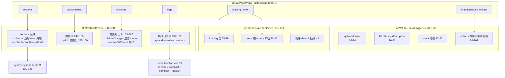
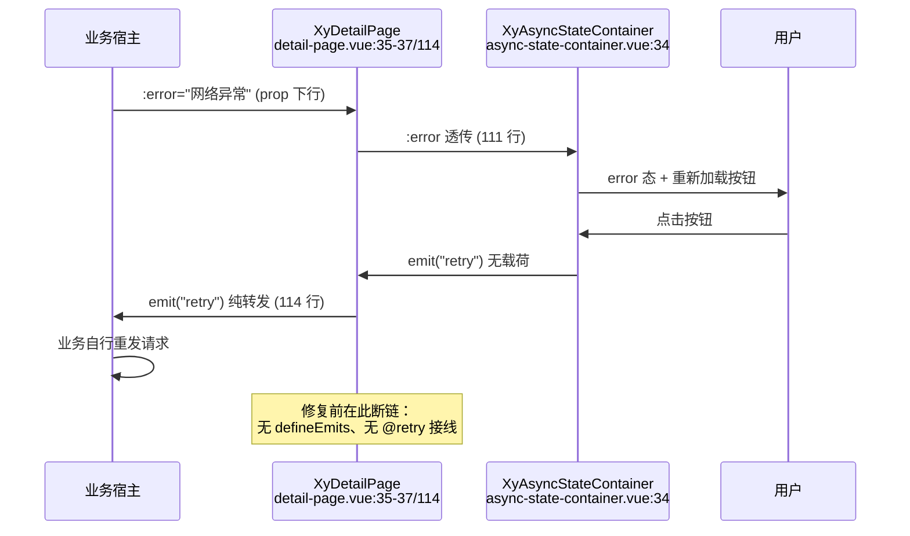

# 9-32 · DetailPage：详情页

> 本篇是 9 卷"增强层（pro-components）"的第 32 篇。大纲给本篇的核心问题只有一行——**异步态 + 描述 + 审计的组装**——但这一行站在四条旧考据的交点上：9-14 考据过 detail-page "不消费 page-header、自绘头部（`detail-page.vue:61-108`）"，并在其类型层立过 `PageHeaderBreadcrumbItem` / `PageHeaderAction` 两个 `@deprecated` 命名遗迹，本篇把这两处从"一行定论"展开成"全景"；9-20 考据过 detail-page 消费 async-state-container（下称 ASC）的接线（110-114 行）与 retry 纯转发姿势，本篇展开这背后的 **2026-09-16 修复战役**——"retry 事件经 detail-page 转发给业务"这件事本身，就是第一轮修复战役在增强层留下的改动，修复后的实码此刻还躺在工作区里没进提交历史，与 6-09 篇的 precision 修复段同款"现场取证"；9-30 考据过 audit-timeline 被 detail-page 当内嵌件用（187-189 行），并立了"三段数据的排队"这道题，本篇正式作答；9-31 结尾预告的"sections 数组里 schema 优先、items 兜底的区块解析（43-49 行的 `resolveSectionItems`）"与"9-03 详情态通道的三号消费方，届时收口"，本篇一并兑现。本篇全部结论以当前工作区实码为准，行号逐一核对，测试实跑通过（`vitest run detail-page`：3 passed）。

接到题目先复述一遍目标，防止写偏。后台系统里"详情页"是一种比"详情浮层"更重的页面形态：用户从列表跳转进来，落地就是一整页——顶部要有面包屑和标题告诉用户"我在哪、这是什么"，页面主体陈列这条记录的结构化字段，往下还常挂着附件、变更对比、操作日志这几段"附属叙事"。这页和 9-31 的 detail-panel 是同一条心智的两个容器版本：detail-panel 把详情装进浮层，detail-page 把详情铺成页面。铺成页面之后，多出来三件浮层不常管的事：**页面的异步态**（整页数据还在请求中、或请求失败时页面呈现什么）、**多区块的编排**（基础信息、附件、变更、日志谁先谁后）、**返回语境**（面包屑）。detail-page 的回答是把这摊事收进一个组件：`loading / error / retry` 一组契约把整页异步态外包给 ASC；`sections` 数组把"展示哪些分组、每组哪些字段"声明成数据，`schema` 优先、`items` 兜底；`attachments / changes / logs` 三个数组各挂一张卡，其中 `logs` 直接喂给 9-30 的 audit-timeline。它自己不渲染任何业务字段——字段的 DOM 全部由基础层 `xy-descriptions` 按翻译后的条目渲染。核心问题按大纲是"异步态 + 描述 + 审计的组装"，这句话里至少藏着五道题：组装者的边界划在哪（它管什么、不管什么）、头部为什么自绘而不复用 9-14 的 page-header、retry 转发协议是怎么修出来的、四段内容以什么顺序排队、以及"组装"与"预设"的深度差怎么度量。本篇逐一给实码定论。

## 一、体量与导出链路：五段式详情页的账单

先交代体量，给全文一个标尺：`packages/pro-components/detail-page/` 四件套——`index.ts` 19 行（安装入口）、`src/detail-page.ts` 57 行（纯类型）、`src/detail-page.vue` 192 行（视图 + 组装）、`__tests__/detail-page.spec.ts` 78 行（3 个用例）；外加 `packages/theme/src/pro/detail-page.css` 136 行样式。合计 482 行——比 9-31 数过的 detail-panel 378 行多出四分之一，比 9-22 的 crud-page 级别轻一截。这个身位在增强层里恰好在"组合组件"与"页面级组装者"的分界线上：它比 detail-panel 多了头部与三张内容卡，比 crud-page 少了表格、表单与整套编排状态机。体量的差值就是"组装深度"的差值，这根标尺第九节收束时要用。

导出链路是 manifest 驱动的标准三段。`packages/pro-components/component-manifest.json:186-192` 登记 `name: "detail-page"`、`installExports: ["XyDetailPage"]`、`installChecks: [{ kind: "component", name: "xy-detail-page" }]`、`styleImports: ["detail-page"]`；`packages/pro-components/exports.ts:24` 显式导出组件值 `export { XyDetailPage } from "./detail-page"`（9-01 讲过这行白名单不许用 `export *`）；根入口 `packages/pro-components/index.ts:101-106` 抬四个类型——`DetailPageAction`、`DetailPageAttachmentFile`、`DetailPageBreadcrumbItem`、`DetailPageProps`。样式经 `packages/pro-components/style.css:25` 的 `@import "../theme/src/pro/detail-page.css"` 汇入。类型面同样克制：`DetailSectionItem` 与 `ChangeDiffItem` 两个"区块级"类型没有进根入口，按 AGENTS.md 的增强层导出规则，这类容器内部结构类型默认留在组件子入口——但这里埋着一处比"没上根入口"更紧的口子，第二节立案。

`ProPageAction` 的消费图谱也值得更新一笔。9-02 数过 core.ts 的直接消费方共 11 组件，其中 `detail-page/src/detail-page.ts:2` 一条 `import type { ProPageAction } from "../../core"` 被点过名，还留了句"与第 3 行的 `ProFieldSchema` 连续两条 import，顺手可合而未合的整理痕迹"——当前实态这两行原样未动，考古痕迹保持考古。9-14 曾把 `ProPageAction`（`core.ts:126-138`）称为"十一字段动作协议"：key/label/type/plain/text/link/danger/disabled/loading/icon/visible。detail-page 对它的消费是全增强层里**最不完整的一份**——两个字段被无视，这处悬案在第四节展开。

## 二、类型层：57 行里的两条地层与一份内联联合

`src/detail-page.ts` 全文 57 行，9-02 引过它 2-3 行的两条 import、9-30 引过 1 行与 56 行（`logs?: AuditTimelineEntry[]`）、9-14 引过 6-13 与 33-34 行的命名遗迹，本篇全文摊开：

```ts
// packages/pro-components/detail-page/src/detail-page.ts:1-57
import type { AuditTimelineEntry } from "../../audit-timeline";
import type { ProPageAction } from "../../core";
import type { ProFieldSchema } from "../../core";
import type { DescriptionsDataItem, DescriptionsProps } from "xiaoye-components";

export interface DetailPageBreadcrumbItem {
  label: string;
  href?: string;
}

export type DetailPageAction = ProPageAction;
/** @deprecated 请改用 DetailPageBreadcrumbItem。 */
export type PageHeaderBreadcrumbItem = DetailPageBreadcrumbItem;

export interface DetailSectionItem {
  key: string;
  title: string;
  description?: string;
  model?: Record<string, unknown>;
  schema?: ProFieldSchema[];
  items?: DescriptionsDataItem[];
  descriptionsProps?: Omit<DescriptionsProps, "items" | "title" | "extra">;
}

export interface DetailPageAttachmentFile {
  id: string | number;
  name: string;
  size?: string;
  status?: "primary" | "success" | "warning" | "danger" | "neutral";
  url?: string;
}

/** @deprecated 请改用 DetailPageAction。 */
export type PageHeaderAction = DetailPageAction;
/** @deprecated 请改用 DetailPageAttachmentFile。 */
export type AttachmentPanelFile = DetailPageAttachmentFile;

export interface ChangeDiffItem {
  key: string;
  label: string;
  before?: string;
  after?: string;
  status?: "added" | "removed" | "changed" | "same";
}

export interface DetailPageProps {
  title?: string;
  description?: string;
  breadcrumbs?: DetailPageBreadcrumbItem[];
  actions?: DetailPageAction[];
  loading?: boolean;
  error?: string | null;
  sections?: DetailSectionItem[];
  attachments?: DetailPageAttachmentFile[];
  changes?: ChangeDiffItem[];
  logs?: AuditTimelineEntry[];
}
```

十个 props 分四组：**语境组**（`title`/`description`/`breadcrumbs`）、**动作组**（`actions`）、**状态组**（`loading`/`error`——ASC 协议的对外再发布，第五节展开）、**内容组**（`sections`/`attachments`/`changes`/`logs`——四段内容的排队队列）。

第一处值得停留的是**命名地层**。三条 `@deprecated` 别名——`PageHeaderBreadcrumbItem`（12-13 行）、`PageHeaderAction`（33-34 行）、`AttachmentPanelFile`（35-36 行）——以 `PageHeader` 为前缀或干脆带着旧组件名的类型，被降级为源码层兼容别名。9-14 读出的地层学结论是"曾经 detail-page 的这些协议类型想过以 page-header 为名义家族，后来类型重命名收敛到 `DetailPage*`，旧名降级"——本篇补上地层的完整截面：三个别名对应三条演化路径。`PageHeaderBreadcrumbItem` 与 `PageHeaderAction` 是"page-header 家族"设想的化石，它们的存在反证了头部自绘决策（第四节）不是一次到位，而是有过"复用 page-header 协议"的中间态；`AttachmentPanelFile` 则泄露了另一段历史——附件区一度想做成独立面板组件（attachment-panel），后来折叠成 detail-page 的一个 prop，类型名跟着改姓。三个别名都只留在源码层、显式标注、不上根入口（检索 `packages/pro-components/index.ts` 确认未导出，9-01 的边界纪律成立），这与 AGENTS.md"旧兼容类型只保留在源码层"的要求逐字吻合。

第二处是 `DetailSectionItem`（15-23 行）——全组件最重的类型。它是 9-31 的 `DetailPanelProps` 在"多区块"维度的展开：那边一份 `schema + model` 管一整个浮层，这边每个 section 各自带一份 `schema + model` 或一份现成的 `items`，再用 `key` 当区块身份、`title/description` 当区块头、`descriptionsProps` 当透传口。`descriptionsProps?: Omit<DescriptionsProps, "items" | "title" | "extra">`（22 行）与 detail-panel.ts:14 的同名字段**逐字同型**——三个 `Omit` 的理由也一样：`items` 由 schema 翻译或调用方按 `DescriptionsDataItem` 协议给（本组件允许 items 直填，所以 `Omit` 掉的是"绕过 section 协议从 descriptions 直通"的旧口），`title/extra` 归区块头管理。两个组件隔着 9-31 与 9-32 两篇、共享同一行类型签名——这就是 9-03"协议层提供全量词汇，消费方各取所需"的类型层实证。

第三处是 `DetailPageAttachmentFile.status`（29 行）：`"primary" | "success" | "warning" | "danger" | "neutral"`——这五个值与 `xiaoye-primitives` 的 `ComponentStatus`（`packages/xiaoye-primitives/src/utils/types/common.ts:1`）**逐字相同**，却是一份手工内联的拷贝，而不是 `status?: ComponentStatus`。对比第 1 行引来的 `AuditTimelineEntry` 的定义方（`audit-timeline/src/audit-timeline.ts`）——那边同样没有引 `ComponentStatus`，但那边定义的是**业务词表**（`default/success/warning/danger/processing`，`processing` 在 `ComponentStatus` 里不存在，是审计语义的特化）；detail-page 这边五个值与 `ComponentStatus` 完全同构，却放弃了类型引用。这个细节暴露了增强层类型层的一个普遍姿势：**pro 组件之间的类型复用走相对路径（第 1 行引 `AuditTimelineEntry`），但对基础设施包的类型引用并不总是发生**——`xiaoye-components` 的类型引了（第 4 行），`xiaoye-primitives` 的没引。功能无损（TS 结构化类型下两者互换无碍），但词表从此多了一处需要人工保持同步的副本。

**这里落本篇第一处立案：`DetailSectionItem` 与 `ChangeDiffItem` 在包的任何入口都拿不到。** 组件级 `index.ts:10-15` 只导出四个 `DetailPage*` 类型；根入口 `index.ts:101-106` 同样四个。于是文档 `apps/docs/pro-components/detail-page.md` Attributes 表里白纸黑字写着 `sections?: DetailSectionItem[]`、`changes?: ChangeDiffItem[]`、Slots 表写着 `{ section: DetailSectionItem }`，业务却**无法按名字导入这两个类型**——想声明一个 sections 变量，只能内联对象字面量，或者绕道 `DetailPageProps["sections"]` 索引类型。类型夹具 `tests/types/fixtures/xiaoye-pro-components.ts:320-350` 恰好全部用内联字面量（`detailPageProps`、`detailPageBreadcrumbs`、`detailPageActions`、`detailPageAttachments` 四段），所以夹具没暴露这个缺口。对比 detail-panel：那边 `DetailPanelContainer` 不上根入口是纪律（props 字面量联合留在子入口，子入口**拿得到**），这边 `DetailSectionItem` 是"子入口也没有"——性质不同，前者是主动收窄，后者是导出清单漏了两行。修复方向直白：组件级 `index.ts` 的类型导出段补上这两行。

## 三、核心组装：script 段全文与三件解析工具

进入组件本体。`detail-page.vue` 的 script 段全文 1-57 行，心脏在三个函数加一个 computed：

```vue
<!-- packages/pro-components/detail-page/src/detail-page.vue:1-57 -->
<script setup lang="ts">
import { XyAsyncStateContainer } from "../../async-state-container";
import { computed } from "vue";
import { XyAuditTimeline } from "../../audit-timeline";
import { resolveProDescriptionsItems } from "../../field-schema";
import {
  XyBreadcrumb,
  XyBreadcrumbItem,
  XyButton,
  XyCard,
  XyDescriptions,
  XyLink,
  XyTag
} from "xiaoye-components";
import type { DetailPageProps } from "./detail-page";
import type { DetailSectionItem } from "./detail-page";

defineOptions({
  name: "XyDetailPage"
});

const props = withDefaults(defineProps<DetailPageProps>(), {
  title: "",
  description: "",
  breadcrumbs: () => [],
  actions: () => [],
  loading: false,
  error: null,
  sections: () => [],
  attachments: () => [],
  changes: () => [],
  logs: () => []
});

const emit = defineEmits<{
  retry: [];
}>();

const visibleChanges = computed(() =>
  props.changes.filter((item) => item.status !== "same")
);

function resolveSectionItems(section: DetailSectionItem) {
  if (section.schema?.length) {
    return resolveProDescriptionsItems(section.schema, section.model ?? {});
  }

  return section.items ?? [];
}

function resolveDiffStatus(status?: string) {
  if (status === "added") return "success";
  if (status === "removed") return "danger";
  if (status === "changed") return "warning";
  return "primary";
}
</script>
```

import 段先立了一条消费纪律（9-20 已从 ASC 侧点过）：**增强层内部互引走相对路径，基础层消费走包名**。2 行 ASC、4 行 audit-timeline、5 行 field-schema 三条相对路径，6-14 行从 `xiaoye-components` 包名导入七个基础组件——pro 组件之间不经过包根白名单（那里只管对外边界），pro 对基础层则必须过正式出口。一个 import 块就是一张分层图。

`withDefaults`（22-33 行）十个默认值里最值得看的是 `error: null`——不是空串。9-20 考据过 ASC 的裁决链用 truthy 判空、**空串错误会被吞回正常态**，detail-page 把默认值定成 `null` 而不是 `""`，恰好绕开了那条暗通道：`error` 缺省时是 `null`（falsy、进正常态），业务传错误时只要传非空串就能进错误态。一个默认值的选择，把上游协议的坑位提前填平了半格——剩下的半格（业务自己传 `error: ""` 会被吞）仍然存在，9-20 已明码标价，组件层没有再包一层。

三个解析工具逐个看。**`resolveSectionItems`（43-49 行）是全组件的心脏**，也是 9-31 预告的正主：

```ts
function resolveSectionItems(section: DetailSectionItem) {
  if (section.schema?.length) {
    return resolveProDescriptionsItems(section.schema, section.model ?? {});
  }

  return section.items ?? [];
}
```

五行，一个优先级：**schema 在场且非空，走翻译管线；否则退回 items；再没有，空数组**。`section.model ?? {}` 兜住 model 缺省——schema 的 `hidden` 函数、点路径求值都拿这份空对象当求值环境，字段全部按 `undefined` 值渲染，而不是报错。9-31 从消费方名单角度立过定论：`resolveProDescriptionsItems` 全仓三个消费方——pro-form 只读态、detail-panel、detail-page——全部服务"只读陈列"，detail-page 是其中唯一**按 section 批量供货**的：detail-panel 一次调用管一层浮层，pro-form 一次调用切整个只读态，detail-page 在模板里对每个 section 各调一次（129-135 行的 `resolveSectionItems(section)`），同一份翻译官按区块规模零售。至此 9-03 立的"详情态通道"三号消费方全部考据完毕，通道收口。优先级本身也有话说：为什么 schema 优先而不是 items 优先？因为 `schema + model` 是**声明式**输入——字段过滤（hidden）、字典回显（valueType 桥接）、金额与日期格式化全部由管线代劳；`items` 是**成品**输入——调用方自己拼好 `DescriptionsDataItem`。声明式的表达力强，但如果 items 优先，一段已经手写好的 items 会被 schema 的存在整个顶掉，调用方改一个字段就平白换了一套渲染路径。schema 优先意味着"给了 schema 就以 schema 为准"的**排他语义**，调用方二选一，不存在两份输入静默混排的模糊地带。

**`resolveDiffStatus`（51-56 行）**是变更对比卡的状态翻译器：`added→success`、`removed→danger`、`changed→warning`、其余一律 `primary`。翻译表吃 `ChangeDiffItem.status` 的四值联合（detail-page.ts:43），但注意输入类型写的是宽泛的 `string` 而不是那个联合——这是函数粒度的类型松弛：模板里 `resolveDiffStatus(item.status)` 的实参类型本来就能对上，写宽一档省了断言，代价是这函数对任何字符串都给 `primary` 兜底而不报错。这个兜底恰好覆盖了 `status` 缺省的项：一条没有 `status` 的变更行会得到一枚 primary 色的空标签吗？不会——模板 177 行有 `v-if="item.status"` 守卫，标签根本不渲染，`resolveDiffStatus` 只在 `status` 在场时才被调用。防御写在模板，兜底写在函数，两层各司其职。

**`visibleChanges`（39-41 行）**是全组件唯一的 computed：`props.changes.filter((item) => item.status !== "same")`。`same` 状态的变更项在数据层就被剔除——语义是"这条字段没变，不值得占变更卡的版面"。但这个过滤和模板的 `v-if` 守卫之间藏着一道缝，第六节展开。

把 script 段收成一张组装架构图：



这张图里有一个本篇反复出现的结构事实：**detail-page 的模板是"头部一段 + 容器一段"的两段式骨架，四段内容全部住在 ASC 的 default 插槽里**。头部不在三态裁决之内——面包屑、标题、操作按钮在任何异步态下都常驻；三态容器包住的是四段内容。这个"头常驻、体受控"的切分是详情页与表单壳（request-form 全页受控）在组装策略上的第一处分野，下一节从头部的自绘讲起。

## 四、头部自绘：四块骨头与命名遗迹的完整截面

`detail-page.vue:61-108` 是自绘头部段全文（9-14 引过 61-85 并点到 88-107，本篇全段摊开）：

```vue
<!-- packages/pro-components/detail-page/src/detail-page.vue:61-108 -->
    <div class="xy-detail-page__header">
      <div class="xy-detail-page__header-main">
        <xy-breadcrumb
          v-if="props.breadcrumbs.length > 0"
          class="xy-detail-page__header-breadcrumb"
        >
          <xy-breadcrumb-item
            v-for="item in props.breadcrumbs"
            :key="item.label"
            :href="item.href"
          >
            {{ item.label }}
          </xy-breadcrumb-item>
        </xy-breadcrumb>

        <div class="xy-detail-page__header-heading">
          <h2 v-if="props.title" class="xy-detail-page__header-title">{{ props.title }}</h2>
          <p v-if="props.description" class="xy-detail-page__header-description">
            {{ props.description }}
          </p>
        </div>

        <div v-if="$slots.meta" class="xy-detail-page__header-meta">
          <slot name="meta" />
        </div>
      </div>

      <div
        v-if="props.actions.length > 0 || $slots.actions"
        class="xy-detail-page__header-actions"
      >
        <slot name="actions">
          <xy-button
            v-for="action in props.actions"
            :key="action.key"
            :type="action.type"
            :plain="action.plain"
            :text="action.text"
            :link="action.link"
            :disabled="action.disabled"
            :loading="action.loading"
            :icon="action.icon"
          >
            {{ action.label }}
          </xy-button>
        </slot>
      </div>
    </div>
```

48 行、四块骨头。**面包屑（63-74 行）**：`v-if="props.breadcrumbs.length > 0"` 空数组不渲染容器，`v-for` 渲染 `xy-breadcrumb-item`，`href` 直透（5-04 讲过 breadcrumb-item 的 `hasHref` 分支——有 href 渲染链接、没有渲染纯文本，`breadcrumb-item.vue:55/82`）。一个细节：`:key="item.label"` 用标签文本当身份，业务传两条同名面包屑会撞 key——真实场景里面包屑层级名重复的概率不高，但这不是协议保证的，是使用惯例撑着的。**标题与说明（76-81 行）**：h2/p 一对标题语义标签，各挂自己的 `v-if`。**meta 插槽（83-85 行）**：状态标签、负责人头像这类"贴着标题的元信息"的落点，无入参——与 detail-panel 的 meta 插槽（那边透传了 `close`）相比，页面的 meta 没有动作可给，纯陈列。**动作区（88-107 行）**：外层 `v-if` 是"数组非空或插槽在场"的双条件，内层 `<slot name="actions">` 用**插槽 fallback 语义**包住默认渲染——业务只给 `actions` 数组时渲染默认的 `xy-button` 循环，给了 `actions` 插槽时整个循环被插槽内容替换，数组作废。这是"数据轨 + 插槽轨"的标准二选一，与 9-13 page-toolbar 的工具条同构。

**这里落本篇第一个设计权衡：为什么自绘头部，而不复用 9-14 的 page-header？** 9-14 立过定论三："detail-page 不消费 page-header，自绘头部"，理由是 detail-page 的头部多了第四块骨头——**面包屑返回区**——而 page-header 的协议里没有返回区的位置。本篇把这个权衡的两侧摆全。复用派会算这笔账：detail-page 的头部与 page-header 有三块同名骨头（标题、说明、meta、动作区对置），复用可以省下 40 来行模板与样式，且两处视觉天然一致。自绘派的账是：page-header 是**通用页头**，它的协议（9-14 第二节）刻意不收 breadcrumb——因为"返回区是页面的骨头"，通用组件不该背；而详情页**必须**有返回区，详情页天然要"回到列表"。两条协议在 breadcrumb 这一块骨头上不相交，硬复用要么给 page-header 加 breadcrumb prop（通用组件为特例扩协议），要么 detail-page 在 page-header 外面再包一层面包屑（头部被拆成两截，对置布局被打破）。实码选了自绘，代价是 61-108 这 48 行与 page-header 的对应段存在**平行实现**——`xy-detail-page__header` 的 flex 对置、`960px` 断点的纵排堆叠（detail-page.css:131-136）都是 page-header 样式的近亲但不共享。命名遗迹给这段权衡补了时间维度：`PageHeaderBreadcrumbItem`/`PageHeaderAction` 两个 `@deprecated` 别名说明"以 page-header 为名义家族"曾是真实选项，协议层最终分家、类型层留了化石。这不是返工，是**协议边界的显式化过程**：先共享命名，再看清"通用页头"与"页面骨架"的职责差，最后让类型名跟着职责走。9-14 的判词在本篇复验：返回区属于页面，不属于页头。

动作区还压着一处协议悬案：`xy-button` 的七个绑定（96-102 行）吃掉了 `ProPageAction` 十一字段里的七个——`key` 当身份、`label` 当内容，`type/plain/text/link/disabled/loading/icon` 逐个透传；**`danger` 与 `visible` 两个字段被无视**。对比同卷的 list-page：`list-page.vue:40` 有 `props.toolbarActions.filter((action) => action.visible !== false)` 的显式过滤，协议的 `visible` 字段在那边是活的；detail-page 这里，业务写 `visible: false` 不会有任何效果，写 `danger: true` 也不会得到危险色按钮。协议声明了十一个字段，这个消费方只认九个——**协议的超集承诺与消费方的子集实现之间没有编译期警告**，`detail-page.ts:11` 的 `export type DetailPageAction = ProPageAction` 类型别名原样签收了全部字段，模板却悄悄砍掉了两根。这是本篇第二处立案：要么补齐两个字段的消费（`:danger="action.danger"` 一行加一个 filter），要么在文档标注"detail-page 的 actions 仅支持七个展示字段"——现状是文档 Attributes 表写 `actions` 类型 `DetailPageAction[]`，读者按 core 协议理解字段面，实码不支持。

## 五、三态容器承接与 retry 转发修复（2026-09-16）

现在进入核心问题"异步态"的部分。`detail-page.vue:110-114` 是 ASC 的接线段（9-20 引过 110-114 与 110-139，本篇给修复战役的全景）：

```vue
<!-- packages/pro-components/detail-page/src/detail-page.vue:110-114 -->
    <xy-async-state-container
      :loading="props.loading"
      :error="props.error"
      @retry="emit('retry')"
    >
```

五行接线，四件事：`:loading` 与 `:error` 把 ASC 七个协议 prop 中的两个抬升为自己的 props（27-28 行默认值），`@retry` 把 ASC 的 retry 事件原样上抛，default 插槽装下四段就绪内容（容器在 190 行才闭合）。9-20 立过"插槽收缩为零"的定论——两个消费壳（request-form、detail-page）对 ASC 的 loading/error/empty 三个状态插槽一个都没用，三态视觉全吃内置实现；本篇从被消费方视角补一句：detail-page 对 ASC 的用法比 request-form 还要"薄"——request-form 把 retry 翻译成 `load('retry')`（直连接线），detail-page 连翻译都不做，`emit('retry')` 纯转发。

**但这条转发链不是组件出生就有的——它是 2026-09-16 第一轮修复战役的改动，且此刻还躺在工作区里没进提交历史。** `git diff HEAD` 对 `packages/pro-components/detail-page/` 可考的修复前实码是：组件**没有 `defineEmits`**（现在的 35-37 行整段不存在），ASC 接线是单行的：

```vue
<!-- 修复前实码（git diff 对 HEAD 可考，已不在工作区） -->
    <xy-async-state-container :loading="props.loading" :error="props.error">
```

修复前的问题链是这样的：ASC 的 error 分支内置"重新加载"按钮（`async-state-container.vue:34`），点击 `emit('retry')`；detail-page 作为壳层把 ASC 包在自己体内，却**没有声明转发**——retry 事件到 detail-page 这一层就断了。业务侧写 `<xy-detail-page :error="..." @retry="reload">`，监听器永远不触发：ASC 的按钮在渲染、用户在点击、事件在壳层内部消失。这正是 9-20 篇立论的"三态容器区别于手写 v-if 链的关键增量"（重试协议）在 detail-page 上的一个断点——协议的上半段（ASC 内置按钮）活着，下半段（穿透壳层边界）没接。修复战役补了三块：

其一，`detail-page.vue:35-37` 声明壳层自己的 emits：

```ts
const emit = defineEmits<{
  retry: [];
}>();
```

`retry: []` 与 ASC 的 emits 表（`async-state-container.vue:18-20`）**逐字同型**——无载荷、同名。壳层转发时改名的诱惑是真实存在的（叫 `reload` 更"业务"，加个 `error` 载荷更"信息丰富"），但转发协议的第一原则是**保真**：事件名与载荷形状在穿透每一层边界时保持不变，业务侧的心智模型才不需要知道壳层内部有颗 ASC。detail-page 把 ASC 的 `loading/error` 两个 prop 抬升为自己的 API、把 `retry` 事件原样穿透——**三态协议被壳层整份再发布**，这正是 9-20 说的"协议的再发布者"的完整含义：prop 上行、event 下行，双向都对得上 ASC 的原签名。

其二，模板接线补上 `@retry="emit('retry')"`（114 行），把 ASC 的事件接到 35-37 行声明的出口。

其三，配套测试与文档。`detail-page.spec.ts:59-77` 新增第三个用例（下节全文展开），`apps/docs/pro-components/detail-page.md:50-54` 新增 Events 表——修复前文档只有 Attributes 与 Slots 两张表，`retry` 事件在 API 层不存在。

修复后的转发链画成时序图：



**这里落本篇第二个设计权衡：壳层的 retry 转发，为什么是"纯转发"而不是"直连"或"内置重试"？** 三个候选。内置重试（组件自己持有一份请求函数自己重发）——否决，detail-page 是纯展示组装者，它连 `request` prop 都没有，无请求可发；直连（像 request-form 那样把 retry 翻译成内部动作）——否决，detail-page 没有内部加载动作可翻译，`loading/error` 本来就是业务持有、以 props 喂进来的受控状态，重发的动作天然在业务手里。剩下的正确答案就是转发：壳层在协议链里的位置是"中继站"，中继站的价值不在于加工信号，在于**信号不衰减地通过**。对照 request-form 的直连姿势（9-20 的"姿势一"），两壳合起来恰好示范了重试协议的两种合法接法：**有内部动作的壳直连，无内部动作的壳转发**——判据是"重试这件事由谁知道怎么做"，而不是统一的某一种接法。修复战役选对了姿势，测试把姿势钉死了（第八节）。

顺带补一段修复战役同期但不同战役的工作区改动：`packages/theme/src/pro/detail-page.css` 在同一份未提交 diff 里把三处硬编码字重换成了刻度令牌——27 行 `font-weight: 700` → `var(--xy-font-weight-bold)`、61 与 117 行 `600` → `var(--xy-font-weight-semibold)`。这是设计令牌约定（组件样式只消费语义层与刻度层）的存量治理，与 retry 修复同在工作区但性质不同：前者是协议补全，后者是令牌迁移。本篇行号以修复后的实态为准。

## 六、四个内容区块：三段数据的排队与一段的插槽豁免

ASC 的 default 插槽里住着四段内容，`detail-page.vue:115-139` 是第一段（sections）的全文（9-20 引过同段作"包裹规模"的例证，本篇展开组装语义）：

```vue
<!-- packages/pro-components/detail-page/src/detail-page.vue:110-139 -->
    <xy-async-state-container
      :loading="props.loading"
      :error="props.error"
      @retry="emit('retry')"
    >
      <div class="xy-detail-page__sections">
        <section
          v-for="section in props.sections"
          :key="section.key"
          class="xy-detail-page__section"
        >
          <div class="xy-detail-page__section-heading">
            <h3 class="xy-detail-page__section-title">{{ section.title }}</h3>
            <p v-if="section.description" class="xy-detail-page__section-description">
              {{ section.description }}
            </p>
          </div>
          <div class="xy-detail-page__section-body">
            <slot :name="section.key" :section="section">
              <xy-descriptions
                v-if="resolveSectionItems(section).length"
                border
                :column="section.descriptionsProps?.column ?? 2"
                v-bind="section.descriptionsProps"
                :items="resolveSectionItems(section)"
              />
            </slot>
          </div>
        </section>
      </div>
```

两个组装机关值得逐个拆。**机关一：动态具名插槽（128 行）**。`<slot :name="section.key" :section="section">` 以区块的 `key` 为插槽名动态开了一个口子，插槽 fallback 是默认的 descriptions 渲染——业务想接管"基础信息"区块的自定义渲染，写 `<template #basic="{ section }">` 就整体替换；没写的区块照常走数据轨。这是"数组驱动 + 逐项插槽豁免"的组合拳，与 9-22 crud-page 的列插槽、9-24 pro-table 的单元格插槽同一族，但粒度更大：豁免的不是单元格，是**整个区块**。文档 Slots 表的 `[section.key]` 行（`apps/docs/pro-components/detail-page.md:58-62`）写的就是这个口子。**机关二：descriptions 的绑定顺序（129-135 行）**——与 9-31 第四节考据的 detail-panel 完全同款：`border` 硬编码在前、`:column` 显式绑定在中、`v-bind="section.descriptionsProps"` 在后、`:items` 垫底。Vue 后写者胜：`descriptionsProps` 能覆盖 `column` 与 `border`，`items` 垫底不可被透传覆盖——`resolveSectionItems` 的翻译结果没有直通口可绕。区别只在 `v-if` 的判断式：detail-panel 用 `hasDetailItems` computed，detail-page 用**函数调用** `resolveSectionItems(section).length`——同一次渲染里这个函数会被调用两次（v-if 一次、:items 一次），schema 翻译跑两遍。detail-panel 把翻译收进 computed 吃缓存，detail-page 图模板直白付了双份调用——section 规模的翻译成本不高（几十个字段），这是可接受的懒，但两兄弟组件在同一处的实现分化值得记一笔。

还有一个空区块行为没有文档背书：section 的标题壳（121-126 行）在 `v-for` 内**无条件渲染**——一个既无 `schema` 也无 `items` 的 section（`resolveSectionItems` 返回空数组、descriptions 被 `v-if` 摘掉）仍会渲染出区块边框和标题。类型上这是合法输入（`schema?`/`items?` 都是可选），行为上得到一个"空壳区块"。是有意的占位还是无意的副作用，源码无从判断，但文档没提，使用者值得知道。

`detail-page.vue:141-190` 是剩下三段的全文：

```vue
<!-- packages/pro-components/detail-page/src/detail-page.vue:141-190 -->
      <xy-card
        v-if="props.attachments.length > 0"
        class="xy-detail-page__attachments"
        header="附件信息"
      >
        <div class="xy-detail-page__attachment-list">
          <div
            v-for="file in props.attachments"
            :key="file.id"
            class="xy-detail-page__attachment-item"
          >
            <div class="xy-detail-page__attachment-file">
              <xy-link
                type="primary"
                underline="hover"
                :href="file.url"
                :target="file.url ? '_blank' : undefined"
              >
                {{ file.name }}
              </xy-link>
              <span v-if="file.size" class="xy-detail-page__attachment-size">{{ file.size }}</span>
              <xy-tag v-if="file.status" size="sm" :status="file.status">{{ file.status }}</xy-tag>
            </div>
          </div>
        </div>
      </xy-card>

      <xy-card v-if="props.changes.length > 0" class="xy-detail-page__changes" header="变更对比">
        <div class="xy-detail-page__change-rows">
          <div
            v-for="item in visibleChanges"
            :key="item.key"
            class="xy-detail-page__change-row"
          >
            <div class="xy-detail-page__change-label">
              <span>{{ item.label }}</span>
              <xy-tag v-if="item.status" size="sm" :status="resolveDiffStatus(item.status)">
                {{ item.status }}
              </xy-tag>
            </div>
            <div class="xy-detail-page__change-value is-before">{{ item.before || "-" }}</div>
            <div class="xy-detail-page__change-value is-after">{{ item.after || "-" }}</div>
          </div>
        </div>
      </xy-card>

      <xy-card v-if="props.logs.length > 0" class="xy-detail-page__logs" header="操作日志">
        <xy-audit-timeline :items="props.logs" compact />
      </xy-card>
    </xy-async-state-container>
```

**附件卡（141-166 行）**。守卫 `attachments.length > 0`，卡片标题硬编码"附件信息"。文件行的渲染核心是 5-03 考据过的 `xy-link` 段（153-160 行）：`type="primary" underline="hover"` 的链接形态，`href` 指向附件 URL，`target` 用三目 `file.url ? '_blank' : undefined`——**无 URL 不输出 target**，恰好复刻了 xy-link 内部 `linkAttrs` 的归一逻辑（5-03 点破的"消费方在数据层就把语义对齐"）。三件套横排：链接、体积（`v-if="file.size"`）、状态标签（`v-if="file.status"`，五值联合直通 xy-tag 的 status）。注意这个 prop 数组轨没有任何插槽豁免——附件区是四段内容里唯一"纯数据渲染、零插槽、零自定义渲染函数"的段，`render`/`renderHTML`/插槽三条逃生路在这段都不存在。附件的展示形态被预设焊死在"链接 + 体积 + 状态标签"一行——这是组装者对"预设深度"的又一次表态，本节末尾统一评。

**变更对比卡（168-185 行）**。每行三栏网格：标签（含状态标签）、改前值、改后值（detail-page.css:106-111 的 `grid-template-columns: 180px minmax(0, 1fr) minmax(0, 1fr)`），`before/after` 用 `|| "-"` 兜空值。**这里落本篇第三处立案：守卫与迭代不同源的空卡缝**。卡的 `v-if` 是 `props.changes.length > 0`（168 行），行渲染却迭代 `visibleChanges`（171 行）——`same` 项已被 script 层过滤。推论：业务传入的 changes **全部**是 `status: "same"` 时，`changes.length > 0` 成立、卡片渲染，`visibleChanges` 为空、行渲染为零——得到一张只有"变更对比"标题的空卡。`v-if` 数的是**输入**，`v-for` 数的是**过滤后**，两个集合的口径差在"全 same"这个边界上漏了风。修复方向一行：`v-if` 改挂 `visibleChanges.length > 0`（或模板里直接用 `visibleChanges` 计数）。当前测试没踩到这条边界（spec 没有任何 changes 用例），文档也没写，属于"实码可证的边界缺口"。

**操作日志卡（187-189 行）**。三行：守卫 `logs.length > 0`、卡片标题硬编码"操作日志"、`<xy-audit-timeline :items="props.logs" compact />`。9-30 从 audit-timeline 侧考据过这条消费链的三细节：空数组连卡片都不渲染（**两层空态防御各管各的粒度**——detail-page 的卡级 `v-if` 在前，audit-timeline 自己的 `xy-empty` 空态（`audit-timeline.vue:77-81`）在这条链上永远不触发）；`compact` 密度透传给 `xy-timeline` 的 `density`（`audit-timeline.vue:83` 三元式）；`AuditTimelineEntry[]` 作为 prop 类型意味着业务拿到的契约里就写着"logs 是审计记录"。本篇从组装侧补第四笔：日志卡是四段内容里**唯一没有自己模板的一段**——attachments 和 changes 都有 detail-page 手写的行模板，logs 的整段渲染委托给了 audit-timeline，detail-page 只出一张卡壳。这个差异是"三段数据排队"叙事里最有信息量的一笔：**附件与变更是 detail-page 的领域逻辑**（文件行的三件套、改前改后的网格是详情页语义，别的组件不长这样），**审计不是**——审计流的行模板 9-30 已经做了一遍业务特化，detail-page 再写一遍就是重复。组装者的边界感在这一行 `compact` 上体现得最清楚：我出容器与密度，行内容归你。

至此"三段数据的排队"可以收束成一句：**sections（描述）→ attachments（附件）→ changes（差异）→ logs（审计）**，模板顺序即渲染顺序，`v-if` 各自守卫、互不依赖——四段可以任意缺省，顺序恒定。排队顺序本身是个产品判断：描述是主体（9-31 的"主体先出"原则），附件与变更是主体的佐证，审计是时间维度的收尾。与 detail-panel 的对照也在此闭合：那边 schema 翻译的主体在前、`timeline` 插槽的审计在后（9-31 第五节），这边主体（sections）、佐证（attachments/changes）、审计（logs）三段排队、外加逐区块插槽豁免——**浮层版赌"主体表达不了的都走插槽"，页面版赌"常见的都该有预设"**。这是本篇第三个设计权衡：组装 vs 预设深度。detail-panel 只有一个 schema 口，别的全给插槽，表达力最大、开箱即用性最弱；detail-page 把"附件、变更、日志"三个高频区块做成 prop 数组，业务传数据就出整页，代价是这三段被预设的行模板焊死（附件区零逃生口、变更区连插槽都没有）、以及"这个组件知道多少业务"的边界争议——"变更对比"这种强业务语义的区块做进通用容器，是该夸的领域沉淀还是该警惕的越界，9-30 的判断式（"输入是成品的组件，格式化是越权"）在这里的同构问题是：**输入是数组的组件，预设区块是服务还是越权**。实码的答案是中间态：主体区块（sections）给了插槽豁免，预设区块（attachments/changes）没给——表达力沿"业务定制概率"梯度递减，定制概率最高的地方开口子，概率低的地方焊预设。

## 七、样式、文档与示例的镜像核对

样式文件 `packages/theme/src/pro/detail-page.css` 全文 136 行，结构五段：根容器 flex 纵排（1-5 行）、头部卡片（7-40 行，含 `--xy-font-weight-bold` 令牌化的标题）、区块卡（42-67 行）、附件与变更（69-124 行）、960px 断点的头部纵排（131-136 行）。看头尾两段：

```css
/* packages/theme/src/pro/detail-page.css:1-16 */
.xy-detail-page {
  display: flex;
  flex-direction: column;
  gap: 20px;
}

.xy-detail-page__header {
  display: flex;
  align-items: flex-start;
  justify-content: space-between;
  gap: 16px;
  padding: 24px;
  border: 1px solid color-mix(in srgb, var(--xy-border) 90%, var(--xy-mix-light));
  border-radius: var(--xy-radius-lg);
  background: var(--xy-bg-container);
}
```

```css
/* packages/theme/src/pro/detail-page.css:106-118 */
.xy-detail-page__change-row {
  display: grid;
  grid-template-columns: 180px minmax(0, 1fr) minmax(0, 1fr);
  gap: 12px;
  align-items: center;
}

.xy-detail-page__change-label {
  display: inline-flex;
  align-items: center;
  gap: 8px;
  font-weight: var(--xy-font-weight-semibold);
}
```

消费的令牌全部是语义层（`--xy-border`/`--xy-bg-container`/`--xy-text-secondary`/`--xy-radius-lg`/`--xy-bg-muted`）加刻度层（`--xy-font-weight-bold/semibold`、`--xy-font-size-sm`）与 `--xy-mix-light` 双主题配方，符合设计令牌约定；工作区 diff 里的三处字重令牌化（第五节已记）正是把这份符合度补齐的最后几行。变更行的三栏网格用 `minmax(0, 1fr)` 而不是裸 `1fr`——`minmax(0, ...)` 允许栏内容收缩换行，改前改后的长文本不会撑破网格，这是 CSS Grid 轨道声明的老练写法。

文档侧，`apps/docs/pro-components/detail-page.md` 全文 62 行。Attributes 表十行与 `detail-page.ts:46-57` 逐项对得上（含 `error` 的类型 `string | null` 与"非空时进入错误态"的措辞——这个措辞恰好诚实：它说的是 truthy 裁决，不是"有 error 字段就报错"）；`changes` 行标注了"`status` 为 `'same'` 的项不展示"，与 `visibleChanges` 实码一致。修复战役补的 Events 表（51-55 行）：

```markdown
<!-- apps/docs/pro-components/detail-page.md:50-54 -->
### DetailPage Events

| 事件名 | 说明 | 回调参数 |
| --- | --- | --- |
| `retry` | `error` 非空进入错误态后，点击错误区「重新加载」按钮时触发 | — |
```

"点击错误区「重新加载」按钮时触发"与 ASC 内置按钮的实码行为一致——文档如实描述了"按钮是容器的、事件是穿透壳层的"，没有把重试按钮说成 detail-page 自己画的。Slots 表三行（meta/actions/[section.key]）与实码的三个插槽口（85/92/128 行）对得上，`[section.key]` 的接收参数 `{ section: DetailSectionItem }` 也与 128 行 `:section="section"` 一致——只是那个 `DetailSectionItem` 正是第二节立案的"导入不到的类型"。

文档示例 `apps/docs/examples/pro/detail-page/basic.vue` 全文 82 行，四段数据的完整演武：

```vue
<!-- apps/docs/examples/pro/detail-page/basic.vue:1-82 -->
<script setup lang="ts">
const sections = [
  {
    key: "base",
    title: "基础信息",
    model: {
      owner: "小叶",
      status: "reviewing",
      updatedAt: "2026-04-18T14:30:00+08:00",
      budget: 128000.5
    },
    schema: [
      {
        prop: "owner",
        label: "负责人"
      },
      {
        prop: "status",
        label: "状态",
        valueType: "tag",
        options: [
          {
            label: "审核中",
            value: "reviewing",
            status: "warning"
          }
        ]
      },
      {
        prop: "updatedAt",
        label: "最近更新",
        valueType: "datetime"
      },
      {
        prop: "budget",
        label: "预算",
        valueType: "money"
      }
    ]
  }
];

const attachments = [
  {
    id: 1,
    name: "权限矩阵.xlsx",
    size: "128 KB",
    status: "success" as const
  }
];

const changes = [
  {
    key: "role",
    label: "角色",
    before: "运营",
    after: "管理员",
    status: "changed" as const
  }
];

const logs = [
  {
    id: "1",
    title: "提交复核",
    operator: "小叶",
    timestamp: "2026-03-28 09:20",
    status: "processing" as const
  }
];
</script>

<template>
  <xy-detail-page
    title="成员详情"
    description="DetailPage 适合标准后台详情页。"
    :sections="sections"
    :attachments="attachments"
    :changes="changes"
    :logs="logs"
  />
</template>
```

示例把四段数据各喂一段：sections 走 `schema + model` 轨（四个字段点亮 tag 字典回显、datetime、money 三种值类型——与 9-31 的 detail-panel 示例同一批字段词汇，两份示例互为页面版与浮层版的镜像）；attachments 一条、changes 一条（`changed` 状态）、logs 一条（`processing` 状态）。但示例也如实暴露了组件的"演示边界"：`breadcrumbs`、`actions`、`loading/error/retry` 四组能力一个都没演示——面包屑与动作是详情页头部的一半骨头，异步三态是本篇核心问题的"异步态"半边，示例全都缺席。文档页本身（62 行）也没有这三组的演示入口。对一组以"异步态 + 描述 + 审计"为核心问题的能力面，示例的覆盖偏科是文档侧最值得补的一块。

## 八、测试：78 行三个用例钉住了什么

`packages/pro-components/detail-page/__tests__/detail-page.spec.ts` 全文 78 行、3 个用例：

```ts
// packages/pro-components/detail-page/__tests__/detail-page.spec.ts:5-78
describe("XyDetailPage", () => {
  it("支持渲染头部并展示加载态", () => {
    const wrapper = mount(XyDetailPage, {
      props: {
        title: "任务详情",
        loading: true
      }
    });

    expect(wrapper.text()).toContain("任务详情");
    expect(wrapper.text()).toContain("正在加载数据");
  });

  it("sections 支持直接声明 schema 和 model 并复用 descriptions 显示协议", () => {
    const wrapper = mount(XyDetailPage, {
      props: {
        title: "任务详情",
        sections: [
          {
            key: "basic",
            title: "基础信息",
            model: {
              status: "approved",
              budget: 128000.5
            },
            schema: [
              {
                label: "状态",
                prop: "status",
                valueType: "tag",
                options: [
                  {
                    label: "已通过",
                    value: "approved",
                    status: "success"
                  }
                ]
              },
              {
                label: "预算",
                prop: "budget",
                valueType: "money"
              }
            ]
          }
        ]
      }
    });

    expect(wrapper.text()).toContain("基础信息");
    expect(wrapper.text()).toContain("已通过");
    expect(wrapper.text()).toContain("¥128,000.50");
  });

  it("error 态点击重新加载按钮会向宿主派发 retry", async () => {
    const onRetry = vi.fn();
    const wrapper = mount(XyDetailPage, {
      props: {
        title: "任务详情",
        error: "网络异常，加载失败"
      },
      attrs: {
        onRetry
      }
    });

    expect(wrapper.text()).toContain("网络异常，加载失败");

    await wrapper.get(".xy-async-state-container__state button").trigger("click");

    expect(wrapper.emitted("retry")).toHaveLength(1);
    expect(onRetry).toHaveBeenCalledTimes(1);
  });
});
```

第一个用例（6-16 行，9-20 引过）钉"头常驻、体受控"的骨架：`loading: true` 下标题照常渲染、内容区换成"正在加载数据"——头部不进三态裁决的模板事实，被一句 `toContain("任务详情")` 间接钉住。第二个用例（18-57 行）钉核心管线：`schema + model` 进、四个断言出——"基础信息"钉区块头，"已通过"钉 tag 字典回显（9-03 桥接表的显式 `valueType` 路线），"¥128,000.50"钉 money 格式化（8-07 的 money 协议），一条断言同时压住详情态翻译与展示态渲染两层协作，与 pro-form 只读用例、detail-panel 用例的同一句断言三处互为镜像。第三个用例（59-77 行）是 **2026-09-16 修复战役的配套测试**，也是全文件最值钱的 19 行。双断言各有含义：`wrapper.emitted("retry")` 验证壳层自己的 emits 声明（35-37 行的 `emit('retry')` 真的执行了）；`onRetry` 收到一次调用则验证 **attrs 直通**同时成立——`onRetry` 经 `attrs` 传入，作为事件监听落在组件上，走的是 Vue 的 `defineEmits` 声明与 attrs 透传的双通道。两个通道都通，转发才算修完整：只验第一个，可能存在"emits 声明了但模板没接线"的假阳性（正是修复前的状态——那时连声明都没有，单看 emitted 会是 undefined）；只验第二个，可能漏掉 emits 声明缺失导致的警告。9-20 从 ASC 侧引过这个用例并点出选择器的含义——`.xy-async-state-container__state button` 穿透 detail-page 直接点名内部容器 DOM，壳层测试认可"重试按钮属于 ASC 的实现细节"，只在转发行为上设卡。

3 个用例实跑通过（`vitest run detail-page`：3 passed，21ms）。覆盖缺口也如实记：**四段内容里的三段零断言**——attachments、changes、logs 三个区块没有任何用例（附件的 `target` 三目、`same` 过滤、`resolveDiffStatus` 翻译表、audit-timeline 的 compact 透传全部裸奔），第二节与第六节立的两处案（全 same 空卡、`visible`/`danger` 无视）都因此没有被测试撞见；sections 的动态插槽豁免（128 行）也没有用例——"传了 `#basic` 插槽后默认渲染被替换"这个行为只活在源码里。对比 detail-panel 的测试账（78 行 3 用例、行为语义半裸奔），两兄弟的测试形状高度相似：**数据轨的渲染断言齐、行为语义与边界断言缺**。修复战役给 retry 补的这条用例是近期唯一一次"行为进断言"，方向对，面积小。

## 九、EP 对照与收束

拿 Element Plus 对照收拢全篇（以 element-plus 2.x 公开 API 为参照）。EP 没有 detail-page 的对应物——"详情页"在 EP 的世界里是纯手拼：`el-page-header`（有 `content`/`extra` 与 2.3+ 的 `breadcrumb` 插槽、`@back` 事件）管头部，`el-descriptions` + 逐个 `el-descriptions-item` 子组件管字段陈列（无 items 数组轨，9-31 已核对），`el-card` 管区块壳，`el-timeline` + `el-timeline-item` 管日志，loading/error/empty 靠 `v-loading` 指令与 `el-empty`/`el-result` 各自为战（9-20 的 EP 对照已核对四件互不统属）。把一页标准详情拼起来，业务要写四层模板、维护三个状态位、自己发明重试事件名。本库的 detail-page 用 192 行把这份手拼收成十个 props：状态两键（`loading/error`）+ 一个事件（`retry`）吃掉异步三态，`sections` 吃掉字段陈列，三数组吃掉三张卡——**EP 用户写的是"页面的模板"，本库用户填的是"页面的数据"**。与 Ant Design 的 Pro 系对照一句带过：ProCard/ProDescriptions 提供了区块与描述的声明式，但"详情页"这个粒度的整页预设同样是空白（ProLayout 管的是导航骨架而非详情内容）。整页详情组装这个生态位，三家库里只有本库把它做成了正式组件。

把 192 行收成本篇三句话。**第一句，组装者的边界是"协议再发布 + 数据零售"**：ASC 的 `loading/error/retry` 被整份抬升为对外 API（ prop 上行、事件下行、签名保真——这条链还是修复战役补上的），`resolveProDescriptionsItems` 按 section 零售翻译，组件本体没有一行业务字段的渲染逻辑。**第二句，头部自绘是协议边界的显式化**：面包屑这块"页面的骨头"把 detail-page 的头部从 page-header 的协议里分了出来，`PageHeaderBreadcrumbItem`/`PageHeaderAction` 两个 `@deprecated` 化石记录了分家前的中间态，代价是 48 行平行实现——通用性与贴合度不可兼得时，页面骨架组件选了贴合。**第三句，三段数据排队 + 一段插槽豁免是"组装 vs 预设"的中间解**：主体（sections）给插槽豁免、佐证（attachments/changes）焊预设、审计（logs）整体委托给 audit-timeline，表达力沿业务定制概率梯度分布；排队顺序恒定（描述→附件→差异→审计），四段可任意缺省。三个权衡彼此咬合：因为组装者无请求（无内置重试），retry 只能转发；因为转发，协议签名必须保真；因为保真，`loading/error` 的 props 抬升与 `error: null` 的默认值选择都成了协议纪律的一部分。同卷实码里留了三笔待还的账：全 same 空卡缝、`visible`/`danger` 字段被无视、`DetailSectionItem`/`ChangeDiffItem` 导不出——都在文末立案，哪天发起第二轮修复战役，这份清单就是作战地图的详情页分册。

下一篇 9-33《ApprovalFlowPanel：审批流》走进 detail-page 的隔壁邻居：`packages/pro-components/approval-flow-panel/` 全组件仅 81 行（ts 18 行 + vue 63 行），是增强层最轻的正式组件之一。核心问题按大纲是**节点面板的状态映射**——`ApprovalFlowNode.status` 的五值词表（`"wait" | "process" | "finish" | "error" | "success"`，`approval-flow-panel.ts:6`）如何映射到底层 `xy-steps` 的状态语义（8-04 的 wait/process/finish/error 四态 + success 派生）、`activeIndex()` 如何用 `findIndex` 找 process 节点决定步骤条的激活位（`approval-flow-panel.vue:20-23`）、以及与 detail-page 同款的 `ProPageAction` 别名（12 行 `ApprovalFlowAction`）在那边又消费了几个字段。8-05 的 timeline 特化之后，steps 的业务特化届时展开。

---

**考据与行号核对说明**：本文所有路径与行号均按当前工作区实态核对。`detail-page.vue` 实测 192 行（1-57 script 全文、61-108 头部、110-114 ASC 接线、110-139 sections、141-190 三卡段、187-189 日志卡——9-20 引用的 110-114/110-139/141-190、9-14 引用的 61-85/88-107、9-30 引用的 187-189 与当前实态一致，无漂移）；`detail-page.ts` 57 行全文引用（2-3 两条 core import 与 9-02 记载一致）；`detail-page/index.ts` 19 行；`detail-page.spec.ts` 78 行，`vitest run detail-page` 实跑 3 passed（21ms）；`packages/theme/src/pro/detail-page.css` 136 行（工作区含三处字重令牌化未提交改动）；`apps/docs/pro-components/detail-page.md` 62 行（Events 表 50-54 行为修复战役新增，diff 可考）；`apps/docs/examples/pro/detail-page/basic.vue` 82 行全文引用；`async-state-container.vue` 44 行（18-20 emits、25-42 三态、34 retry 按钮）；`audit-timeline.vue` 169 行（77-81 空态、83 density 三元）；`core.ts` 145 行（ProPageAction 126-138 十一字段）；`field-schema.ts` 260 行（`resolveProDescriptionsItems` 222-260，消费方 detail-panel.vue:11/45、pro-form.vue:8/68、detail-page.vue:5/45 六处落点经 `rg` 复核）；`component-manifest.json:186-192`、`exports.ts:24`、根入口 `index.ts:101-106`、`style.css:25`、类型夹具 `xiaoye-pro-components.ts:8/39-42/320-350/430`、`list-page.vue:40`（visible 过滤先例）、`xiaoye-primitives/src/utils/types/common.ts:1`（ComponentStatus 五值）、`approval-flow-panel.ts` 18 行与 `approval-flow-panel.vue` 63 行（预告用）均逐一核对。retry 修复段为工作区未提交改动，修复前实码经 `git diff HEAD` 核考：无 35-37 行 emits、ASC 接线为单行无 `@retry`、spec 无 59-77 用例、文档无 Events 表。

**立案：叙述/文档与源码不符处**（均为当前实态核对所得）：其一，变更对比卡的守卫与迭代不同源——`v-if="props.changes.length > 0"`（detail-page.vue:168）数的是输入数组，行渲染迭代 `visibleChanges`（171 行）已滤掉 `same`，changes 全为 `same` 时渲染出一张只有标题的空卡；修复方向是 `v-if` 改挂 `visibleChanges.length`。其二，`ProPageAction` 的 `visible` 与 `danger` 两字段在 detail-page 的动作渲染（93-105 行七个绑定）中被无视——list-page.vue:40 有 `filter((action) => action.visible !== false)` 的先例，本组件未跟进；协议十一字段、消费九字段，文档 Attributes 表按 `DetailPageAction[]` 表述会误导读者以为全字段可用。其三，`DetailSectionItem` 与 `ChangeDiffItem` 两个类型在组件级 `index.ts:10-15` 与根入口 `index.ts:101-106` 均未导出——文档 Attributes/Slots 表直接引用这两个类型名，业务却无法按名导入，只能内联字面量或走 `DetailPageProps["sections"]` 索引类型；类型夹具（320-350 行）全用内联字面量，未暴露该缺口。其四，`DetailPageAttachmentFile.status`（detail-page.ts:29）为 `ComponentStatus`（common.ts:1）的手工内联副本，未复用类型，词表从此多一处人工同步点。其五，文档示例 basic.vue 与文档页均未演示 `breadcrumbs`/`actions`/`loading/error/retry` 三组能力，与本篇核心问题"异步态"的演示缺口同案。其六（轻量备忘）：面包屑 `:key="item.label"`（69 行）以文本为身份，同名层级会撞 key；无 schema 无 items 的空 section 仍渲染标题壳（121-126 行），文档未背书该行为。
