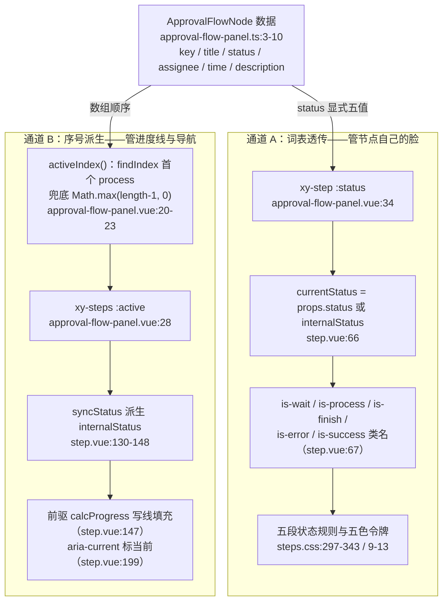
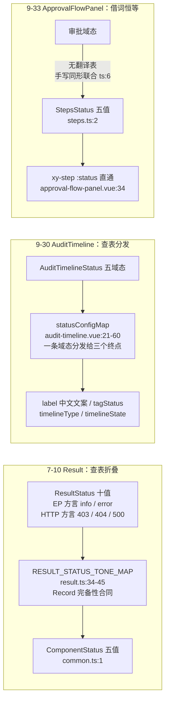

# 9-33 · ApprovalFlowPanel：审批流

> 本篇是 9 卷"增强层（pro-components）"的第 33 篇。大纲给本篇的核心问题只有一行——**节点面板的状态映射**——前置依赖标注 8-04 steps，理由是审批流的"节点链"与 steps 的"步骤链"形态相近。本篇先给实码定论：`approval-flow-panel.vue:28-36` 消费的正是基础层 `xy-steps`/`xy-step`，不是 timeline，也不是全自绘。旧考据一共四条在这里交汇：9-02 引过 `approval-flow-panel.ts:1` 的 import 段（全组件只借 `ProPageAction` 一条 core 条款）；9-23 数过根入口 `packages/pro-components/index.ts:115-118` 抬了两个类型，把它立为"主 Props 之外还有什么该出根入口"的决策样本之一；5-05 引过 `approval-flow-panel.vue:46-47` 的 `xy-text` 消费（办理人 `type="default"`、时间 `size="sm"`）；9-30 的 `statusConfigMap` 与 7-10 的 `RESULT_STATUS_TONE_MAP` 各自立过一种"状态→视觉"的收口设计，本篇的状态映射恰好是第三种——**不查表的借词恒等映射**。本篇全部结论以当前工作区实码为准，行号逐一核对，测试实跑通过（`vitest run approval-flow-panel`：2 passed）；开篇先勘误一条大纲考据：所谓"5-03 引过 approval-flow-panel.vue:147-155 的 xy-link 段"与实态不符——该组件全文只有 63 行、无一处 xy-link，147-155 的 xy-link 段实际位于 `audit-timeline.vue`（详见文末核对说明）。

接到题目先复述目标，防止写偏。审批流面板要回答的事很具体：一条审批单走到哪了、卡在谁手上、下一步能做什么。传统后台的做法是三件套手拼——`el-steps` 摆一条进度链，下面再手写一排节点卡片放办理人与时间，底部来一组操作按钮，三块东西的间距、词表、状态语义全靠每个项目自觉对齐。approval-flow-panel 的回答是把这三块收进一张卡：`title` 一根标题、`nodes` 一条节点数组、`actions` 一组动作，外加 `node-click`/`action` 两个事件出口。核心问题按大纲是"节点面板的状态映射"，但这句话里至少藏着四道题：审批节点要不要建类型模型（发起/审批/抄送）？节点的业务状态（审批中/已通过/已驳回）怎么翻译成视觉？当前节点的高亮与进度线由谁驱动——是像 7-10 那样查表折叠、像 9-30 那样查表分发，还是第三条路？以及大纲依赖暗示的选型题——为什么是 steps 不是 timeline？本篇逐一给实码定论。

## 一、体量与导出链路：166 行的增强层最小组件之一

先交代体量，给全文一个标尺：`packages/pro-components/approval-flow-panel/` 四件套——`index.ts` 15 行（安装入口）、`src/approval-flow-panel.ts` 19 行（纯类型）、`src/approval-flow-panel.vue` 63 行（视图 + 一段 4 行的派生函数）、`__tests__/approval-flow-panel.spec.ts` 45 行（2 个用例）；外加 `packages/theme/src/pro/approval-flow-panel.css` 24 行样式。合计 166 行——对比 9-31 数过的 detail-panel 378 行，不到它的一半，是增强层里最轻的一档；但"轻"不等于"浅"，状态映射的全部设计决策都压缩在这 166 行里，第三节会逐行拆开。

导出链路是 manifest 驱动的标准四段。`packages/pro-components/component-manifest.json:227-232` 登记 `name: "approval-flow-panel"`、`docsGroup: "workflow"`（与 9-34 的 import-wizard、9-35 的 export-task-panel 同组，是增强层三个"工作流组件"的第一个）、`installExports: ["XyApprovalFlowPanel"]`、`installChecks: [{ kind: "component", name: "xy-approval-flow-panel" }]`、`styleImports: ["approval-flow-panel"]`；`packages/pro-components/exports.ts:29` 显式导出组件值 `export { XyApprovalFlowPanel } from "./approval-flow-panel"`（9-01 讲过这行白名单不许用 `export *`）；根入口 `packages/pro-components/index.ts:115-118` 只抬两个类型——`ApprovalFlowNode` 与 `ApprovalFlowPanelProps`；`packages/pro-components/style.css:30` `@import "../theme/src/pro/approval-flow-panel.css"`。9-23 引这段时说过"相邻三行就是三种决策样本"——113 行 crud-page 抬 1 个、114 行 split-layout-page 抬 1 个、115-118 行 approval-flow-panel 抬 2 个。注意这里有个类型面的小账本：`ApprovalFlowAction`（动作类型别名）**没有**上根入口，只有数据类型 `ApprovalFlowNode` 和主 Props 出去了——按 AGENTS.md 增强层导出规则衡量，这是"主 Props / 主数据类型出门、共享协议别名留在子入口"的标准姿势，与 9-31 的 `DetailPanelInstance` 出门、`DetailPanelContainer` 留守同一种纪律。

安装入口 `index.ts` 全文 15 行，是增强层标准安装三件套的又一次零意外落地——默认导出组件值、类型只出两个、`withInstall` 挂 kebab-case 安装名：

```ts
// packages/pro-components/approval-flow-panel/index.ts:1-15
import ApprovalFlowPanel from "./src/approval-flow-panel.vue";
import type {
  ApprovalFlowNode,
  ApprovalFlowPanelProps
} from "./src/approval-flow-panel";
import { withInstall } from "xiaoye-primitives";

export type { ApprovalFlowNode, ApprovalFlowPanelProps };

export const XyApprovalFlowPanel = withInstall(
  ApprovalFlowPanel,
  "xy-approval-flow-panel"
);

export default XyApprovalFlowPanel;
```

类型测试夹具也认了这份账：`tests/types/fixtures/xiaoye-pro-components.ts:33` 从包根导入 `type ApprovalFlowNode`，`:390-396` 用它声明了一条最短审批流数据（一个 `status: "process"` 的节点），`:437` 与 `:487` 两行 `void` 断言组件值与数据值都可从安装入口取得——`xy-approval-flow-panel` 这个安装名同时被 manifest 的 `installChecks` 与夹具的导入链双重钉住。

## 二、类型层：19 行里的一次词表借调

`src/approval-flow-panel.ts` 全文 19 行，9-02 引过它第 1 行的 import 段，本篇全文摊开：

```ts
// packages/pro-components/approval-flow-panel/src/approval-flow-panel.ts:1-19
import type { ProPageAction } from "../../core";

export interface ApprovalFlowNode {
  key: string;
  title: string;
  status?: "wait" | "process" | "finish" | "error" | "success";
  assignee?: string;
  time?: string;
  description?: string;
}

export type ApprovalFlowAction = ProPageAction;

export interface ApprovalFlowPanelProps {
  title?: string;
  nodes: ApprovalFlowNode[];
  actions?: ApprovalFlowAction[];
}
```

11 个成员分三组，逐条过。**节点组** `ApprovalFlowNode` 六字段：`key` 是渲染键与事件回传的身份证，`title` 是节点名，`status` 是可选的流程状态，`assignee` 办理人、`time` 时间戳、`description` 说明是三个纯展示附件位。**动作组** `ApprovalFlowAction` 一行别名——`type ApprovalFlowAction = ProPageAction`，把 core 协议层的动作接口原样借来（`core.ts:126-138`，`key`/`label` 必填，`type`/`plain`/`text`/`link`/`danger`/`disabled`/`loading`/`icon`/`visible` 九个可选位），不添不减。**面板组** `ApprovalFlowPanelProps` 三字段：`title` 默认"审批流程"，`nodes` 必填，`actions` 可选默认空。

先落本篇第一个设计权衡：**节点不建类型**。大纲的疑问是"节点类型：发起/审批/抄送？"——实码定论是**没有** `type` 字段，六个字段里没有任何一个表达"这是哪种节点"。发起节点是数组的第一个元素，审批节点是中间的任意元素，抄送节点则根本表达不了（硬要表达只能塞进 `description` 文案）。这不是偷懒，是一次自觉的轻建模：BPMN 式的强模型（type + 处理人规则 + 分支条件 + 会签或签）是流程**编排器**的职责，需要状态机、回退、条件路由一整套机制；而审批流面板的自我定位是流程**快照的展示件**——它消费的是后端已经算好的"这条单子当前长什么样"。文档把这条边界写得明明白白（`apps/docs/pro-components/approval-flow-panel.md:24-25`："当前不处理流程图布局、分支节点和评论流……更复杂的工作流编排仍建议在页面层处理"）。轻建模的代价同样真实：`xy-steps` 是一条线性链，分支流程在这个组件里没有落点，`status` 也只够表达"单链进度"，表达不了"会签三人中两人已过"这类部分完成态——这类需求在当前模型下只能上页面层自绘。**展示件不承接编排语义**，是这个组件所有类型决策背后的同一条准绳。

第二处值得停的是 `status` 的词表：`"wait" | "process" | "finish" | "error" | "success"`——逐字等于基础层 steps 的状态枚举。`packages/components/steps/src/steps.ts:2` 是这张词表的本源：

```ts
// packages/components/steps/src/steps.ts:1-21
export const stepsDirections = ["horizontal", "vertical"] as const;
export const stepsStatuses = ["wait", "process", "finish", "error", "success"] as const;

export type StepsDirection = (typeof stepsDirections)[number];
export type StepsStatus = (typeof stepsStatuses)[number];
export type StepsChangeHandler = (newValue: number, oldValue: number) => void;

export interface StepsProps {
  space?: number | string;
  active?: number;
  direction?: StepsDirection;
  alignCenter?: boolean;
  simple?: boolean;
  finishStatus?: StepsStatus;
  processStatus?: StepsStatus;
  /**
   * 仅用于开发期捕获误用：XySteps 不支持 items prop。
   * @deprecated 请使用默认插槽渲染 XyStep。
   */
  items?: unknown;
}
```

大纲问"节点状态：pending/approved/rejected/cancelled？"——实码定论：都不是。审批域自己的方言（待审批、已通过、已驳回、已撤回）**完全没有出现在这个组件里**，数据生产方必须在喂进来之前就把域态翻译成 steps 五值。这就是本篇核心问题的第一个答案：**approval-flow-panel 不做状态翻译，它直接借用了下游展示件的词表**。注意大纲追问的 pending/approved/rejected/cancelled 这套词在仓库里另有近亲——timeline 的 `TimelineItemState`（`packages/components/timeline/src/timeline-item.ts:13`）是 `default/done/current/pending/blocked` 五值，9-30 的 audit-timeline 用的就是"域态 → 这套词"的查表路线。同样面对审批域态，audit-timeline 选择"域词表 + 映射表"，approval-flow-panel 选择"直接采用 steps 词表"——两条路线的正面比较放到第三节。

这里还有一个精确的类型事实值得立案在案：`status` 字段是**手写的同形联合**，不是 `import type { StepsStatus } from "xiaoye-components"` 的借型。对比同卷的 detail-panel——`detail-panel.ts:19` 老老实实 `import type { DescriptionsProps, ... } from "xiaoye-components"`，而 approval-flow-panel.ts 明明可以借（`StepsStatus` 在 `steps.ts:5` 是导出的，且组件视图层本来就在从 `xiaoye-components` 导入运行时值），却选择了把五个字符串字面量抄一遍。目前两个联合逐字同形（连成员顺序 wait/process/finish/error/success 都一致），所以一切正常；但这是一份没有类型关联的"口头契约"——将来 steps 若给 `StepsStatus` 加第六个值（比如 EP 2.x 也在讨论的 `wait` 之外的中间态），`xy-step` 的 `status` prop 类型（`StepStatus = "" | StepsStatus`，`step.ts:3`）跟着变宽，而 `ApprovalFlowNode.status` 不变，"面板喂给步骤条的 status 一定在步骤条词表内"这个不变量就从编译期保证退化成了 review 时的人眼保证。8-04 讲过 result 的三张映射表用 `Record<ResultStatus, ...>` 把词表膨胀成本钉在编译期，这里的借词路线把同一份成本交还给了纪律。诚实评级：功能无损，但这是全组件最脆的一处接缝，修复只需一行 import。

第三处是 `ApprovalFlowAction = ProPageAction` 的别名而不引用。9-02 数过 core.ts 的消费密度：approval-flow-panel 是"只引一条条款"的最轻消费方（`ts:1` 一行 import），别名导出 `ts:12` 让组件子入口对外只暴露自己的词汇。但接口宽不等于消费宽——视图层实际吃下了几个字段，第四节的动作区会算这笔账。

## 三、状态映射：一次借调，两条通道

现在进入本篇正题。先看组件的 script 段全文——`approval-flow-panel.vue:1-24`：

```vue
<!-- packages/pro-components/approval-flow-panel/src/approval-flow-panel.vue:1-24 -->
<script setup lang="ts">
import { XyButton, XyCard, XyStep, XySteps, XyText } from "xiaoye-components";
import type { ApprovalFlowAction, ApprovalFlowPanelProps } from "./approval-flow-panel";

defineOptions({
  name: "XyApprovalFlowPanel"
});

const props = withDefaults(defineProps<ApprovalFlowPanelProps>(), {
  title: "审批流程",
  nodes: () => [],
  actions: () => []
});

const emit = defineEmits<{
  action: [action: ApprovalFlowAction];
  "node-click": [node: { key: string }];
}>();

function activeIndex() {
  const index = props.nodes.findIndex((node) => node.status === "process");
  return index >= 0 ? index : Math.max(props.nodes.length - 1, 0);
}
</script>
```

整段脚本 24 行：一行 import 基础层五个组件（`XyButton`/`XyCard`/`XyStep`/`XySteps`/`XyText`——五个 import 已经预告了模板的全部演员）、`withDefaults` 三条默认值、一张两行的事件类型表、然后就是全组件唯一的"逻辑"——`activeIndex()`，4 行。没有 computed，没有 watch，没有ref。核心问题"节点面板的状态映射"的代码形态，就是这 4 行加模板里的两根绑定线。

`activeIndex()` 的算法一句话说完：在 `nodes` 里找第一个 `status === "process"` 的节点下标（`vue:21`），找不到就兜底取最后一个下标（`vue:22`，`Math.max(props.nodes.length - 1, 0)` 同时兜住空数组——空数组时 `length - 1` 是 -1，钳到 0）。它喂给 `xy-steps` 的 `:active`。而每个节点的 `status` 又原样喂给 `xy-step` 的 `:status`。这两根线合起来，构成了状态映射的完整架构——**双通道**：

**通道 A（词表透传，管"节点自己的脸"）**：`:status="node.status"`（`vue:34`）进 `xy-step` 后，被 `step.vue:66` 的 `currentStatus = props.status || internalStatus` 接管——显式传入的 status 优先级最高，直接决定 `statusClass`（`step.vue:67`）拼出的 `is-*` 类名、状态图标（`step.vue:48-65`：success 给 `mdi:check`、error 给 `mdi:close`）与标题字重。视觉的最后一跳在样式层，`packages/theme/src/components/steps.css:9-13` 给五个状态各锚定一枚令牌，`steps.css:297-343` 是五段状态规则：

```css
/* packages/theme/src/components/steps.css:297-343 */
.xy-steps__item.is-wait {
  color: var(--xy-steps-wait-color);
}

.xy-steps__item.is-process {
  color: var(--xy-steps-process-color);
}

.xy-steps__item.is-process .xy-steps__icon {
  transform: scale(1.03);
  background: color-mix(in srgb, var(--xy-brand-soft) 60%, var(--xy-bg-raised));
  box-shadow:
    0 0 0 2px color-mix(in srgb, var(--xy-bg-raised) 94%, transparent),
    0 0 0 5px color-mix(in srgb, var(--xy-brand) 8%, transparent);
}

.xy-steps__item.is-finish {
  color: var(--xy-steps-finish-color);
}

.xy-steps__item.is-finish .xy-steps__icon {
  background: color-mix(in srgb, var(--xy-brand-soft) 62%, var(--xy-bg-raised));
}

.xy-steps__item.is-success {
  color: var(--xy-steps-success-color);
}

.xy-steps__item.is-success .xy-steps__icon {
  background: color-mix(in srgb, var(--xy-success-soft) 54%, var(--xy-bg-raised));
}

.xy-steps__item.is-error {
  color: var(--xy-steps-error-color);
}

.xy-steps__item.is-error .xy-steps__icon {
  background: color-mix(in srgb, var(--xy-danger-soft) 78%, var(--xy-bg-raised));
}

.xy-steps__item.is-process .xy-steps__title {
  font-weight: var(--xy-font-weight-bold);
}

.xy-steps__item.is-wait .xy-steps__description {
  color: color-mix(in srgb, var(--xy-text-muted) 88%, var(--xy-mix-light));
}
```

wait 挂 `--xy-text-muted`、process/finish 挂 `--xy-brand`、success/error 各挂语义色——五个状态值在令牌层一一落座（8-04 把这段称为"五值枚举的视觉对账单"）。process 的 `scale(1.03)` 加双环 `box-shadow` 就是"当前节点高亮"的本体。

**通道 B（序号派生，管"进度线与导航"）**：`activeIndex()` → `:active="activeIndex()"`（`vue:28`）进 steps 体系后，走的是 8-04 讲过的那条派生流水线——每个 `xy-step` 的 `syncStatus`（`step.vue:130-148`）比较自己的 `index` 与 `active` 派生出 `internalStatus`，再调前驱注册上来的 `calcProgress` 写进度线的填充样式：

```ts
// packages/components/steps/src/step.vue:112-148
function calcProgress(status: StepsStatus, active: number, previousActive: number) {
  const stepDiff = active - previousActive;
  let transitionDelay = 0;

  if (Math.abs(stepDiff) !== 1) {
    transitionDelay =
      stepDiff > 0 ? Math.max(index.value + 1 - previousActive, 0) * 150 : -Math.max(index.value + 1 - active, 0) * 150;
  }

  const progress = status === (parent?.processStatus.value ?? "process") || status === "wait" ? 0 : 100;

  lineStyle.value = {
    transitionDelay: `${transitionDelay}ms`,
    borderWidth: progress && !isSimple.value ? "1px" : "0px",
    [isVertical.value ? "height" : "width"]: `${progress}%`
  };
}

function syncStatus(active: number, previousActive: number) {
  if (!parent || index.value < 0) {
    internalStatus.value = "wait";
    return;
  }

  const previousStep = parent.steps.value[index.value - 1];
  const previousStatus = previousStep?.internalStatus.value ?? "wait";

  if (active > index.value) {
    internalStatus.value = parent.finishStatus.value;
  } else if (active === index.value && previousStatus !== "error") {
    internalStatus.value = parent.processStatus.value;
  } else {
    internalStatus.value = "wait";
  }

  previousStep?.calcProgress(internalStatus.value, active, previousActive);
}
```

两条通道画成图：



**为什么是两条通道而不是一条？** 这是本篇的关键。初看像是冗余：既然每个节点都显式传了 `status`，为什么还要算 `activeIndex` 传 `:active`？反着问更清楚：既然有 `active` 派生，为什么还要每个节点传 `status`？答案在两边词表的能力差。派生通道（`syncStatus` 三分支）只会产出三种值——`finishStatus`（默认 finish）、`processStatus`（默认 process）、`wait`（`step.vue:139-145`），它是**序数机器**：只知道"第几步走到了"，不知道"这一步办成了还是办砸了"。而审批域恰恰需要 error（驳回）和 success（终审通过）这两个**业务终态**——它们不在派生词表里，只能走显式透传。反过来，线的填充（`calcProgress`）读的是派生的 `internalStatus` 而非显式的 `currentStatus`（`step.vue:147` 传的是 `internalStatus.value`），显式 status 管不到它。于是分工自然形成：**显式 status 管节点的脸（类名/图标/字重），序号派生管链的线（进度填充 + 150ms 阶梯动画）与无障碍导航（`step.vue:199` 的 `aria-current="step"`）**。`activeIndex()` 不是冗余，它是线的心跳；显式透传不是重复，它是脸的词表。

双通道也带来两个实码可证的边界。**边界一：全完成流程的末段线恒暗。** 一条全部 `finish` 的流程，`activeIndex` 找不到 process、兜底取最后一个下标，于是末节点的派生状态是 process（`active === index`）——按 8-04 的结论"当前步左侧的线永远是暗的"，末节点之前那段线不会点亮，而末节点自己的脸却因显式 status 显示 finish；同时 `aria-current` 会落在那个已经办完的节点上（`step.vue:199` 比较的是派生用的 `currentActive`）。数据全对、脸全对，线错了一段。**边界二：驳回流程的阻断语义在派生通道失真。** `syncStatus` 的 `previousStatus !== "error"`（`step.vue:141`）是 8-04 讲过的"前驱驳回则当前步不亮 process"阻断语义，但它读的是前驱的**派生**状态——而驳回恰恰是显式 status 才能表达的业务终态，永远进不了派生链。所以 `[finish, error, wait]` 这条流程（无 process 节点）兜底取末位下标后，active 越过了 error 节点，阻断分支不触发；好在脸的通道不受影响（error 节点显示红色），线也不撒谎（error 之后的线不点亮），只有"派生链认为 error 节点已 finish"这一层内部事实与业务直觉相悖。这两个边界共同指向同一个结构性事实：**显式词表与派生词表是两套并行的事实源，面板没有（也无法在 63 行内）做对账**。第三节末的收口讨论会回到这里。

现在回答"为什么不是查表"。把仓库里三种"状态→视觉"的收口设计摆在一张图上：



前两种的共同点是**域词表与展示词表分离**，靠一张映射表连接——result 是十值折五值的折叠表（`result.ts:34-45`），audit-timeline 是五域态对三终点的分发表（`audit-timeline.vue:21-60`，`label/tagStatus/timelineType/timelineState` 四件套）。第三种干脆取消翻译：**让域词表直接采用展示词表**，映射函数退化为恒等透传，运行时零映射代码、零查表开销。三种路线没有高下，判据是**域词汇与展示词汇的语义距离**：result 的域是"页面结果"，天然混着 EP 方言与 HTTP 方言，必须有人把十个词折回五色，表是唯一收口；audit-timeline 的一条记录要同时喂饱中文标签、tag 色调、timeline 点色与线态四个终点，词表不同构，必须逐项分发；而审批流的叙事——"还没到 / 正在办 / 已办结 / 办砸了 / 终审通过"——与步骤条的 wait/process/finish/error/success 几乎逐词对位，这时候再造一张 `ApprovalStatus → StepsStatus` 的映射表，表里每一行都是恒等式，纯属仪式。**同构则借词，异构则查表**，这是三种收口设计合起来给出的判据。

但借词路线的代价第二节已经记过一笔：词表是手写同形而非类型借调，恒等映射的"恒等"没有编译期担保。把话说全：这条接缝的维护责任从"类型系统"移交给了"改 steps 词表的人记得全局搜一遍 `wait.*process.*finish`"。9-30 的 `statusConfigMap` 用 `Record<AuditTimelineStatus, ...>` 把完备性合同钉在类型上，本篇的借词连这份合同都没有——它省下的是一张五行的表，押上的是一处跨包的类型同步。

选型题在此一并收口。大纲依赖 8-04 的直觉是对的，但实码的答案比"消费 steps"更精确一层：模板 `vue:28-36` 的 `xy-steps`/`xy-step` 承担进度链，`vue:37-49` 的节点区却是**自绘**的原生 `button` 列表。为什么不全交给 steps？因为 steps 的 `description` 插槽只能放静态文字，而审批节点需要办理人、时间与**点击交互**（`node-click` 事件）。为什么不用 timeline？把它的类型面摊开看，`TimelineItemState` 五值虽然也能承接映射，但它的 prop 面完全没有"进度"词汇：

```ts
// packages/components/timeline/src/timeline-item.ts:1-31
import type { ComponentStatus } from "xiaoye-primitives";

export const timelineItemPlacements = ["top", "bottom"] as const;
export const timelineItemTypes = [
  "",
  "neutral",
  "primary",
  "success",
  "warning",
  "danger"
] as const;
export const timelineItemSizes = ["normal", "large"] as const;
export const timelineItemStates = ["default", "done", "current", "pending", "blocked"] as const;

export type TimelineItemPlacement = (typeof timelineItemPlacements)[number];
export type TimelineItemType = "" | ComponentStatus;
export type TimelineItemSize = (typeof timelineItemSizes)[number];
export type TimelineItemState = (typeof timelineItemStates)[number];

export interface TimelineItemProps {
  timestamp?: string;
  hideTimestamp?: boolean;
  center?: boolean;
  placement?: TimelineItemPlacement;
  type?: TimelineItemType;
  color?: string;
  size?: TimelineItemSize;
  icon?: string;
  hollow?: boolean;
  state?: TimelineItemState;
}
```

`state` 里确实有一个 `current`（`timeline-item.ts:13`），9-30 也正是把"处理中"映射到它——但 timeline 的视觉范式是竖向"记录流"，语义重心是"发生过什么"，`current` 只负责把那个点染色，没有"当前位置"的一等公民语义：进度线、`aria-current`、150ms 阶梯填充动画都是 steps 的专属能力，审批面板的核心叙事恰是"走到哪了、还差什么"。所以最终形态是**混合体：steps 表链、自绘表点**。这个混合有代价——同一份 `nodes` 数组被两个 `v-for` 渲染两遍（`vue:30` 与 `vue:39`），顺序一致性与 key 一致性全靠数据不可变保证——但换来了进度语义与交互细节各归其位。

## 四、节点区与动作区：模板层的三段式

模板段全文 39 行，`approval-flow-panel.vue:26-63`：

```vue
<!-- packages/pro-components/approval-flow-panel/src/approval-flow-panel.vue:26-63 -->
<template>
  <xy-card class="xy-approval-flow-panel" :header="props.title">
    <xy-steps :active="activeIndex()">
      <xy-step
        v-for="node in props.nodes"
        :key="node.key"
        :title="node.title"
        :description="node.description"
        :status="node.status"
      />
    </xy-steps>
    <div class="xy-approval-flow-panel__nodes">
      <button
        v-for="node in props.nodes"
        :key="node.key"
        type="button"
        class="xy-approval-flow-panel__node"
        @click="emit('node-click', node)"
      >
        <strong>{{ node.title }}</strong>
        <xy-text v-if="node.assignee" type="default">{{ node.assignee }}</xy-text>
        <xy-text v-if="node.time" size="sm">{{ node.time }}</xy-text>
      </button>
    </div>
    <div v-if="props.actions.length > 0 || $slots.actions" class="xy-approval-flow-panel__actions">
      <slot name="actions">
        <xy-button
          v-for="action in props.actions"
          :key="action.key"
          :type="action.type"
          @click="emit('action', action)"
        >
          {{ action.label }}
        </xy-button>
      </slot>
    </div>
  </xy-card>
</template>
```

结构是标准三段式，全部装在 `xy-card` 里（标题用 `:header` 托管给卡片，面板自己不画头部）。**第一段** `xy-steps` 已在第三节拆完。**第二段**节点区，一个原生 `button`（`type="button"` 防止表单误提交的细节没漏）装三行内容：`strong` 的节点名、办理人、时间——5-05 引过的 `vue:46-47` 就在这里，办理人 `type="default"` 取正文灰、时间 `size="sm"` 降一号，`v-if` 守卫让可选字段缺席时整个元素不渲染，节点卡的高度随数据自适应。5-05 给这三行的判词是"组件给档，令牌给语言，消费方做组合"——面板没有为办理人发明新的灰色档位，而是在 Text 的档位词表内取用。**第三段**动作区，渲染条件 `props.actions.length > 0 || $slots.actions`（`vue:50`）保证"没有动作也不拖一条空横排"，默认内容是 `xy-button` 循环，`slot name="actions"` 兜底让业务可以整排替换——这个"数组默认渲染 + 插槽整体接管"的二元结构和 9-31 detail-panel 的 actions footer 同款。

动作区是本节要立案的地方。`xy-button` 的绑定只有 `:type` 一项（`vue:55`），而 `ProPageAction`（`core.ts:126-138`）有九个可选字段。对照同协议的另一个消费方 detail-page——`detail-page.vue:93-103` 的动作按钮绑了 `type/plain/text/link/disabled/loading/icon` 七项：

```ts
// packages/pro-components/detail-page/src/detail-page.vue:93-103
          <xy-button
            v-for="action in props.actions"
            :key="action.key"
            :type="action.type"
            :plain="action.plain"
            :text="action.text"
            :link="action.link"
            :disabled="action.disabled"
            :loading="action.loading"
            :icon="action.icon"
          >
```

两相对照，approval-flow-panel 的动作协议是**接口宽、消费窄**：调用方在 `actions` 里写 `plain: true`、`disabled: true`、`loading: true`，类型检查全部通过，运行时却没有任何效果——字段被静默丢弃。这不只是理论推演，官方示例就踩在里面：`apps/docs/examples/pro/approval-flow-panel/basic.vue:37-40` 的动作数组写的是 `{ key: 'transfer', label: '转交复核', plain: true }`——这个 `plain: true` 是死配置，"转交复核"按钮并不会呈现朴素形态。另一个细节：`visible` 字段（`core.ts:137`）在两个消费方里都没有过滤逻辑——按协议语义它应该是"为 false 就不渲染"，实码里为 false 照样渲染（两处都漏，不是本组件独有的问题，但本组件是消费面最窄的那个）。协议复用的正常代价是消费方各取所需，但**官方示例写了一个不被消费的字段**，就把"接口宽消费窄"从契约细节变成了文档事故——立案待修，修法要么补齐绑定（对齐 detail-page 七项），要么把示例里的 `plain` 删掉。

节点区的 `node-click` 载荷也有一笔灰账。类型声明写的是 `"node-click": [node: { key: string }]`（`vue:17`），文档事件表同款（`approval-flow-panel.md:42`）；但运行时 `emit('node-click', node)`（`vue:43`）抛出去的是**整个节点对象**——TS 结构类型下 `ApprovalFlowNode` 满足 `{ key: string }`，编译无恙；测试用 `toEqual(node)`（`spec:23`）把全量载荷钉死。于是消费方实际拿到的比类型承诺的多：`node.title`/`node.status`/`node.assignee` 都可以合法地用，只是类型上不可见。"类型收窄是最小承诺、运行时宽供是演化余地"是一种说得通的立场——载荷写窄，将来给事件加字段不构成破坏性变更；但文档按类型写、运行时给更多，中间这条缝没有任何文档提示。算轻度立案：不算错，算欠一句"运行时回传完整节点"的注脚。

样式文件全文 24 行，三段全是布局胶水：

```css
/* packages/theme/src/pro/approval-flow-panel.css:1-24 */
.xy-approval-flow-panel__nodes {
  display: flex;
  flex-direction: column;
  gap: 12px;
  margin-top: 16px;
}

.xy-approval-flow-panel__node {
  display: flex;
  flex-direction: column;
  gap: 6px;
  align-items: flex-start;
  padding: 12px 14px;
  border: 1px solid color-mix(in srgb, var(--xy-border) 88%, var(--xy-mix-light));
  border-radius: var(--xy-radius-md);
  background: var(--xy-bg-container);
}

.xy-approval-flow-panel__actions {
  display: flex;
  justify-content: flex-end;
  gap: 12px;
  margin-top: 16px;
}
```

零状态色纪律在此复验（9-30 给 audit-timeline 立过同一条判词）：24 行里没有一个 success/danger/warning，所有颜色语义都让给了 steps 通道——节点卡自己只有边框、圆角、底色三件排版衣，`--xy-mix-light` 的掺入让边框在双主题下自动深浅。要挑的是交互反馈的三件缺：`.xy-approval-flow-panel__node` 是一个可点击按钮，却没有 `cursor: pointer`（对照 `button.css:10`、`check-card.css:12`，全库的可点击件都配了）、没有 hover 态（check-card 的 `:hover` 抬底色是现成范式）、也没有 focus-visible 定制（`xiaoye-primitives/src/theme/reset.css:17-22` 只兜了 `font: inherit`）。用户把鼠标移到节点卡上，光标不变、卡片不动——一个宣称"可点进节点详情"的交互件，三件套一件没配。立案，修复三行 CSS 的事。

## 五、测试、文档与示例

`__tests__/approval-flow-panel.spec.ts` 全文 45 行、2 个用例：

```ts
// packages/pro-components/approval-flow-panel/__tests__/approval-flow-panel.spec.ts:1-45
import { mount } from "@vue/test-utils";
import { defineComponent, h } from "vue";
import { describe, expect, it, vi } from "vitest";
import { XyApprovalFlowPanel } from "@xiaoye/pro-components";

describe("XyApprovalFlowPanel", () => {
  it("支持渲染节点并触发节点点击", async () => {
    const node = {
      key: "review",
      title: "审批中",
      status: "process" as const
    };
    const wrapper = mount(XyApprovalFlowPanel, {
      props: {
        nodes: [node]
      }
    });

    expect(wrapper.text()).toContain("审批中");

    await wrapper.get(".xy-approval-flow-panel__node").trigger("click");

    expect(wrapper.emitted("node-click")?.[0]?.[0]).toEqual(node);
  });

  it("步骤条真实渲染 xy-step 节点", () => {
    const wrapper = mount(XyApprovalFlowPanel, {
      props: {
        nodes: [
          { key: "draft", title: "草稿", status: "finish" },
          { key: "review", title: "审批中", status: "process" },
          { key: "archive", title: "完成", status: "wait" }
        ]
      }
    });

    expect(wrapper.findAll(".xy-steps__item")).toHaveLength(3);
    expect(wrapper.findAll(".xy-steps__title").map((node) => node.text())).toEqual([
      "草稿",
      "审批中",
      "完成"
    ]);
  });
});
```

两个用例各有分工。用例一钉交互链：节点渲染出标题、点 `.xy-approval-flow-panel__node` 触发 `node-click`、载荷 `toEqual(node)` 全量回传——顺带把第四节说的"运行时给全量"钉成了事实（类型上 `{ key: string }`，断言上全量对象）。用例二钉选型事实：三条 `finish/process/wait` 的节点进去，`.xy-steps__item` 恰好 3 个、`.xy-steps__title` 的文本序列与数据序一致——这条用例的价值在第三节已经点过，它钉住的是"消费 steps"这个架构决策本身：哪天有人把 `xy-steps` 换成 timeline 或自绘，这条会先红。用例二的三条状态值（finish/process/wait）是刻意挑的：与 `activeIndex` 的"找 process"逻辑呼应， process 居中时派生链各就各位。

但覆盖面与组件的面积不成比例，**漏了四件事**：`action` 事件零断言（动作区的唯一出口）；`actions` 插槽整体接管零断言；五状态到 `is-*` 类名的映射零断言（通道 A 的最后一跳没有测试保护）；以及最可惜的——`activeIndex()` 的三个分支（找到 process / 无 process 兜底末位 / 空数组钳零）零断言。全组件唯一的"逻辑"恰好是零覆盖的那四行，第三节的两个边界（全完成末段线暗、驳回流程派生失真）因此在回归层面无护栏。45 行测试对一个 63 行组件，比例不低，但钉住的偏是"不太会坏"的部分（模板渲染），没钉"最容易错"的部分（状态派生的边界）。

文档侧，`apps/docs/pro-components/approval-flow-panel.md` 的 Attributes 表三行（`title` 默认'审批流程'、`nodes`、`actions` 默认 `[]`）与 `ts:14-18` 逐项对得上；Events 表两行与 `vue:15-18` 一致（`node-click` 参数照抄类型收窄，即第四节的灰账）；Slots 表一行（`actions`）。"当前边界"一节（md:22-25）诚实声明了不做流程图、分支与评论流——与第二节的轻建模定论互为印证，这处文档与实码零出入。示例 `basic.vue` 全文 43 行：

```vue
<!-- apps/docs/examples/pro/approval-flow-panel/basic.vue:1-43 -->
<script setup lang="ts">
const nodes = [
  {
    key: "submit",
    title: "提交账单差异说明",
    status: "finish" as const,
    assignee: "小叶",
    time: "2026-03-29 09:00",
    description: "已提交供应商差异说明和原始附件。"
  },
  {
    key: "review",
    title: "财务复核",
    status: "process" as const,
    assignee: "小星",
    time: "2026-03-29 11:00",
    description: "正在核对金额差异和税率说明。"
  },
  {
    key: "publish",
    title: "工作台生效",
    status: "wait" as const,
    assignee: "系统",
    description: "复核通过后会同步到结算工作台。"
  }
];
</script>

<template>
  <div class="xy-pro-demo-stack">
    <xy-card header="供应商账单差异审批">
      <p>当前这条差异单已经补齐附件和金额说明，正在等待财务复核通过后自动推送到结算工作台。</p>
    </xy-card>
    <xy-approval-flow-panel
      title="审批流程"
      :nodes="nodes"
      :actions="[
        { key: 'urge', label: '提醒审批', type: 'primary' },
        { key: 'transfer', label: '转交复核', plain: true }
      ]"
    />
  </div>
</template>
```

示例是一条三节点审批链的标准演武：提交（finish）→ 财务复核（process）→ 生效（wait），`assignee`/`time`/`description` 三个可选字段各就各位，`activeIndex` 找到 process 居中，进度链的语义完整。除了那个 `plain: true` 死配置（已立案），示例的另一个示范价值在于它同时放了业务卡与面板卡——`xy-card` 讲业务上下文、面板讲流程状态，这正是 detail-page 等页面级消费方的实际排布。

## 六、EP 对照与收束

拿 Element Plus 对照收拢全篇（EP 侧以 element-plus 2.x 公开 API 为参照，不引行号）。EP 没有"审批流"组件——`el-steps`/`el-step` 提供进度链（status 五值与本库逐字同源，8-04 已证是同一次施工），`el-timeline`/`el-timeline-item` 提供记录流，审批场景的业务要自己拼：`el-steps` 摆链、自己写节点详情卡、自己发明 status 词表并写映射、自己拼按钮组——每个项目重做一遍"节点面板的状态映射"，而且每个项目翻出来的答案都不一样。Ant Design 系同样没有对应特化（Steps + TimeLine + 自组装）。本库的路线延续 9-30 给出的判词：**同构数据的高频组装模式，值得沉淀成特化组件**——approval-flow-panel 把"进度链 + 节点详情 + 动作区"的排布、`node-click`/`action` 的出口、以及状态词表的选择权一并收编。但也要诚实地给这个特化称重：63 行里没有一行审批域的业务规则（没有催办、转交、加签、撤回的语义，`actions` 只是事件透传），它特化的是**组装**而非**业务**——与 crud-page 那种"整页语义特化"相比，它更接近 detail-panel 一档的"区块级组装模板"。轻，是它的体量，也是它的定位。

把 166 行收成本篇三句话。**第一句，状态映射的答案是借词恒等**：`ApprovalFlowNode.status` 手写同形 steps 五值（`ts:6` 对 `steps.ts:2`），域态到视觉的映射退化为透传（`vue:34` 直通 `step.vue:66`），与 7-10 的查表折叠、9-30 的查表分发并列成三种收口设计——判据是域词表与展示词表的语义距离，同构则借词、异构则查表；借词省一张表，押一处跨包类型同步。**第二句，双通道分工扛住了词表能力差**：显式 status 管节点的脸（error/success 这两个派生词表装不下的业务终态只能走它），`activeIndex()` 的序号派生管线的填充与 `aria-current`；两条通道在全完成流程（末段线恒暗、aria-current 落在已办结节点）与驳回流程（阻断语义失真）处出现缝隙，是实码可证的两个边界。**第三句，接口宽消费窄**：`ProPageAction` 九字段只消费 `type` 一个（对照 detail-page 绑七项），官方示例的 `plain: true` 是死配置；节点类型不建模（发起/审批/抄送皆无）、分支流程不承接，六个字段一条数组把审批流退化为线性快照——展示件不抢编排器的活。三个权衡彼此咬合：因为借词，映射才零成本；因为轻建模，双通道才够用；因为动作只是透传，特化才敢停在 63 行。

下一篇 9-34《ImportWizard：导入向导》走进同一个 workflow 组的第二位成员：分步上传、校验与结果的编排——大纲给它的核心问题是"分步上传/校验/结果的编排"，依赖 9-09 StepsForm。它的 `ImportWizardStep`（`import-wizard.ts:1-5`，`key/title/description` 三字段）与 `ApprovalFlowNode` 的前三个字段同形，是 steps 词系在增强层的第二次借调；但它多出 `active`/`defaultActive` 一对受控与非受控 prop（4-04 的老话题第一次在 workflow 组落地），"步骤链"要从展示件变成编排器——届时看多一步的 `active` 管理，要多付多少行代码。

---

**考据与行号核对说明**：本文所有路径与行号均按当前工作区实态核对。`approval-flow-panel.vue` 实测 63 行（script 段 1-24、模板段 26-63；`:20-23` 为 activeIndex、`:34` 为 status 透传、`:55` 为动作按钮仅绑 type）；`approval-flow-panel.ts` 19 行全文引用；`approval-flow-panel/index.ts` 15 行；`__tests__/approval-flow-panel.spec.ts` 45 行，`vitest run approval-flow-panel` 实跑 2 passed；`packages/theme/src/pro/approval-flow-panel.css` 24 行全文引用；`steps.ts` 21 行全文引用，`stepsStatuses` 在 `:2`；`step.vue` 231 行，引用 112-148（calcProgress/syncStatus），`currentStatus` 在 `:66`、`aria-current` 在 `:199`；`steps.css` 454 行，引用 297-343，五色令牌在 `:9-13`；`timeline-item.ts:13` 为 `timelineItemStates`；`audit-timeline.vue` 170 行，`statusConfigMap` 在 21-60；`result.ts:34-45` 为 `RESULT_STATUS_TONE_MAP`；`ComponentStatus` 在 `xiaoye-primitives/src/utils/types/common.ts:1`；`core.ts:126-138` 为 `ProPageAction`；`detail-page.vue` 动作按钮绑定在 93-103；manifest 登记在 `component-manifest.json:227-232`；`exports.ts:29`；根入口类型在 `pro-components/index.ts:115-118`；`style.css:30`；夹具 `xiaoye-pro-components.ts:33/390-396/437/487`；示例 `basic.vue` 43 行全文引用。历史核对：9-02 引用的 `approval-flow-panel.ts:1`、9-23 引用的 `index.ts:115-118`、5-05 引用的 `approval-flow-panel.vue:46-47` 均与当前实态一致，无漂移。

**立案：叙述/考据与源码不符处**（均为当前实态核对所得）：其一，**大纲考据勘误**——"5-03 引过 approval-flow-panel.vue:147-155（xy-link 段）"与实态不符：`approval-flow-panel.vue` 全文 63 行、无一处 xy-link；5-03 实际引用的是 `audit-timeline.vue:147-155` 的 xy-link 附件链接段（5-03:508 原文可证），两条考据在任务链上被张冠李戴，本篇已按实态归位。其二，`basic.vue:39` 的 `plain: true` 是死配置：`approval-flow-panel.vue:55` 只绑 `:type`，`ProPageAction` 的 `plain/text/link/danger/disabled/loading/icon` 七个视觉字段均未消费（对照 `detail-page.vue:96-102` 绑七项），`visible`（`core.ts:137`）两个消费方都未过滤——官方示例写入不被消费的字段，构成文档级误导。其三，`node-click` 类型载荷 `{ key: string }`（`vue:17`）与文档表（`approval-flow-panel.md:42`）收窄于运行时实发的全量节点（`vue:43`，`spec:23` 的 `toEqual` 钉住），文档无"运行时回传完整节点"注脚。其四，双通道边界的测试缺口：`activeIndex()` 三个分支零断言，全完成流程末段线恒暗、`aria-current` 误标已办结节点（`step.vue:199`）、驳回流程的派生阻断失真（`step.vue:141` 读派生而非显式状态）三处边界无回归护栏。其五，`.xy-approval-flow-panel__node`（`approval-flow-panel.css:8-17`）作为可点击按钮缺 `cursor: pointer`、hover 态与 focus-visible 定制（对照 `button.css:10`、`check-card.css:12`；`reset.css:17-22` 仅兜 `font: inherit`）。其六，`ApprovalFlowNode.status` 为手写同形联合而非 `import type { StepsStatus }` 借型，与 `StepsStatus` 无类型关联——steps 词表变更时编译期无感知，建议后续以一行 import 收口。
