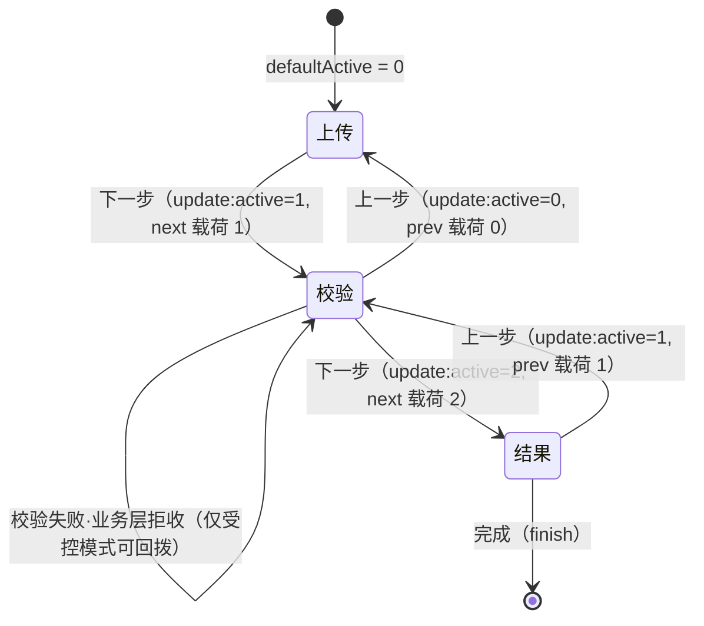
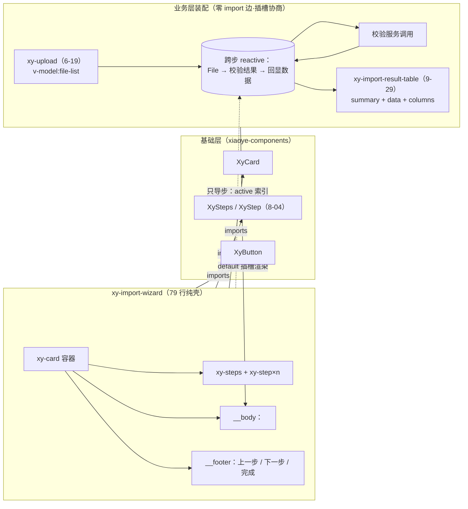

# 9-34 · ImportWizard：导入向导

本篇是「增强组件」卷（9 卷）的第三十四篇，研究对象是 `packages/pro-components/import-wizard`。大纲给这篇的核心问题是九个字：**分步上传/校验/结果的编排**。接到题目先复述一遍目标，防止写偏：一个"导入 Excel/CSV 到系统"的业务流程，天然分三段——先选文件上传，再等服务端校验并确认错误与警告，最后看导入结果。ImportWizard 要做的，是把这三段的"阶段感"装进一个组件里：步骤条画到第几步、当前步显示什么、上一步/下一步/完成三个按钮怎么走。它听起来和 9-09 的 steps-form 是同一件事，但先把三条实测事实亮出来，三条都和直觉有出入：

**第一条：向导不导数据。** `import-wizard` 全目录（`index.ts`、79 行的 `import-wizard.vue`、12 行的 `import-wizard.ts`、90 行测试）检索 `upload`、`import-result-table`、`model`、`provide`，**零命中**——它既不消费 6-19 的上传组件，也不消费 9-29 的结果表格，更没有任何跨步数据通道。步骤间传递"上传的文件→校验结果→回显数据"这条数据流，组件一寸都不参与，全部活在业务层。它只导**步**（当前索引），不导**据**（业务状态）。

**第二条：容器是 Card，不是浮层。** 大纲预案问"容器是 drawer/dialog？消费 overlay-form？"——实码定论是 `xy-card` 页面内嵌容器（`import-wizard.vue:38`），与 overlay-form 家族（9-06）零关联。真正住浮层里的分步组件是同族的 steps-form（`steps-form.vue:122` 起的 drawer/dialog 双分支）；import-wizard 恰好互补地占了"页面内嵌向导"的位置。

**第三条：这只壳曾经断过两根线，都修了。** git 考据显示，初版模板给基础层 `xy-steps` 传的是 `:items` 数组——而基础层在 items 双轨废弃战役（8-04 记载）之后专门埋了 `warnOnce` 陷阱捕获这种用法；同时初版"上一步"的事件载荷存在一个差一缺陷，根因是**先变更 computed 的依赖、再读这个 computed**。两处修复在当前实码里都留下了痕迹：`xy-step` 子件写法，和 footer 里先捕获 `prevIndex` 再变更的顺序。

本篇按这条线索走：第一节看类型面 12 行的全部协议，第二节拆 79 行的骨架与三步状态机，第三节定论"导步不导数据"的步骤间数据传递，第四节复盘 prev 差一的修复，第五节讨论失败回退策略，第六节定容器分工，第七节讲 ：items 断桥，第八节展开结果页的插槽协商，第九节过样式与测试，第十节给 Element Plus 坐标系下的对照，最后收束并预告 9-35。

## 一、类型面：12 行的全部协议

`packages/pro-components/import-wizard/src/import-wizard.ts` 全文 12 行，一个向导组件对外的全部契约就在这里：

```ts
// packages/pro-components/import-wizard/src/import-wizard.ts（全文 12 行）
export interface ImportWizardStep {
  key: string;
  title: string;
  description?: string;
}

export interface ImportWizardProps {
  title?: string;
  steps: ImportWizardStep[];
  active?: number;
  defaultActive?: number;
}
```

三个观察点。**其一，`ImportWizardStep` 是纯展示元数据**：`key/title/description` 三个字段，没有一个字符描述"这一步做什么业务"——没有 `type`（不分上传步/校验步/结果步）、没有 `component`（不挂组件）、没有 `validate`（不挂守门函数）。步骤的业务语义在类型层就被拒之门外，这是理解整只组件的钥匙：向导只理解"步骤"这个抽象，不理解"导入"这个业务。

**其二，`active` 的可选性与 9-04/9-09 一脉相承**：`active?: number` 配合 `defaultActive?: number`，`undefined` 才是非受控探针——这套"受控/非受控双模"的写法在 9-09 拆解过同款（`steps-form.vue` 的同名三件套），本篇第二节看它的实现。

**其三，类型必填与运行时兜底并存**：`steps: ImportWizardStep[]` 没有 `?`，类型上是必填；但视图层的 `withDefaults` 又给它备了 `() => []` 的运行时默认（`import-wizard.vue:12`）。类型必填拦住 TS 层的漏传，运行时兜底接住类型逃逸（JS 调用、动态 props）的漏网——双保险，代价是 API 文档必须写清楚"必填"以运行时为准还是以类型为准。

组件的安装入口 `import-wizard/index.ts` 全文 9 行，同样薄得对称：

```ts
// packages/pro-components/import-wizard/index.ts（全文 9 行）
import ImportWizard from "./src/import-wizard.vue";
import type { ImportWizardProps, ImportWizardStep } from "./src/import-wizard";
import { withInstall } from "xiaoye-primitives";

export type { ImportWizardProps, ImportWizardStep };

export const XyImportWizard = withInstall(ImportWizard, "xy-import-wizard");

export default XyImportWizard;
```

`withInstall` 注册 `xy-import-wizard`，类型出口只有 `ImportWizardProps` 与 `ImportWizardStep` 两个——没有 Instance 类型，这个缺席在第五节会变成一个实打实的代价。

增强层根入口的账目同步核对：`packages/pro-components/exports.ts:30` 导出 `XyImportWizard`，`index.ts:118-123` 导出两个类型，`component-manifest.json:235-240` 的条目登记 `docsGroup: "workflow"`、安装检查 `xy-import-wizard`、样式入口 `import-wizard`，`scripts/check-pro-components.mjs:55` 把根入口类型白名单钉在 `["ImportWizardProps", "ImportWizardStep"]`——四个入口一处不少，与 9-01 讲的双重守卫完全对齐。

## 二、视图面：79 行的骨架与三步状态机

`packages/pro-components/import-wizard/src/import-wizard.vue` 当前实态 79 行。脚本段全文 35 行：

```vue
<!-- packages/pro-components/import-wizard/src/import-wizard.vue:1-35（脚本段全文） -->
<script setup lang="ts">
import { ref, computed } from "vue";
import { XyButton, XyCard, XyStep, XySteps } from "xiaoye-components";
import type { ImportWizardProps } from "./import-wizard";

defineOptions({
  name: "XyImportWizard"
});

const props = withDefaults(defineProps<ImportWizardProps>(), {
  title: "导入向导",
  steps: () => [],
  active: undefined,
  defaultActive: 0
});

const emit = defineEmits<{
  "update:active": [value: number];
  next: [value: number];
  prev: [value: number];
  finish: [];
}>();

const innerActive = ref(props.defaultActive);
const activeBridge = computed(() => props.active ?? innerActive.value);
const currentStep = computed(() => props.steps[activeBridge.value]);

function updateActive(value: number) {
  if (props.active === undefined) {
    innerActive.value = value;
  }

  emit("update:active", value);
}
</script>
```

三件套——`innerActive`（内部态）、`activeBridge`（受控/非受控的合流 computed）、`updateActive`（唯一变更入口，内部态只在非受控分支变更、`update:active` 永远发射）——与 9-09 引用过的 `import-wizard.vue:24-34` 完全一致。注意第三行：`XyButton, XyCard, XyStep, XySteps` 四个消费对象全部来自基础层 `xiaoye-components`（`XyStep` 在列，因为模板用的是子件声明式，第七节会讲到这曾是断桥修复的痕迹），增强层依赖基础层、不依赖浮层家族，这条 import 边就是"容器定论"的第一证词。

模板段 43 行（37-79）：

```vue
<!-- packages/pro-components/import-wizard/src/import-wizard.vue:37-79（模板段全文） -->
<template>
  <xy-card class="xy-import-wizard" :header="props.title">
    <xy-steps :active="activeBridge">
      <xy-step
        v-for="step in props.steps"
        :key="step.key"
        :title="step.title"
        :description="step.description"
      />
    </xy-steps>
    <div class="xy-import-wizard__body">
      <slot :step="currentStep" :active="activeBridge" />
    </div>
    <div class="xy-import-wizard__footer">
      <xy-button
        :disabled="activeBridge === 0"
        @click="
          () => {
            const prevIndex = activeBridge - 1;
            updateActive(prevIndex);
            emit('prev', prevIndex);
          }
        "
      >
        上一步
      </xy-button>
      <xy-button
        v-if="activeBridge < props.steps.length - 1"
        type="primary"
        @click="
          () => {
            const nextIndex = activeBridge + 1;
            updateActive(nextIndex);
            emit('next', nextIndex);
          }
        "
      >
        下一步
      </xy-button>
      <xy-button v-else type="primary" @click="emit('finish')">完成</xy-button>
    </div>
  </xy-card>
</template>
```

骨架四层：`xy-card` 打底（`header` 吃 `title`，5-10 的容器插槽约定在这里只剩头部）；`xy-steps` 画步骤条（`:active` 吃合流索引，`xy-step` 子件用 `v-for` 声明——8-04 的注册模式消费方）；`__body` 里**一个**作用域插槽（47-49 行）；`__footer` 里三个按钮排成前进/后退/完成。9-29 考据时引过 47-49 行，这里把它的含义说透：body 的插槽作用域只有两项——`step`（当前步的元数据对象，越界时是 `undefined`，所以文档 API 表写 `step: ImportWizardStep | undefined`）和 `active`（当前索引）。**没有每步一个具名插槽，没有数据通道，没有 provide**。

三个按钮的守门条件值得逐句读：上一步在索引 0 时 disabled；下一步在 `activeBridge < props.steps.length - 1` 时显示，否则换成"完成"。事件时序是 `update:active` 先行、`next`/`prev` 跟进——前者是受控协议（"我请求变成这个值"），后者是行为通知（"确实前进了"），载荷都是**目标索引**。9-09 对照 steps-form 时指出过这层并存语义，本篇第五节会看到它在回退策略里的真实代价。还有一个文档没写的边界：`steps` 为空数组时，`0 < -1` 为假，footer 走 `v-else` 分支直接渲染"完成"按钮——一个零步向导的可用动作是"完成"，`emit('finish')` 照常发射。

把三步编排画成状态机——组件自身的转移边只有 `next/prev/finish`，虚线那条"校验失败回退"是业务层在受控模式下才能画出的边（第五节展开）：



注意这张图里组件画不出的东西：三个节点叫"上传/校验/结果"只是业务层的命名（`ImportWizardStep.title`），组件眼里的状态机是"索引 0/1/2"的整数自转——**步进器不知道自己在步进什么**。

组件的装配关系与数据流向是本篇第二节到第八节的总纲，画成第二张图：



实线是代码里真实存在的 import 边与插槽边，虚线是唯一的"导"——索引。数据流 `File → 校验结果 → 回显数据` 整条画在业务层舱里，向导的手从头到尾没碰过它。

## 三、核心问题：步骤间的数据传递，答案是"零通道"

大纲预设的问题"步骤间的数据传递（上传的文件→校验结果→回显数据）怎么编排"，实码给出的答案出乎意料地干脆：**组件不提供任何通道，因此这条数据流在组件内不存在**。逐项核对排除法：

- **没有 `model` prop**：`ImportWizardProps` 四个字段里没有一个装业务数据（对照 steps-form 的 `model: Record<string, unknown>`，`steps-form.ts:13`）。
- **没有 provide/inject**：脚本段只有 `provide` 之外的零依赖（35 行里连 `provide` 这个词都不出现），而基础层 steps 的父组件靠 `provide(stepsContextKey, ...)` 下发协议——import-wizard 连自己的 context 都没有。
- **没有每步具名插槽**：body 只有一个 default 插槽，三个步骤共用，业务层自己拿 `active` 写 `v-if` 切换。
- **插槽作用域只有元数据**：`{ step, active }`——`step` 是标题与描述，`active` 是索引，没有第 OPTIONS。

于是"上传的文件"这个对象从产生到消费的旅程是：`xy-upload` 的 `v-model:file-list` 把它接进业务层的 reactive 状态舱（6-19 的完全受控队列设计在这里兑现红利——文件队列既然完全受控，业务层天然持有它，不需要向导代持）。上传步最自然的消费对象，其受控队列协议面在 `packages/components/upload/src/upload.ts:50-85`：

```ts
// packages/components/upload/src/upload.ts:50-85（UploadProps 全文）
export interface UploadProps {
  fileList?: UploadFileItem[];
  action?: string;
  headers?: Record<string, string | number | boolean | null | undefined>;
  method?: string;
  data?:
    | Awaitable<Record<string, unknown>>
    | ((file: UploadRawFile) => Awaitable<Record<string, unknown>>);
  name?: string;
  accept?: string;
  multiple?: boolean;
  limit?: number;
  disabled?: boolean;
  drag?: boolean;
  directory?: boolean;
  paste?: boolean;
  tip?: string;
  size?: ComponentSize;
  autoUpload?: boolean;
  showFileList?: boolean;
  withCredentials?: boolean;
  listType?: UploadListType;
  beforeUpload?: (
    file: UploadRawFile
  ) => Awaitable<boolean | void | null | undefined | File | Blob>;
  beforeRemove?: (file: UploadFileItem, files: UploadFileItem[]) => Awaitable<boolean>;
  onRemove?: (file: UploadFileItem, files: UploadFileItem[]) => void;
  onChange?: (file: UploadFileItem, files: UploadFileItem[]) => void;
  onPreview?: (file: UploadFileItem) => void;
  previewFile?: (file: UploadFileItem) => Awaitable<string | undefined>;
  onSuccess?: (response: unknown, file: UploadFileItem, files: UploadFileItem[]) => void;
  onProgress?: (event: UploadProgressEvent, file: UploadFileItem, files: UploadFileItem[]) => void;
  onError?: (error: Error, file: UploadFileItem, files: UploadFileItem[]) => void;
  onExceed?: (files: File[], filesList: UploadFileItem[]) => void;
  httpRequest?: UploadRequestHandler;
}
```

`fileList` 是普通可选 prop，没有任何"注册到父组件"的语义——文件队列的所有权从一开始就设计在调用方手里。这正是"向导不导据"能成立的前提：如果 upload 的队列是内部私有态（EP 老版本的路线），跨步传递就得靠向导开数据通道把队列"交"出来，壳的复杂度立刻翻倍；受控队列让业务层自己就是队列的主人，向导只是舞台。"校验结果"由业务层在校验步调用服务后写回同一个 reactive；"回显数据"在结果步从同一个 reactive 读出交给结果表格。向导在这个旅程里的全部参与，是决定**此刻该渲染哪一段**——`active` 是几，body 就渲染谁。

**权衡一：导步不导数据 vs 向导代持数据。** 假设另一种设计：ImportWizard 提供 `model`（或 `stepData: unknown[]` 按步分舱），footer 的"下一步"把当前步数据收进舱内再前进，"上一步"再交还。收益是业务层少维护一个跨步状态对象；代价有三——向导必须理解"每步的数据形状"（类型从 `ImportWizardStep` 膨胀成泛型容器，9-04 泛型组件的复杂度整套进场）；数据归属产生二义（上传步的 file-list 到底归 upload 还是归向导舱，6-19 的受控队列与向导舱会打架）；步骤语义被数据通道焊死（想加一个纯展示的"确认"步，也得往舱里塞一个空格子）。79 行的选择是把这些复杂度全部留在使用现场——组件只承诺"索引什么时候变"，数据自管。这不是偷懒：`ImportWizardStep` 三个字段的极简类型就是证据，向导的抽象被刻意钉死在"步骤元数据 + 索引"这个最小面上。

文档对这条边界是诚实的。`apps/docs/pro-components/import-wizard.md:22-25` 的"当前边界"一节明说："当前不包含文件上传、解析进度和失败修复工作流""真实导入逻辑仍需页面层或专门上传组件承接"。官方示例 `apps/docs/examples/pro/import-wizard/basic.vue` 全文 19 行，三步内容是三句文字，连 upload 都没放——这份克制本身就是设计表态：

```vue
<!-- apps/docs/examples/pro/import-wizard/basic.vue（全文 19 行） -->
<script setup lang="ts">
const steps = [
  { key: "upload", title: "上传文件", description: "选择待导入文件" },
  { key: "check", title: "校验数据", description: "确认错误与警告" },
  { key: "done", title: "完成导入", description: "查看最终结果" }
];
</script>

<template>
  <xy-import-wizard title="成员导入" :steps="steps">
    <template #default="{ active }">
      <xy-card :header="`当前步骤 ${active + 1}`">
        <span v-if="active === 0">上传成员模板并确认文件格式。</span>
        <span v-else-if="active === 1">校验字段映射与必填项。</span>
        <span v-else>导入完成后可继续查看结果表格。</span>
      </xy-card>
    </template>
  </xy-import-wizard>
</template>
```

这就是"三步编排"在官方物料里的全部：步骤数组三行（`upload/check/done` 三个 key 正是"上传→校验→结果"的命名定论），插槽里一个 `v-if/v-else-if/v-else` 切三段。注意示例拿到的作用域只有 `active`——连 `step` 都没用上，因为"当前步显示什么"的判断用索引最直接。

## 四、prev 差一：一次"先变更、后读取"的失效读

当前模板的 footer 里有一处新手看不懂的写法：上一步的点击处理器先 `const prevIndex = activeBridge - 1` 捕获一个局部常量，再用它调用 `updateActive(prevIndex)` 和 `emit('prev', prevIndex)`（53-58 行）。为什么不直接写两次 `activeBridge - 1`？因为初版就是这么写的，而且写出了一个真实的差一缺陷。git 考据初版的点击属性（git `a32e399`，`import-wizard.vue:55-60`，原文缩进）：

```vue
<!-- 旧版（git a32e399，import-wizard.vue:55-60）：上一步的点击处理器，无先捕获 -->
        @click="
          () => {
            updateActive(activeBridge - 1);
            emit('prev', activeBridge - 1);
          }
        "
```

两行都读 `activeBridge`，看起来对称、无害。但在非受控模式下走一遍：设当前索引为 2。第一行调用 `updateActive(1)`，函数体内 `innerActive.value = 1`——`activeBridge` 是 `computed(() => props.active ?? innerActive.value)`，此刻依赖已变更，computed 被标记为脏。第二行再读 `activeBridge`，computed **重新求值**，返回 1；于是 `emit('prev', 1 - 1)` 发射的载荷是 **0**——而"从 2 退到 1"的正确载荷应是 1。每一次 prev 都比目标索引少一。同版本代码里"下一步"的处理器却是先捕获 `const nextIndex = activeBridge + 1` 再变更再发射（git a32e399 的 next 段与现版同构），所以 next 无恙——同一段模板里两个处理器，一个先捕获后变更，一个先变更后读取，差一缺陷只住在后者。

对照测试把这颗钉子钉死了（`__tests__/import-wizard.spec.ts:50-69`）：

```ts
// packages/pro-components/import-wizard/__tests__/import-wizard.spec.ts:50-69
  it("非受控模式从索引 2 点上一步，prev 载荷为 1", async () => {
    const wrapper = mount(XyImportWizard, {
      props: {
        defaultActive: 2,
        steps: [
          { key: "confirm", title: "确认导入" },
          { key: "upload", title: "上传文件" },
          { key: "result", title: "完成" }
        ]
      }
    });

    await wrapper
      .get(".xy-import-wizard__footer .xy-button:not(.xy-button--primary)")
      .trigger("click");
    await nextTick();

    expect(wrapper.emitted("prev")?.[0]?.[0]).toBe(1);
    expect(wrapper.emitted("update:active")?.[0]?.[0]).toBe(1);
  });
```

用例名直接写成规格："prev 载荷为 1"。`defaultActive: 2` 起步、点一次上一步，断言 `prev` 与 `update:active` 的载荷都是 1——旧代码在这里会发射 0，测试必红。71-89 行还有一组对称用例（`defaultActive: 1` 起步断言载荷 0），把"载荷=目标索引"从单点钉成线。

**权衡二：先捕获后变更，还是事件即裁决？** 这次的修复把"读旧值"的职责显式化——在变更 computed 依赖**之前**把目标值捕获成常量，变更与发射共享同一份不可变的快照。这个模式值得写进所有"computed 派生自可变内部态、事件又要携带派生值"的组件的手册：Vue 的 computed 是**失效后惰性重算**，不提供读旧值的 API，"改了再读"读到的必然是新值。更深的账在导航语义本身：`next`/`prev` 与 `update:active` 载荷相同、时序相随（前者总是紧跟着后一个 `update:active` 发射），看似冗余，实际分工是——`update:active` 是受控协议，v-model 消费它；`next`/`prev` 是行为通知，埋点、日志、按方向刷新数据的副作用消费它。但它们都**不是裁决**：事件发射时索引已经变更，监听方无法在事件里说"不许走"。要拦截，只能走受控模式把 `active` 握在手里（第五节）。9-09 的 steps-form 把同样的三件套收进 `next/prev` 两个 async 函数并 `defineExpose`，能被 ref 直接驱动；import-wizard 没有 expose，外部唯一的驱动面就是模板里那三个按钮和 `v-model:active`——壳的体量决定了它不需要命令式句柄，但代价也在第五节显形。

## 五、失败回退：无守门的下一步与受控回退

大纲问"校验失败回到上传步？"——先看组件给的能力，再看业务层要补的胶水。组件侧的实码定论是：**"下一步"没有任何守门**。点击处理器是内联箭头函数，无校验、无异步、无条件前进；没有 `before-next` 之类的裁决钩子，没有 loading 态锁按钮。对比同族的 steps-form，同一段导航逻辑长这样（`packages/pro-components/steps-form/src/steps-form.vue:68-88`）：

```ts
// packages/pro-components/steps-form/src/steps-form.vue:68-88（next/prev 守门段）
async function next() {
  const valid = await formRef.value?.validate();

  if (!valid || activeBridge.value >= props.steps.length - 1) {
    return;
  }

  const nextIndex = activeBridge.value + 1;
  updateActive(nextIndex);
  emit("next", nextIndex);
}

async function prev() {
  if (activeBridge.value <= 0) {
    return;
  }

  const nextIndex = activeBridge.value - 1;
  updateActive(nextIndex);
  emit("prev", nextIndex);
}
```

steps-form 的 `next` 先 `await formRef.value?.validate()`，校验不过直接 `return`——**守门长在组件里**，因为它有 `model`、有表单体、有 6-17 的校验编排可以委托。它的 submit 与 expose 面同样完整（`steps-form.vue:90-118`）：

```ts
// packages/pro-components/steps-form/src/steps-form.vue:90-118（submit/expose 段）
async function submit() {
  if (props.readonly) {
    return;
  }

  const valid = await formRef.value?.validate();

  if (!valid) {
    return;
  }

  emit("submit", cloneProValue(props.model));
}

function close() {
  emit("update:open", false);
}

function handleCancel() {
  emit("cancel");
  close();
}

defineExpose({
  next,
  prev,
  submit,
  close
});
```

import-wizard 没有这些，守门无从谈起：它不知道"这一步做什么"，自然不知道"这一步能不能过"。于是业务层的校验失败回退只有一条正路：**受控模式**。

```vue
<!-- 示意代码：受控模式的校验失败回退，非仓库实码。 -->
<script setup lang="ts">
import { ref, reactive } from "vue";

const active = ref(0);
const wizard = reactive({
  fileList: [] as UploadFileItem[],
  report: null as CheckReport | null
});

async function runCheck() {
  wizard.report = await checkImport(wizard.fileList);
  if (wizard.report.errors.length > 0) {
    active.value = 0;              // 业务层主动回拨：回到上传步改文件
  }
}
</script>

<template>
  <xy-import-wizard v-model:active="active" title="成员导入" :steps="steps">
    <template #default="{ active: step }">
      <xy-upload v-if="step === 0" v-model:file-list="wizard.fileList" drag />
      <check-report v-else-if="step === 1" :report="wizard.report" @recheck="runCheck" />
      <xy-import-result-table v-else :summary="wizard.report!.summary" ... />
    </template>
  </xy-import-wizard>
</template>
```

（这段是胶水示意，`UploadFileItem`/`checkImport` 等符号按业务层实际替换。）机制上的要点：`v-model:active` 之后，`active` 的所有权归业务层，向导每次前进都先 `emit('update:active')` 征求变更；校验失败的"回退"不是向导做的，是业务层把 `active` 拨回 0——向导对此的唯一感知是下一次渲染时索引变了。组件侧唯一自带的回退能力是 footer 的"上一步"按钮（索引 0 时 disabled），它是无条件的、人工的，也正因为无条件，"校验失败"用户至少永远能手动退回上一步改东西——**手动回退组件管够，自动回退全靠受控**。

**权衡三：守门内置 vs 守门外置。** steps-form 把守门内置（validate 不过不走），因为表单校验是它的本职；import-wizard 把守门外置，因为"校验"在导入流程里不是前端表单校验，而是一次可能持续数秒的服务端调用——把异步裁决钩子（`before-next: () => Promise<boolean>`）内置进 79 行的壳，就要处理竞态（连点两次、回调迟到后索引已变）、loading 呈现、错误提示归属，壳的体量会翻倍。外置的代价是业务层必须用受控模式才拦得住，非受控模式下"下一步"永远前进——所以本库对 import-wizard 的隐含推荐其实是：**凡是第二步依赖异步校验的真实导入，一律受控**；非受控留给纯展示的"确认"类流程。这也是为什么组件没有 Instance 类型、没有 expose：它的命令式驱动面（前进/后退/回拨）在受控模式下天然由 `active` 这个变量承担，`ref` 句柄是多余的。

## 六、容器定论：Card，而不是浮层

大纲预案问"容器 drawer/dialog？消费 overlay-form？"——实码一行定论：`xy-card`。38 行 `<xy-card class="xy-import-wizard" :header="props.title">`，导入步骤的整个舞台是一个页面内的卡片，不是浮出来的抽屉或对话框。三条佐证：其一，脚本段只 import 了 `XyButton, XyCard, XyStep, XySteps`（第 3 行），overlay-form 家族（9-06 的 `XyOverlayForm`、7-16 的 dialog、7-17 的 drawer）一个都没进来；其二，`packages/theme/src/pro/import-wizard.css` 全文 11 行（第九节引全文），没有任何浮层相关的类名或 z-index；其三，`component-manifest.json:235-240` 的条目里没有浮层装配字段。

这个选择和 steps-form 恰好拼成同族的完整分工。steps-form 的容器是 `xy-drawer`/`xy-dialog` 双分支（`steps-form.vue:122` 起），`placement` prop 切换——它定位"从当前页面浮出来完成一段分步录入"，结束时关闭浮层回原页面。import-wizard 定位"导入是一段工作流，值得一个页面级舞台"——上传大文件、等待服务端校验、翻看几百行错误明细，这些动作在浮层里都很局促。两兄弟共享同一套导航三件套（9-09 已考据 `import-wizard.vue:24-34` 与 steps-form 同构），却在容器维度一浮一嵌、在数据维度一有一无、在守门维度一门一无：

| 维度 | steps-form（9-09） | import-wizard（9-34） |
| --- | --- | --- |
| 容器 | drawer/dialog 浮层 | xy-card 页面内嵌 |
| 数据 | `model` + 步间模型共享 | 零通道，业务层自持 |
| 守门 | validate 内置 | 无守门，受控回退 |
| 提交 | `submit` + 克隆快照 | `finish` 裸事件 |
| 句柄 | `defineExpose` 四个 | 无 expose |

**权衡四：页面内嵌 vs 浮层复用。** 让 import-wizard 也走 overlay-form（比如 `formType` 多一个 "wizard"）的收益是容器能力白得：append 到 body、滚动锁、焦点陷阱（4-07）全套。代价是导入流程被绑进"表单提交"的语义框——overlay-form 家族的一切都围绕"打开-填写-提交/取消"的生命周期，而导入向导的 finish 之后往往还有"查看结果"甚至"再导一次"，生命周期不是对话框型的。Card 打底让向导成为页面布局的一等公民：可以嵌在 tab 里、可以和筛选区并排、可以三步拆给三个路由段共用一个壳。EP 的 `el-steps` 同样不管容器，EP 生态里"浮层向导"要自己拿 el-dialog 包——本库让两种容器各归其主，消费方按业务语义选，而不是让一个组件硬吃两种生命周期。

## 七、:items 断桥：与基础层 steps 的契约

第二节模板里 `xy-steps` 的写法是 `xy-step` 子件 `v-for`。这看起来天经地义，git 史却显示初版不是这样——初版给 `xy-steps` 传的是 `:items`（git `a32e399`，`import-wizard.vue:39-48`，原文缩进）：

```vue
<!-- 旧版（git a32e399，import-wizard.vue:39-48）：步骤条的数据驱动写法 -->
    <xy-steps
      :active="activeBridge"
      :items="
        props.steps.map((step) => ({
          key: step.key,
          title: step.title,
          description: step.description
        }))
      "
    />
```

`props.steps` 映射成 items 数组喂给步骤条——数据驱动，省模板。但基础层在 8-04 记载的 items 双轨废弃战役之后，把 `items` 从正式 API 降级成了**陷阱 prop**：`packages/components/steps/src/steps.ts:8-21` 现在长这样——

```ts
// packages/components/steps/src/steps.ts:8-21
export interface StepsProps {
  space?: number | string;
  active?: number;
  direction?: StepsDirection;
  alignCenter?: boolean;
  simple?: boolean;
  finishStatus?: StepsStatus;
  processStatus?: StepsStatus;
  /**
   * 仅用于开发期捕获误用：XySteps 不支持 items prop。
   * @deprecated 请使用默认插槽渲染 XyStep。
   */
  items?: unknown;
}
```

`items?: unknown` ——一个类型是 unknown、注释自认"仅用于开发期捕获误用"的 prop，配上 `steps.vue:26-28` 的守卫：`if (props.items !== undefined) { warnOnce("XySteps", "不支持 items prop，请使用默认插槽渲染 XyStep。") }`。步骤条子项走的是 5-04/8-04 的注册模式，注册与协议下发的正文在 `steps.vue:95-136`：

```ts
// packages/components/steps/src/steps.vue:95-136（注册表与协议下发段）
function addStep(step: StepState) {
  if (steps.value.some((item) => item.uid === step.uid)) {
    return;
  }

  steps.value = [...steps.value, step];
  sortSteps();
}

function removeStep(uid: number) {
  steps.value = steps.value.filter((item) => item.uid !== uid);
  sortSteps();
}

watch(
  () => props.active,
  (newValue, oldValue) => {
    emit("change", newValue, oldValue);
  }
);

provide(stepsContextKey, {
  active,
  direction,
  alignCenter,
  simple,
  space,
  finishStatus,
  processStatus,
  steps,
  addStep,
  removeStep,
  orderSteps: queueSortSteps
});

onMounted(() => {
  sortSteps();
});

onUpdated(() => {
  queueSortSteps();
});
```

`XyStep` 挂载时 `addStep` 进注册表、按 DOM 位置排序、分配 index、自己派生状态；items 模式下子项是父组件自造的 vnode，不进注册表，index 与状态机全盘失效。所以"断桥"的本质不是 API 改名，是**两套子项机制里数据驱动那套被拆掉了**——基础层拆轨后，所有还在用 `:items` 的消费方（import-wizard 是其中之一）被 `warnOnce` 逐个抓出来迁移。

迁移后的写法把 `props.steps` 的映射从"父组件造 vnode"改回"插槽声明"：`:key`/`:title`/`:description` 三个绑定逐字段透传。顺带的收益是类型对齐——旧版 `.map` 的对象字面量没有类型标注，新版 `xy-step` 的 props 类型由基础层把关。这条断桥给 AI 协作研发的启示很具体：**跨包的 API 废弃，废弃方（基础层）埋陷阱比变更方（增强层）逐个排查更可靠**——`warnOnce` 在开发期把所有漏网消费方炸出来，8-04 的"废弃战役"之所以能收敛，靠的就是这个机制。知识矩阵的 I34 条目（`column/01-知识点全集矩阵.md:209`）把":items 断桥与 prev 差一均已修复"记在这只组件名下，两条修复在当前实码里的痕迹就是本节的 `xy-step` 写法与上一节的 `prevIndex` 捕获。

## 八、结果页插槽协商：9-29 的续篇

9-29 从结果表格侧考据过：`packages/pro-components/import-result-table/` 全目录检索 `import-wizard` 零命中，`import-wizard` 目录检索 `import-result-table` 也零命中——两个组件之间**没有任何 import 边**，文档里"导入向导的最后一步放结果表格"（`apps/docs/pro-components/import-result-table.md:13`）是建议用法而非代码事实。本篇从向导侧补完这个考据的另一半：向导侧零消费是**设计使然**，不是待办。回想第一节的类型定论：`ImportWizardStep` 没有 `type` 字段，向导不理解"结果步"这个概念；如果内置结果协议（`type: "result"` 命中时自动渲染 `XyImportResultTable` 并吃进 summary），收益是开箱即用，代价是 9-29 已清算过的三条——两个组件锁死双向 import 依赖、步骤数被协议固化（两步向导、四步"上传→映射→校验→结果"都要绕协议）、结果页形态被单一组件垄断。

插槽协商让两个组件都保持独立可用：import-result-table 自己也是"汇总条 + ProTable"的独立成品，模板段（`import-result-table.vue:39-48`）看不到任何向导痕迹：

```vue
<!-- packages/pro-components/import-result-table/src/import-result-table.vue:39-48（模板段全文） -->
<template>
  <div class="xy-import-result-table">
    <div v-if="props.summary" class="xy-import-result-table__summary">
      <xy-tag status="primary">总数 {{ props.summary.total }}</xy-tag>
      <xy-tag status="success">成功 {{ props.summary.success }}</xy-tag>
      <xy-tag status="danger">失败 {{ props.summary.failed }}</xy-tag>
    </div>
    <pro-table-renderer />
  </div>
</template>
```

汇总条只在 `props.summary` 就位时出现——组件不依赖"批次数据必然存在"，它对"结果还没来"的全部应对就是隐藏汇总条，9-29 的 62 行成品由此保持独立可用，不挂在任何向导名下；import-wizard 保持 79 行纯粹。代价是装配胶水业务层自己写——第三节的示意代码里那一段 `<xy-import-result-table v-else :summary="..." />` 就是全部胶水。这层协商还有个常被忽略的时序细节：结果步渲染时，`wizard.report` 必须已经就位，而向导不保证"到达最后一步时数据已就绪"（它连数据都不知道）——业务层要么在校验步拦住不放行（第五节的受控回退），要么在结果步里对 `report` 判空给 loading/Empty（7-07）。**插槽协商把"到达"与"就绪"两个正交问题拆开了**：向导只管到达，就绪是数据层的事。这个拆分在浮层向导方案里会被生命周期搅在一起（浮层一关全清），Card 内嵌 + 插槽协商的组合反而让每一步的数据就绪语义各自独立。

## 九、样式与测试：11 行 CSS 和 90 行断言

`packages/theme/src/pro/import-wizard.css` 全文 11 行：

```css
/* packages/theme/src/pro/import-wizard.css（全文 11 行） */
.xy-import-wizard__body {
  margin-top: 18px;
}

.xy-import-wizard__footer {
  display: flex;
  justify-content: flex-end;
  gap: 12px;
  margin-top: 18px;
}
```

一个增强层组件的主题文件薄到只剩两个布局类——`__body` 的上间距和 `__footer` 的右对齐按钮排布。步骤条、卡片、按钮的全部视觉都由基础层各自的 CSS 承担（`packages/theme/src/components/steps.css` 等），增强层只出"组合排版"的份子。样式注册链也核对过：`packages/pro-components/style.css:31` 一行 `@import "../theme/src/pro/import-wizard.css"` 聚合进增强层样式入口，manifest 的 `styleImports: ["import-wizard"]` 与之对应——9-01 讲的"清单驱动样式聚合"在这里是最小实例。对照 steps-form.css（浮层向导要管抽屉内的布局），这 11 行是"Card 容器定论"在样式层的余波：没有浮层，就没有浮层的样式债。

测试 `__tests__/import-wizard.spec.ts` 全文 90 行、4 个用例，实跑全绿（`vitest run packages/pro-components/import-wizard`：4 passed）。除第四节引过的 prev 载荷两连（50-69、71-89），前两个用例：

```ts
// packages/pro-components/import-wizard/__tests__/import-wizard.spec.ts:7-48
  it("支持渲染步骤并推进下一步", async () => {
    const wrapper = mount(XyImportWizard, {
      props: {
        steps: [
          {
            key: "confirm",
            title: "确认导入"
          }
        ]
      },
      slots: {
        default: ({ step }: { step: { title: string } }) =>
          h("div", { class: "wizard-slot" }, step.title)
      }
    });

    expect(wrapper.text()).toContain("确认导入");

    await wrapper.get(".xy-button--primary").trigger("click");
    await nextTick();

    expect(wrapper.emitted("finish")).toHaveLength(1);
  });

  it("步骤条真实渲染 xy-step 节点", () => {
    const wrapper = mount(XyImportWizard, {
      props: {
        steps: [
          { key: "confirm", title: "确认导入" },
          { key: "upload", title: "上传文件" },
          { key: "result", title: "完成" }
        ]
      }
    });

    expect(wrapper.findAll(".xy-steps__item")).toHaveLength(3);
    expect(wrapper.findAll(".xy-steps__title").map((node) => node.text())).toEqual([
      "确认导入",
      "上传文件",
      "完成"
    ]);
  });
```

用例一有个聪明的减法：单步向导点主按钮——单步时 footer 走 `v-else` 分支直接是"完成"，**一次点击同时验证了"primary 按钮在末步是完成"的分支选择与 finish 事件**，省掉两步导航的样板。用例二断言到 `.xy-steps__item`/`.xy-steps__title` 的真实 DOM——钉住的是第七节那条修复后的链路：`xy-step` 子件真进了基础层注册表并渲染出来（`:items` 断桥时期这条断言会挂）。用例三、四的按钮选择器也值得看一眼：`.xy-button:not(.xy-button--primary)` 精确绕开主按钮拿"上一步"——footer 里两个非主按钮类名相同，选择器按"非 primary"语义选，比 nth-child 稳。

盲区与体量同样清楚，三件事没有断言：**`next` 事件零覆盖**（用例一在单步向导里点的是"完成"，多步向导的"下一步"点击从未发生，`next` 载荷语义只活在第四节引用的源码里）；**受控模式零覆盖**（没有一个用例传入 `active` prop——`updateActive` 里 `props.active === undefined` 的另一条分支、以及"受控时 innerActive 不变"的行为，全无断言）；**插槽作用域的 `step` 字段零断言**（两个用例只用 `active` 或自造 step）。第四节的 prev 差一能被钉死，靠的恰是"载荷语义写进用例名"这条纪律——`next` 与受控分支至今没有同等待遇，这是本组件测试面最值得补的两针。

## 十、EP 对照

以 Element Plus 2.x 公开 API 为参照。EP 没有导入向导组件：`el-steps`/`el-step` 提供步骤条（与 `xy-steps` 同为插槽声明式，且 EP 从未提供过 items 数据驱动轨——本库基础层的 items 双轨是自作自受后的自废武功），`el-upload` 提供文件上传，"上传→校验→结果"的编排要业务方自己拼 `el-steps` + 条件渲染 + 按钮区，没有导航壳可复用。本库的 ImportWizard 把"导航壳"（步骤条联动、footer 三钮、双模索引）抽成了 35 行脚本 + 43 行模板的可复用件，把"内容与数据"完全留给插槽——与 EP 生态常见的"每个业务自己抄一遍 steps 联动"相比，壳的一次成型至少消灭了每业务 50 行的样板与各自的差一 bug（第四节那种）。EP 的 `el-steps` 有 `process-status`/`finish-status` 等状态定制，`xy-steps` 也有（`steps.ts:2` 的五个状态字面量）；差异在编排层——EP 的 `el-steps` 假设调用方自己管 active，本库的 import-wizard 在此之上多给了受控/非受控双模与 `next/prev/finish` 的行为事件。横向再看 Ant Design 的 ProComponents：其 StepsForm 是浮层与页面双容器、与表单校验深度绑定——本库选择把"浮层分步表单"（steps-form）与"页面分步向导壳"（import-wizard）拆成两个组件，而不是一个组件吃两种角色，代价是 import-wizard 显得"什么都没干"，收益是它真的什么都能装。

## 收束

把 79 行收成本篇三句话。**第一句，向导只导步不导据**：步骤间数据传递的全部答案是一个只含 `{ step, active }` 的作用域插槽，File→校验结果→回显数据整条流活在业务层 reactive 里，`ImportWizardStep` 的三字段类型把这个抽象钉死在元数据层。**第二句，前进无守门，回退靠受控**：footer 的"下一步"无条件前进（对照 steps-form 的 validate 内置），校验失败的自动回退必须走 `v-model:active`——组件连 expose 都没有，受控变量就是全部命令式接口；prev 差一的修复则把"先捕获后变更"写进了这只壳的骨相。**第三句，Card 打底、插槽协商**：容器定论是页面内嵌而非浮层（与 steps-form 一浮一嵌拼齐同族分工），与 upload、import-result-table 全部零 import 边——理解"导入"这个业务的，从头到尾是业务层那几十行装配胶水。四个权衡彼此咬合：因为不导据，才能不守门（数据就绪是业务层的事）；因为不守门，才能 79 行；因为 79 行，容器才轻到只剩 Card 与 11 行 CSS；因为插槽协商，三步的内容（upload、校验报告、结果表）才各自保持独立可复用。

下一篇 9-35《ExportTaskPanel：导出任务》把视角从"导入"翻到镜像的"导出"：`packages/pro-components/export-task-panel` 的 `ExportTaskItem` 带着 `status: "waiting" | "processing" | "success" | "error"` 与 `progress?: number` 两个字段（`export-task-panel.ts:4-5`），54 行的组件如何呈现异步任务的排队/进行/成败——导出没有"步骤"，只有"进度"，同一批业务动作用另一种时间形态收口。

---

**考据与行号核对说明**：本文所有路径与行号均按当前工作区实态核对。`import-wizard.vue` 实测 79 行（脚本段 1-35 全文、模板段 37-79 全文；footer prev 按钮处理器在 51-62，先捕获 `prevIndex` 在 55 行；`__body` 插槽在 47-49——与 9-09 引用的 24-34/37-79、9-29 引用的 37-62/47-49 完全一致，无行号漂移）；`import-wizard.ts` 12 行全文引用；`import-wizard/index.ts` 9 行全文引用；`import-wizard.spec.ts` 90 行 4 用例，引用 7-48 与 50-69 两段，`pnpm vitest run packages/pro-components/import-wizard` 实跑 4 passed；`packages/theme/src/pro/import-wizard.css` 11 行全文引用，`packages/pro-components/style.css:31` 聚合引入；`packages/components/steps/src/steps.vue` 143 行（items 陷阱守卫在 26-28、注册与协议下发段引用 95-136）、`steps.ts` 21 行（8-21 全文，`items?: unknown` 在 16-21）；`steps-form.vue` 222 行（next/prev 守门段引用 68-88、submit/expose 段引用 90-118）；`upload.ts` 176 行（UploadProps 全文引用 50-85，`fileList` 在 51）；`import-result-table.vue` 48 行（模板段引用 39-48，与 9-29 记载一致）；git 考据以 `a32e399` 版本的 `import-wizard.vue`（`:items` 段 39-48、prev 处理器点击属性 55-60 无先捕获，均按原文缩进引用）为旧版引用源，示意胶水代码已标注非仓库实码。注册面四处：`exports.ts:30`、`index.ts:118-123`、`component-manifest.json:235-240`、`scripts/check-pro-components.mjs:55`。类型夹具 `tests/types/fixtures/xiaoye-pro-components.ts` 的 `importWizardSteps` 在 398-403、`void XyImportWizard` 在 438。文档页 `apps/docs/pro-components/import-wizard.md` 的"当前边界"（22-25 行）与 API 表（31-52 行）逐项与实码相符；官方示例 `basic.vue` 19 行全文引用。

**立案：叙述/文档与源码不符处**（均为当前实态核对所得）：其一，知识矩阵 I34 条目记"80 行纯壳"（`column/01-知识点全集矩阵.md:209`），`import-wizard.vue` 实测 79 行（wc -l 口径）。其二，大纲预案"上传步消费 6-19 upload"不成立：全目录检索 `upload` 仅命中测试里的步骤标题字符串，零 import 边，官方示例连 upload 都未接入——上传步内容由插槽协商，文档页"当前边界"一节与实码口径一致。其三，大纲预案"容器 drawer/dialog、消费 overlay-form"不成立：实码为 `xy-card` 页面内嵌（38 行），overlay-form 家族零关联。其四，`import-result-table.md:13`"通常放在导入向导的最后一步"是建议用法而非代码事实（9-29 已立案，本篇从向导侧复核为零消费）。其五，测试盲区两处：`next` 事件与受控模式（传 `active` prop 的分支）零断言，`next` 载荷语义目前只活在源码里。其六，空 `steps` 数组时 footer 走 `v-else` 渲染"完成"按钮（`0 < -1` 为假），零步向导可直接 `finish`——边界行为文档未载。
