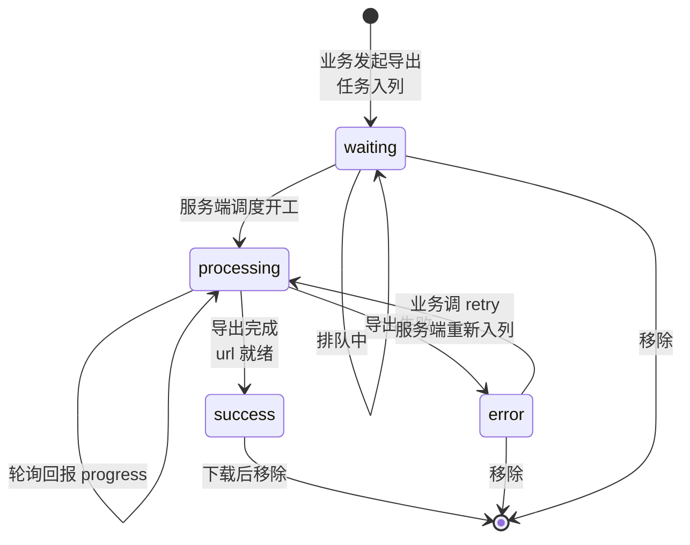
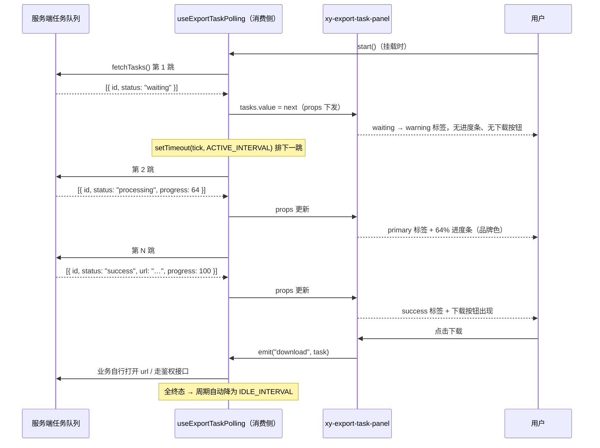

# 9-35 · ExportTaskPanel：导出任务

> 本篇是 9 卷"增强层（pro-components）"的第三十五篇，workflow 组（approval-flow-panel、import-wizard、export-task-panel）的收官之作。核心问题按大纲只有八个字——**异步任务的进度呈现**。但先亮底牌：把 `export-task-panel` 全部源码读完（组件包 105 行、主题 30 行），你会发现这个组件里**没有一行轮询代码、没有一毫秒定时器、没有一次网络请求**。大纲里"轮询机制"四个字的实码定论是：**轮询被外置了**——面板只做"任务状态数组 → UI"的纯投影，状态从哪来、多久刷一次、失败怎么重试，全部留给业务层。这个"没有"不是偷工减料，而是本篇要正面解剖的第一个设计决策；它同时是全库定时器治理系列（5-12 carousel、7-02 message、8-02 countdown、8-12 audio-player）的第五个样本——一个以"缺席"作答的样本。本篇沿四条线走：`ExportTaskItem` 六字段四态的状态契约（与 6-19 upload 文件状态机对照）、54 行视图层的容器形态与状态色分工、消费侧轮询参考实现的定时器治理、以及与 9-25 pro-table 前端导出收口成的"两条导出路线"。全部给实码定论，并为 10-01《测试金字塔：114 个 spec 的分工》埋好第十卷的引线。

接到题目先复述一遍目标，防止写偏：导出任务面板要解决的业务场景，是"数据量大到前端算不动、耗时长到请求撑不住"的导出。9-25 拆 pro-table 时已经立过前端导出的边界——CSV 零依赖、xlsx 动态分包，但数据源是内存里的 `internalData`，翻页模式下"全量导出"没有协议；逃生口 `beforeExport` 把"服务端导出"降级成了一个钩子。本篇的 export-task-panel 就是那笔欠账的另一半：当导出从"浏览器里的一次变换"升级为"服务端的一个任务"，UI 需要一个地方承接任务的排队、进度、成败与下载——导出中心。基础层给了全部零件（8-03 的 `xy-progress`、5-21 的 `xy-tag`、5-10 的 `xy-card`、5-02 的 `xy-button`），但把"一台异步任务状态机投影成一张任务列表"这件事，从 EP 到本库基础层都没有现成答案。

先交代体量，给全文一个标尺。`packages/pro-components/export-task-panel/` 的全部家当：`src/export-task-panel.vue` 54 行、`src/export-task-panel.ts` 13 行、`index.ts` 12 行、`__tests__/export-task-panel.spec.ts` 26 行 1 个用例——组件包合计 105 行；样式在 `packages/theme/src/pro/export-task-panel.css` 30 行；文档示例 `apps/docs/examples/pro/export-task-panel/basic.vue` 33 行；类型夹具 `tests/types/fixtures/export-task-panel.ts` 17 行——加起来 185 行，是增强层最小的几个组件之一（src 合计 67 行，与 stat-card 并列，倒数第五；全层最小是 async-state-container 的 52 行，9-20 拆过）。但体量小不等于账薄：一个 6 字段的状态契约、一台四态状态机、三个事件、四个基础组件的消费组合，全都挤在这 185 行里。脚本与模板的行号地图先钉在这里，后文逐段展开：

- 数据契约：`ExportTaskItem` 1-8（状态联合在第 4 行）、`ExportTaskPanelProps` 10-13；
- 视图层：props 默认值 9-12、emits 14-18、`resolveStatus` 20-25、card 容器 29、任务循环 31、状态标签 34、进度条 37-41、按钮区 42-50；
- 入口：`withInstall` 与类型再导出 `index.ts:8-10`；
- 清单登记：`component-manifest.json:242-249`、`exports.ts:31`、根入口类型 `index.ts:123-126`、样式聚合 `style.css:32`。

## 一、ExportTaskItem：六个字段，一台四态状态机

数据契约是本组件真正的"源码主体"——13 行的类型层里，10 行属于两个接口。全文引用：

```ts
// packages/pro-components/export-task-panel/src/export-task-panel.ts（全文 13 行）
export interface ExportTaskItem {
  id: string | number;
  name: string;
  status: "waiting" | "processing" | "success" | "error";
  progress?: number;
  createdAt?: string;
  url?: string;
}

export interface ExportTaskPanelProps {
  title?: string;
  tasks: ExportTaskItem[];
}
```

`ExportTaskItem` 六个字段可以分成两组。**身份组**三个是必填的：`id`（`string | number` 双兼容，服务端自增主键与 UUID 都放得下）、`name`（任务的人类可读名）、`status`（四态联合）。**呈现组**三个全部可选：`progress?`（0-100 的数字，模板里用 `undefined` 判断渲染）、`createdAt?`（裸字符串，组件不做任何格式化）、`url?`（下载地址）。可选性的分布不是随手一标——它把"哪些信息是任务的本体、哪些信息是状态的附属"画进了类型层：没有名字和状态的任务不成立，但没有进度的任务完全合法（排队中的任务、失败的任务、以及不汇报进度的服务端实现），没有 `url` 的任务也完全合法（还没成功、或者下载要走鉴权接口而不直连文件地址）。

四个状态就是本篇题眼里的那台状态机。先把迁移图画出来：



这张图有一个必须言明的性质：**迁移边一个都不在组件里**。`status` 只是一个被投影的字段，谁把它从 `waiting` 改成 `processing`、什么时候改、改错了他自己负责——组件既不校验迁移合法性，也不提供 `transition()` 之类的迁移函数。对照 8-12 audio-player 那条"命令走引擎、状态走回调"的单向环（组件方法一个都不写状态，等引擎回调回来再落），export-task-panel 走得更极端：它连"回调"都没有，`tasks` 是完全受控的 props，组件对状态机的全部参与就是**渲染它此刻的快照**。这不是状态机的降级，而是状态机的另一种归属——迁移逻辑跟着事实源走：导出任务的事实源在服务端，那么迁移裁决权就在"拿到服务端响应的那段业务代码"手里，组件硬要插一脚反而会造出第二份事实。

### 与 6-19 upload 文件状态机的对照

全库另一个"任务条目四态机"是 6-19 拆过的 upload。把两份类型定义并排放着看：

```ts
// packages/components/upload/src/upload.ts:1-22（节选）
export type UploadStatus = "ready" | "uploading" | "success" | "fail";

export interface UploadFileItem {
  uid: string;
  name: string;
  size: number;
  type?: string;
  status?: UploadStatus;
  percentage?: number;
  response?: unknown;
  url?: string;
  raw?: UploadRawFile;
}
```

三个差异点，每个都有工程含义。**其一，词汇分叉**：upload 的失败态叫 `fail`，export task 的失败态叫 `error`——这不是不一致的事故，而是 8-03 拆 progress 时立过的"词汇分叉"结论的又一次落点：progress 用 EP 系的 `exception` 而不是全库 `ComponentStatus` 的 `danger`，因为进度条的"异常"是领域词；导出任务的失败叫 `error`，对齐的是 HTTP 与 JS 异常世界的通名（消费侧轮询拿到 `catch (error)` 时可以原样映射，不需要一次词汇翻译）；upload 的 `fail` 对齐的是文件上传领域的惯用语。**状态机的词汇跟着领域走，不强行统一**——代价是三套失败词（`fail`/`error`/`exception`），收益是每个组件的 API 面都对它的母语使用者和既有生态诚实。

**其二，排队态的有无**。upload 四态是 `ready/uploading/success/fail`，没有"排队中"——文件被选择即入列、即上传（`autoUpload` 默认开），`ready` 表达的是"还没轮到我"但它实际是"待上传"的初始态，客户端自己就是调度器，排队是瞬时的事。export task 有显式的 `waiting`——因为调度器在服务端，"排队"是一个可持续数分钟的真实物理状态，任务中心必须能把它渲染出来（示例里它对应 warning 色的标签）。**队列在哪一侧，"排队"就从隐式变显式**。

**其三，字段体的宽窄**。`UploadFileItem` 十个字段（还有 `size`/`type`/`response`/`raw`），`ExportTaskItem` 六个。upload 的宽是因为它管的是"字节级事实"：文件大小、MIME 类型、原始 File 对象、服务端响应体，全都得在类型上留位。export task 窄到六个字段，因为它只管"任务的公开简历"——任务在服务端的执行细节（导了多少行、占了多少内存、跑到哪个分片）一概不出现在契约里。**契约的宽度等于组件对事实的管辖宽度**，两个四态机在各自领域的宽窄恰好都是对的。

还有一个"隐式耦合"值得点破：可选字段之间跟着状态走。`progress` 在 `processing` 态才有意义（示例 `basic.vue:5-9` 的 processing 任务给了 64，成功任务给了 100，失败任务干脆没给）；`url` 在 `success` 态才就绪。类型层没有表达这种联合约束（没有 `discriminated union` 写成 `{ status: "success"; url: string } | ...`），组件用两个 `v-if` 在渲染层兜住（37 行的 `v-if="task.progress !== undefined"`、43 行的 `v-if="task.status === 'success'"`），消费侧的余下约定靠文档与示例传承。用判别联合可以把约束抬进类型层，代价是六字段的扁平接口变成四套变体——对一个 67 行的组件，扁平接口加渲染层守卫是更匹配体量的选择，这是本篇第一处"类型严格度与体量的权衡"。

## 二、视图层：54 行把四态翻译成 UI

视图层全文 54 行，一次给全：

```vue
<!-- packages/pro-components/export-task-panel/src/export-task-panel.vue（全文 54 行） -->
<script setup lang="ts">
import { XyButton, XyCard, XyProgress, XyTag } from "xiaoye-components";
import type { ExportTaskItem, ExportTaskPanelProps } from "./export-task-panel";

defineOptions({
  name: "XyExportTaskPanel"
});

const props = withDefaults(defineProps<ExportTaskPanelProps>(), {
  title: "导出任务",
  tasks: () => []
});

const emit = defineEmits<{
  download: [task: ExportTaskItem];
  retry: [task: ExportTaskItem];
  remove: [task: ExportTaskItem];
}>();

function resolveStatus(status: ExportTaskItem["status"]) {
  if (status === "success") return "success";
  if (status === "error") return "danger";
  if (status === "processing") return "primary";
  return "warning";
}
</script>

<template>
  <xy-card class="xy-export-task-panel" :header="props.title">
    <div class="xy-export-task-panel__list">
      <div v-for="task in props.tasks" :key="task.id" class="xy-export-task-panel__item">
        <div class="xy-export-task-panel__meta">
          <strong>{{ task.name }}</strong>
          <xy-tag size="sm" :status="resolveStatus(task.status)">{{ task.status }}</xy-tag>
          <span v-if="task.createdAt" class="xy-export-task-panel__time">{{ task.createdAt }}</span>
        </div>
        <xy-progress
          v-if="task.progress !== undefined"
          :percentage="task.progress"
          :stroke-width="8"
        />
        <div class="xy-export-task-panel__actions">
          <xy-button v-if="task.status === 'success'" text @click="emit('download', task)">
            下载
          </xy-button>
          <xy-button v-if="task.status === 'error'" text @click="emit('retry', task)">
            重试
          </xy-button>
          <xy-button text @click="emit('remove', task)">移除</xy-button>
        </div>
      </div>
    </div>
  </xy-card>
</template>
```

### 容器形态：card 而不是 dialog/drawer

第一个值得展开的是 29 行的容器选择。增强层已经有整整一族的容器组件——9-16 dialog-form 落在模态、9-08 drawer-form 落在抽屉、9-31 detail-panel 落在浮层——而 export-task-panel 选了 5-10 的 `xy-card`，一个**常驻的面板容器**。这个选择由导出任务的交互性质决定：模态与抽屉都是"打断式"容器——打开时抢占注意力、关闭时状态离场，适合"做完就走"的单次事务；而导出任务的观看模式是**旁观式**的——用户发起导出后继续干活，任务面板常驻在导出中心页面或工作台侧栏，每次轮询回来瞟一眼进度。任务列表还天然是"开放集合"：新任务会进来、旧任务会被清走，模态容器的"进出仪式感"对这种持续变化的数据流反而是负担。文档示例（`basic.vue:27-32`）给出的用法就是这个形态——外层一张"导出中心"卡，下面跟一张任务面板卡，纵向堆叠。

EP 对照在此处可以从两个方向立。其一，Element Plus 没有任何"导出任务中心"形态——`el-table` 零导出能力（9-25 已立），EP 生态里这类需求的社区答案通常是 `el-drawer` 装一个手写的任务列表，抽屉容器的打断性与任务中心的旁观性天然打架，这是社区拼装方案的隐性错位。其二，EP 的 `el-card` 的 header 走具名插槽，本库 `xy-card` 同时支持 `header` prop（`packages/components/card/src/card.ts:14`）与插槽（`card.vue:87` 的 `header?: () => unknown`），面板用的是 prop 直传（`:header="props.title"`），一行模板把"标题也配置化"收干净。

### resolveStatus：四态到五档色的一行一映射

20-25 行的 `resolveStatus` 是组件里唯一的"逻辑函数"，四行映射把 `ExportTaskItem` 的领域态翻译成全库 `ComponentStatus` 五档（`"neutral" | "primary" | "success" | "warning" | "danger"`，`packages/xiaoye-primitives/src/utils/types/common.ts:1`）：`success → success`、`error → danger`、`processing → primary`、其余（即 `waiting`）→ `warning`。三个决策藏在四行里：

- **waiting 给 warning 而不是 neutral**。"排队中"是唯一不映射到同名色档的状态。给 neutral（灰）在色觉上最诚实——排队确实什么都没发生；但任务中心的用户视角里，一列灰标签容易读成"卡死了"或"无效项"，warning 的琥珀色传达的是"已被受理、等待资源"，这是任务中心语境里更准确的语义。**状态色的职责不是翻译状态，而是翻译状态对用户的行动含义**。
- **processing 给 primary 而不是用进度条表达**。进行中的任务其实有双通道视觉：标签的 primary 蓝是"它活着"，进度条的填充长度是"它走到哪了"。两通道分工明确，标签不需要"loading"这种第六档。
- **error → danger 而不是 error**。又一次词汇翻译：领域态 `error` 进了全库色档体系就得换成 `danger`——`resolveStatus` 的存在意义正是把"领域的词"翻译成"色板的词"，让 `xy-tag` 保持对 `ComponentStatus` 的纯消费。

对照 8-04 steps 的状态派生：steps 用 `activeIndex` 推每一步的 `status`，是"单一序数 → 多处状态"的派生；export-task-panel 是"单一状态 → 单处颜色"的映射。两者都遵守同一条纪律——**派生函数是纯函数，不持状态、不落副作用**，`resolveStatus` 四行连 `else` 都没用兜底 `if`，`waiting` 走的是"其余"分支，这让新增强态时（比如未来的 `canceled`）组件的行为是可预期的降级（落到 warning），而不是运行时崩溃。

### 进度条与状态标签的色权分工

37-41 行是 8-03 的 `xy-progress` 的消费点：

```html
<xy-progress
  v-if="task.progress !== undefined"
  :percentage="task.progress"
  :stroke-width="8"
/>
```

三个消费细节。**第一，只传了 `percentage` 与 `stroke-width="8"`，没传 `status`**。8-03 拆过 progress 的状态色机制——`progress.vue:19-24` 的 `STATUS_COLOR_MAP` 把 `success → --xy-success`、`exception → --xy-danger`、`warning → --xy-warning`、无状态 → `--xy-brand`，`progress.vue:85` 的 `currentColor` 按传入状态取色。面板不传 status，意味着进度条的填充**永远是品牌蓝**，哪怕任务是失败态。失败任务的视觉信号全部由标签的 danger 红独扛。这是刻意的分工还是漏传？从设计意图看更像前者：任务条目的"状态色"统一收口在标签一处，进度条只承担"量"的表达，一条任务上同时出现红色标签和红色进度条反而制造双焦点；从缺陷面看，EP 的 `el-progress` 在 `status="exception"` 时整条变红，社区习惯里"失败的任务进度条变红"是常见预期。两说都成立，本篇把它记作**一个未经文档言明的选择**（缺口清单第三笔）：至少 API 文档应当写明"进度条不随状态变色"。

**第二，`v-if="task.progress !== undefined"` 的语义是"无进度可显示"，不是 0**。失败任务（示例 `basic.vue:18-22` 的审批日志追溯包）不传 `progress`，渲染出来就是没有进度条的裸条目——0% 的进度条会暗示"刚开工"，`undefined` 的语义是"此状态无进度语义"。`withDefaults` 没有给 `progress` 配默认值是对的：默认 0 会把这个语义差异抹掉。

**第三，`stroke-width="8"` 比默认的 6 粗一档**（`progress.ts` 默认值 `strokeWidth: 6`）。任务列表是密集排布的扫描型 UI，进度条从"表单里的精密仪表"变成"远看可辨的量块"，8px 的加粗是消费场景驱动的视觉调参——这也反证 progress 把 `strokeWidth` 做成 prop 的价值。

### 三个按钮：按钮可见性即状态机投影

42-50 行的按钮区是状态机的第二处投影：`下载` 仅在 `success`、`重试` 仅在 `error`、`移除` 恒在。这条规则的含义比"条件渲染"深一层——**操作按钮的可见性编码了"当前状态下哪些动作合法"**，把状态机的迁移前条件渲染成了 UI。用户在 waiting 态看不见下载按钮，不是"按钮禁用"，而是"这个动作此刻不存在"——对照"全部渲染 + disabled"的方案：禁用按钮传达"有这个动作但现在不行"，条件渲染传达"没这个动作"。任务中心选后者更干净：排队中的任务本来就没有可下载的东西，摆一个灰按钮只会引来"为什么点不动"的疑问。但条件渲染也有代价：布局会在状态迁移时跳动（成功瞬间多出下载按钮），`__actions` 的 `flex-wrap`（CSS 19-25 行）部分吸收了这种跳动。

三个按钮全用 `text` 形态（无边框底色的轻量按钮），全部只 emit 意图不执行动作——`download` 不打开 `task.url`，`retry` 不重发请求，`remove` 不改数组。事件载荷是整个 `task` 对象的**原引用**（不是快照拷贝，测试 24 行的 `toEqual(task)` 钉的是同形），业务在处理器里直接拿到可操作对象。为什么连"下载"都不帮忙做？因为下载鉴权是业务变量——`url` 可能是签名地址直接开、可能是带 token 的接口、可能要二次确认；组件猜任何一种都会猜错。这与 6-19 upload 把 `httpRequest` 整个让渡给业务是同一个哲学：**组件管"什么动作在什么状态可见"，业务管"动作真实做什么"**。

### 样式全文：30 行的三笔克制

```css
/* packages/theme/src/pro/export-task-panel.css（全文 30 行） */
.xy-export-task-panel__list {
  display: flex;
  flex-direction: column;
  gap: 16px;
}

.xy-export-task-panel__item {
  display: flex;
  flex-direction: column;
  gap: 10px;
  padding: 14px 0;
  border-bottom: 1px solid color-mix(in srgb, var(--xy-border) 88%, var(--xy-mix-light));
}

.xy-export-task-panel__item:last-child {
  border-bottom: 0;
}

.xy-export-task-panel__meta,
.xy-export-task-panel__actions {
  display: inline-flex;
  align-items: center;
  gap: 10px;
  flex-wrap: wrap;
}

.xy-export-task-panel__time {
  color: var(--xy-text-secondary);
  font-size: var(--xy-font-size-sm);
}
```

30 行里三笔值得记。其一，**分隔线用 `color-mix` 淡化**（12 行）：`var(--xy-border)` 与 `var(--xy-mix-light)` 按 88:12 混合，比纯 border 淡一档——任务列表的分隔线是"弱结构线"，要与卡片边框拉开视觉层级；`--xy-mix-light` 是双主题机制里 3-03 拆过的反转变量，暗色主题下自动换向，一行 CSS 吃满两主题。其二，**`last-child` 收边**（15-17 行）：最后一条不加分割线，列表的"结束感"交给容器 padding，这是列表样式的礼貌性收尾。其三，**全部尺寸走 flex `gap` 而非 margin**（4/9/22 行）：`gap: 16px` 撑条目间距、`gap: 10px` 撑条目内部与按钮间距，配合 `flex-wrap: wrap`，窄容器下按钮组换行不会产生"末行悬挂 margin"的经典问题。没有一行硬编码色值、没有一行媒体查询，令牌消费纪律（3-01）在这个最小组件里依然满分。

## 三、轮询外置：第五个定时器样本的"缺席"

现在到本篇真正的题眼。任务规格里"轮询机制"四个字，在实码里的答案是**零行**——组件里没有任何 `setInterval`、`setTimeout`、`requestAnimationFrame`，连一个 `let timer` 都没有。官方文档把这个边界写得明明白白（`apps/docs/pro-components/export-task-panel.md:22-25`）：

> ## 当前边界
>
> - 当前不处理轮询、通知订阅和历史分页。
> - 任务调度与下载鉴权仍由业务层处理。

这不是一句免责声明，而是一个可以论证的设计决策。三个论点：

**第一，轮询的每个参数都是业务变量。** 刷新周期（财务报表导出十分钟一刷足够、实时日志导出两秒一刷嫌慢）、暂停条件（页面隐藏时停不停？组件卸载呢？）、终止条件（轮多少次放弃？失败要不要退避？）、鉴权方式（轮询接口带不带 token、401 了怎么办）——这四个变量没有任何一组"组件默认值"能覆盖多数业务。内建轮询的组件最后都会长出一堆 `pollInterval`/`pollOnHidden`/`maxPollRetries` 配置项，而每个默认值都注定对一半业务是错的。外置之后，组件的类型面干干净净（两个接口、三个事件），这 67 行才守得住。

**第二，测试成本的不对称。** 本篇第六节会看到：这个组件的单测 26 行、零 mock——因为受控 props 组件没有异步面可测。假如内建轮询，测试要先 mock 定时器（vi.useFakeTimers）、再 mock 轮询接口、还要处理组件卸载时的清理断言，测试体积至少翻三倍。**轮询外置把组件的测试面从"异步时序"缩到了"纯渲染"**——这是第九卷反复出现的原则（9-02 协议层、9-10 request-form）的最小样本：把不可控的异步留在外层，内层就是可穷举的纯函数。

**第三，事实源的归属。** 第一节已经立过：任务状态机的事实源在服务端。轮询是"把服务端事实搬进前端"的搬运动作，搬运的节奏、通道与错误处理属于"接入层"而非"呈现层"。组件把呈现做绝（第二节）、把搬运让出（本节），两层各自可测、各自可换——轮询换成 SSE 推送、换成 WebSocket、换成手动刷新按钮，面板一行不用改。**这也是为什么它敢叫"Panel"而不叫"Center"**：面板只管展示，中心的调度逻辑在业务手里。

### 第五个定时器样本：消费侧参考实现

组件不轮询，不代表轮询没有答案。全库定时器治理到 8-12 为止已有四个样本：5-12 carousel 的 `setTimeout` 自调度链（每跳重估等待时长）、7-02 message 的双 `setTimeout`（`message.vue:200/229`）、8-02 countdown 的 `requestAnimationFrame` 链（`countdown.vue:44-59` 的存在性检测降级）、8-12 audio-player 的 rAF tick 循环（`audio-player.vue:67-80`）。导出任务的轮询是第五个样本——它活在消费侧，但治理原则全部承自前四个。先看一个可直接落地的参考实现（注意：**这段是本篇为读者汇编的消费侧代码，不是仓库实码**，引用的治理手法全部来自前四篇拆过的实码）：

```ts
// 消费侧参考实现：useExportTaskPolling（非仓库实码，治理手法引自 5-12/8-02/9-25 实码）
import { onBeforeUnmount, ref } from "vue";
import type { ExportTaskItem } from "xiaoye-pro-components";

export function useExportTaskPolling(fetchTasks: () => Promise<ExportTaskItem[]>) {
  const tasks = ref<ExportTaskItem[]>([]);
  const polling = ref(false);

  let timer: ReturnType<typeof setTimeout> | null = null;   // 句柄是普通 let，不进响应式（5-12 惯例）
  let latestTick = 0;                                        // 令牌：过期轮次的响应直接丢弃（9-25 的令牌比对）
  let backoff = 0;                                           // 连续失败计数，驱动退避

  const IDLE_INTERVAL = 4000;      // 全部终态时的低频巡检
  const ACTIVE_INTERVAL = 1500;    // 存在 waiting/processing 时的高频轮询
  const MAX_BACKOFF = 30000;       // 退避上限

  function activeOf(list: ExportTaskItem[]) {
    return list.some((task) => task.status === "waiting" || task.status === "processing");
  }

  function stopTimer() {                                     // 熄火权收敛：唯一停表入口（8-02）
    if (timer !== null) {
      clearTimeout(timer);
      timer = null;
    }
  }

  async function tick() {
    const currentTick = ++latestTick;                        // 本轮令牌
    try {
      const next = await fetchTasks();
      if (currentTick !== latestTick) {
        return;                                              // 过期轮次：数据不落、不排下一跳
      }
      tasks.value = next;
      backoff = 0;
    } catch {
      if (currentTick !== latestTick) {
        return;
      }
      backoff += 1;                                          // 失败退避：4s → 8s → … → 30s 封顶
    }

    if (!polling.value) {
      return;                                                // 已被 stop 停表：不再续跳
    }

    const interval = Math.min(
      activeOf(tasks.value) ? ACTIVE_INTERVAL : IDLE_INTERVAL,
      backoff > 0 ? Math.min(2000 * 2 ** (backoff - 1), MAX_BACKOFF) : Number.POSITIVE_INFINITY
    );
    timer = setTimeout(tick, interval);                      // setTimeout 自调度链：每跳重估周期（5-12）
  }

  function start() {
    if (polling.value) {
      return;                                                // 点火权收敛：重复 start 不叠加定时器
    }
    polling.value = true;
    void tick();
  }

  function stop() {
    polling.value = false;
    stopTimer();
  }

  onBeforeUnmount(stop);                                     // 卸载必停（8-02 countdown.vue:109-111 同款）

  return { tasks, polling, start, stop };
}
```

这段 60 行的参考实现里，前四个样本的治理原则各就各位。**句柄用普通 `let` 不用 `ref`**——5-12 立过的"不是所有状态都该是响应式的"：没有任何渲染依赖需要观察"当前定时器 id"，真正被渲染的是结果 `tasks`。**点火权与熄火权双收敛**——`start` 的重入守卫与 `stopTimer` 的唯一入口，是 8-02 对 countdown `stopTimer` 的结论（"熄火权也要收敛"）在轮询场景的镜像：轮询的 `start()` 若不防重入，业务在 `onMounted` 与 watch 里各调一次就会叠出两条链。**`setTimeout` 自调度链而不是 `setInterval`**——5-12 的选型表里 `setInterval` 的"回调执行慢于周期时排队"缺陷在轮询场景尤其致命：轮询接口慢于周期时，`setInterval` 会把请求越积越多；自调度链保证"上一跳完全落地才排下一跳"，天然串行。**令牌比对**——9-25 的 `latestRequestId` 在这里变身 `latestTick`：`stop()` 之后才返回的那一跳响应，若没有令牌守卫，会把数据写进一个已经宣告停止的面板。**动态周期**——有活跃任务时 1.5 秒、全终态时 4 秒、连续失败按指数退避封顶 30 秒：`setInterval` 做不到"每跳重估"，自调度链做得到。

为什么轮询不需要 rAF？8-02 的选型结论是"展示频率等于渲染频率时才用 rAF"——countdown 的 `SSS` 格式要求帧级刷新。而导出任务的进度是**服务端事件的粒度**：任务在服务端按分片推进，两次有意义的状态变化之间至少隔着几秒，1.5 秒的轮询节拍已经是"足够贴脸"；rAF 在页面隐藏时自动停摆（countdown 反而要专门回答页面隐藏问题），对轮询是"免费的后台暂停"但换不来任何精度收益。**轮询的节拍由事实源的更新粒度决定，不由屏幕刷新率决定**——这是 8-02 结论在第五个样本上的反向应用。

### 轮询全链路时序

把消费侧轮询与面板投影接到一起，完整时序如下：



时序图里藏着一个第二节埋好的呼应：UI 的每一次变化（标签变色、进度条伸长、按钮出现）都不是面板"做"出来的，而是 props 换了一帧快照、面板重新投影的结果。面板从头到尾只有一种动作：`tasks` 变了，就把新的快照画出来。

## 四、两条导出路线的收口

本篇与 9-25 是一对合称：pro-table 的 `handleExport` 与 export-task-panel 的任务面板，构成这个组件库对"导出"这件事的完整答案。先把 9-25 拆过的前端路线核心段再引一次（行号已在当前工作区复核）：

```ts
// packages/pro-components/pro-table/src/pro-table.vue:1087-1132（9-25 曾全文拆解）
async function handleExport(type?: "csv" | "excel") {
  const exportType = type ?? props.exportOptions?.defaultType ?? "csv";
  const filename = props.exportOptions?.filename ?? "pro-table-export";
  const rows = internalData.value.slice();
  const columns = exportableColumns.value.map((column) => cloneColumn(column));
  const payload = {
    type: exportType,
    filename,
    columns,
    rows
  };

  if ((await props.exportOptions?.beforeExport?.(payload)) === false) {
    return;
  }

  const mappedRows = rows.map((row) => props.exportOptions?.mapRow?.(row) ?? row);
  const headers = columns.map((column) => column.label ?? column.prop ?? column.key ?? "");
  const records = mappedRows.map((row) =>
    columns.map((column) => {
      const key = column.prop ?? column.key;
      return stringifyCellValue(key ? readPathValue(row, key) : undefined);
    })
  );

  if (exportType === "excel") {
    const XLSX = await import("xlsx");
    const worksheet = XLSX.utils.aoa_to_sheet([headers, ...records]);
    const workbook = XLSX.utils.book_new();
    XLSX.utils.book_append_sheet(workbook, worksheet, "Sheet1");
    XLSX.writeFile(workbook, `${filename}.xlsx`);
  } else {
    const csv = [headers.map((value) => escapeCsvValue(value)).join(","), ...records.map((row) => row.map((value) => escapeCsvValue(value)).join(","))].join("\n");
    const blob = new Blob([csv], {
      type: "text/csv;charset=utf-8;"
    });
    const url = URL.createObjectURL(blob);
    const anchor = document.createElement("a");
    anchor.href = url;
    anchor.download = `${filename}.csv`;
    anchor.click();
    URL.revokeObjectURL(url);
  }

  emit("export", payload);
}
```

两条路线的分工表（这也是本篇的核心权衡之一）：

| 维度 | pro-table 前端导出（同步） | export-task-panel 异步导出 |
| --- | --- | --- |
| 数据源 | 内存 `internalData`（翻页模式=当前页） | 服务端全量（数据库到文件） |
| 耗时 | 毫秒到秒级 | 秒到分钟级 |
| 失败面 | 构造 Blob 失败（几乎不失败） | 队列积压、OOM、超时、权限 |
| 进度 | 无（一次变换，无过程） | `progress` 字段逐跳回报 |
| 产物 | 浏览器直接落盘 | `url` 指向服务端文件，下载走 `download` 事件 |
| 用户视线 | 不离开表格 | 导出中心旁观 |

分工的分界线画在**"数据算得动算不动"**上：当前页或已加载的小数据集，前端一次变换直接落盘，零等待零协议；全量大表、跨表关联、需要服务端权限裁剪的导出，只能走异步任务。两条路线不是竞争关系而是覆盖关系，而把它们焊在一起的正是 9-25 留下的那个钩子——`beforeExport`。一个典型的组合用法：

```ts
// 消费侧组合示例（非仓库实码）：beforeExport 把"服务端导出"接入任务面板
async function handleBeforeExport(payload: ProTableExportPayload<Row>) {
  if (payload.rows.length <= 5000) {
    return true;                                  // 小数据：放行内置前端导出
  }

  const { taskId } = await api.createExportTask({ // 大数据：转服务端异步任务
    filename: payload.filename,
    filters: lastQueryFilters
  });
  taskList.value = [
    { id: taskId, name: payload.filename, status: "waiting" },
    ...taskList.value
  ];
  polling.start();                                // 面板轮询启动（第三节参考实现）
  message.info("数据量较大，已转为后台导出，可在导出中心查看进度");
  return false;                                   // 返回 false 拦截内置导出
}
```

这段组合里，`beforeExport` 返回 `false` 拦截了 pro-table 的内置管道（`pro-table.vue:1099-1101` 的审批段），业务自己把导出请求转投服务端，把返回的任务以 `waiting` 态塞进面板的任务列表，轮询接管后续——服务端把状态推到 `processing/progress`，面板把它画成进度条；推到 `success/url`，面板长出下载按钮。两条路线在 `beforeExport` 这一个函数里完成交接，pro-table 与 export-task-panel 两个组件**互相不知道对方存在**——没有共享 store、没有事件总线、没有彼此 import（全仓检索 `ExportTaskPanel` 的引用，`packages/pro-components/` 内只有清单、入口与本组件自身，pro-table 一行都没有）。这种"协议交棒、组件互盲"的收口方式，与 9-21 list-page 对 pro-table 的"插槽透传、逻辑归零"是同一族解法：**增强层组件之间的协作走业务代码与协议，不走组件间直连**。

EP 对照再收一笔：`el-table` 零导出、无任务中心，EP 生态这两件事都是每个项目手写；本库把"前端导出"内建成 pro-table 的默认值、"异步任务呈现"内建成 export-task-panel 的协议位、中间的交接留给 `beforeExport`——三个协议位覆盖两条路线，而没有一个组件越界去管业务的路由。

## 五、测试与夹具：26 行测什么、漏什么

组件包的测试只有一个文件 26 行 1 个用例，全文引用：

```ts
// packages/pro-components/export-task-panel/__tests__/export-task-panel.spec.ts（全文 26 行）
import { mount } from "@vue/test-utils";
import { defineComponent, h } from "vue";
import { describe, expect, it, vi } from "vitest";
import { XyExportTaskPanel } from "@xiaoye/pro-components";

describe("XyExportTaskPanel", () => {
  it("支持渲染任务并触发下载事件", async () => {
    const task = {
      id: "task-1",
      name: "成员导出",
      status: "success" as const,
      progress: 100
    };
    const wrapper = mount(XyExportTaskPanel, {
      props: {
        tasks: [task]
      }
    });

    expect(wrapper.text()).toContain("成员导出");

    await wrapper.get(".xy-button").trigger("click");

    expect(wrapper.emitted("download")?.[0]?.[0]).toEqual(task);
  });
});
```

先说这个用例的**取点之准**。三条断言对应三个消费契约：文本含"成员导出"钉的是 `tasks` 的渲染通路（名字进 DOM）；`wrapper.get(".xy-button")` 取的是**第一个**按钮——对一个 success 任务，按钮区渲染顺序是"下载、移除"（模板 43/49 行），第一个就是下载，这一取法隐式验证了"success 态只出现下载与移除、不出现重试"的按钮投影规则；`toEqual(task)` 钉的是事件载荷与入参同形——业务在 `download` 处理器里拿到的就是它放进去的那个对象。整个用例**零 mock**：不 mock 定时器（没有）、不 mock 网络（不发）、不 mock DOM API（不点真实链接），26 行全是纯渲染断言。这就是第三节说的"轮询外置的测试红利"在数字上的呈现——对比 pro-table 导出测试要桩掉 `URL.createObjectURL` 与 `window.open`（9-25 引过的 `pro-table.spec.ts:726-756`，30 行桩代码），受控面板的测试面小到近乎免费。

再说这个用例的**面之窄**，这是缺口清单的第一笔。三个事件只测了 `download`，`retry` 与 `remove` 两个按钮的 emit 没有任何断言——它们是模板 46-49 行的真实行为，却活在测试盲区里；将来谁把 `retry` 的 `v-if` 条件从 `error` 改成 `success`（哪怕手滑），测试不会红。同样缺席的还有：空列表渲染（`tasks: []` 会不会崩、渲染成什么）、`resolveStatus` 的四分支（error→danger、processing→primary、waiting→warning 三条映射零覆盖）、`createdAt` 的条件渲染。对 54 行的组件，这些缺口补起来不过再要 40 行测试，属于"便宜但没捡"的典型。

类型侧的守护比行为侧齐全。专用夹具全文 17 行：

```ts
// tests/types/fixtures/export-task-panel.ts（全文 17 行）
import type { ExportTaskItem, ExportTaskPanelProps } from "@xiaoye/pro-components";

const tasks: ExportTaskItem[] = [
  {
    id: "task-1",
    name: "成员导出",
    status: "success",
    progress: 100
  }
];

const props: ExportTaskPanelProps = {
  tasks
};

void tasks;
void props;
```

它钉了两件事：两个类型确实从 `@xiaoye/pro-components` 包根可导（配合 `packages/pro-components/index.ts:123-126` 的类型再导出与 `tests/types/fixtures/xiaoye-pro-components.ts:12/439` 的聚合断言）；`status: "success"` 的字面量收窄在数组字面量里直接可用（TS 会把 `"success"` 推成字面量类型塞进四态联合，无需 `as const`——对比测试文件里 `status: "success" as const` 的写法，那是因为测试的对象字面量独立声明、推宽成了 `string`）。夹具参与 `pnpm typecheck:types` 全量检查，类型回归有闸门。

## 六、收束：三条权衡与六笔缺口

回头看核心问题——异步任务的进度呈现——本篇的实码可以收成三条权衡：

**权衡一：轮询外置，组件只做投影。** 刷新周期、暂停条件、退避策略、鉴权方式四个变量全是业务变量，组件不猜默认值；受控 props 让测试面缩到零 mock 的 26 行；轮询作为第五个定时器样本活在消费侧，治理原则（自调度链、令牌、双收敛、onBeforeUnmount 清理）全部承自 5-12/8-02/9-25 的实码。状态机没有迁移函数，是因为事实源在服务端——迁移裁决权跟着事实源走。

**权衡二：容器选 card 常驻面板，操作走意图事件。** 导出任务是旁观式、开放集合式的数据流，模态与抽屉的打断性与之错位；三个按钮全用条件渲染编码"状态合法动作"，全用 text 形态、全只 emit 意图——下载鉴权、重试请求、移除落库都是业务变量，组件一个都不猜。这与其说是功能不全，不如说是把"Panel"这个词的语义守到底：面板只呈现，中心在业务。

**权衡三：状态色单通道收口，进度条保真。** `resolveStatus` 把四态翻译成五档色，色权集中在标签一处；`xy-progress` 只接量不接状态，失败任务的进度条不染红——是否算缺口见仁见智，但"一条任务一个状态焦点"的取向是清晰的。四态词汇（`waiting/processing/success/error`）不与 upload（`ready/uploading/success/fail`）、progress（`exception`）强行统一，三套失败词各自对齐各自的领域母语，8-03 的词汇分叉结论在此第三次验证。

**缺口记账六笔**（按修补成本从低到高）：一是 `retry`/`remove` 两个事件零测试覆盖，`resolveStatus` 三条分支与空列表渲染同样缺席，补测约 40 行；二是 `url` 字段在契约里存在，但面板对 `download` 之外没有任何"可直接点击链接"的降级渲染——`url` 有值时业务忘接 `download` 事件，下载能力整体哑掉，契约字段成了死字段；三是"进度条不随状态变色"这个选择文档未言明，EP 用户带着 `el-progress` 的 `exception` 预期迁移过来会踩预期差；四是 `createdAt` 是裸字符串直出，无格式化协议，与 8-01 statistic 的格式化管道没有接轨；五是空任务列表渲染成一张空 card，没有接 7-07 Empty 的空态协议；六是 `tasks` 数组的顺序完全由消费侧负责（新任务插头部还是尾部、已移除的怎么清），文档示例与 API 表都没有言明约定。这份清单连同第三节的参考实现，是后续修整的现成起点。

最后预告。第九卷到本篇收束了 workflow 组的最后一个面板，增强层四十四个组件的深潜也接近尾声。下一篇起进入第十卷《测试与工程化》，开篇 10-01《测试金字塔：114 个 spec 的分工》要回答一个本篇已经触到边沿的问题——我们在本篇看到 1 个用例 26 行的"最小测试面"，也看到 pro-table 822 行十个用例的"重装阵地"：全库一百多个 spec 到底怎么分工？哪些组件值得零 mock 的纯渲染断言、哪些必须桩掉浏览器 API、哪类逻辑（如 `reorderVisibleTopLevelColumns` 的纯函数）根本不需要挂载组件就能测尽？从 `mount` 的成本曲线到 fake timers 的时序治理，第十卷开篇拆解这套让 44 个增强组件与 72 个基础组件都"测得起也测得动"的分工体系。

## 考据附录

```text
【本篇直接拆解】
packages/pro-components/export-task-panel/src/export-task-panel.ts
                                                            1-8（ExportTaskItem 全文）/ 4（四态联合）
                                                            5-7（progress/createdAt/url 可选三件）
                                                            10-13（ExportTaskPanelProps 全文）
packages/pro-components/export-task-panel/src/export-task-panel.vue
                                                            2（四基础组件 import）/ 5-7（defineOptions）
                                                            9-12（withDefaults）/ 14-18（三事件声明）
                                                            20-25（resolveStatus）/ 29（xy-card 容器）
                                                            31（任务循环）/ 34（xy-tag 状态投影）
                                                            35（createdAt 条件渲染）
                                                            37-41（xy-progress 消费）/ 42-50（按钮区）
                                                            43-45（download）/ 46-48（retry）/ 49（remove）
packages/pro-components/export-task-panel/index.ts          1-12（全文）/ 8（类型再导出）/ 10（withInstall）
packages/theme/src/pro/export-task-panel.css                1-30（全文）/ 12（color-mix 分隔线）/ 15-17（last-child 收边）
packages/pro-components/export-task-panel/__tests__/export-task-panel.spec.ts
                                                            1-26（全文）/ 20（渲染断言）/ 22-24（下载事件断言）
apps/docs/examples/pro/export-task-panel/basic.vue          1-33（三任务示例）/ 18-22（无 progress 的 error 任务）
tests/types/fixtures/export-task-panel.ts                   1-17（全文）
packages/pro-components/component-manifest.json             242-249（清单条目）
packages/pro-components/exports.ts                          31（值导出）
packages/pro-components/index.ts                            123-126（根入口类型再导出）
packages/pro-components/style.css                           32（样式聚合）
tests/types/fixtures/xiaoye-pro-components.ts               12 / 439（聚合安装断言）
apps/docs/pro-components/export-task-panel.md               22-25（当前边界：轮询外置的官方表述）
                                                            29-43（Attributes/Events API 表）
【对照源码】
packages/components/upload/src/upload.ts                    1-22（UploadStatus 与 UploadFileItem，6-19 对照）
packages/components/progress/src/progress.ts                3-4（progressStatuses）/ 27-31（percentage/strokeWidth props）
packages/components/progress/src/progress.vue               19-24（STATUS_COLOR_MAP）/ 85（currentColor 取色）
packages/components/countdown/src/countdown.vue             37-66（句柄/降级/stopTimer）/ 109-111（onBeforeUnmount）
packages/components/audio-player/src/audio-player.vue       67-80（rAF tick 循环）
packages/components/card/src/card.ts                        14（header prop）
packages/components/card/src/card.vue                       87（header 插槽）
packages/xiaoye-primitives/src/utils/types/common.ts        1（ComponentStatus 五档）
packages/pro-components/pro-table/src/pro-table.ts          218-224（ProTableExportOptions / beforeExport）
packages/pro-components/pro-table/src/pro-table.vue         1087-1132（handleExport，9-25 拆解再引）/ 1099-1101（beforeExport 审批）
【专栏内引】
column/02-分卷大纲.md                                       189（本篇条目）
column/01-知识点全集矩阵.md                                 210（I35：六字段四态 + 轮询外置 + 场景分野）
column/9-25-ProTable下-运行时引擎.md                        （前端导出/令牌比对/beforeExport 钩子）
column/9-01-增强层总览-导出边界与双重守卫.md                （导出边界白名单）
column/8-02-Countdown-定时器治理.md                         （rAF 选型/熄火权收敛/页面隐藏）
column/8-12-AudioPlayer-howler封装.md                       （状态走回调/第五个定时器样本）
column/5-12-Carousel-轮播状态机与定时器治理.md              （setTimeout 自调度链/句柄不入响应式）
column/8-03-Progress-SVG描边.md                             （词汇分叉/状态色映射）
column/6-19-Upload-文件队列.md                              （四态文件状态机对照）
column/7-02-Message-命令式消息治理.md                       （双 setTimeout 样本）
column/7-07-Empty-无逻辑组件的规范.md                       （空态协议，缺口之五）
column/9-20-AsyncStateContainer-三态容器.md                 （增强层最小组件对照）
column/9-21-ListPage-薄预设封装.md                          （组件互盲的协作方式）
column/3-03-双主题机制-data-theme协议与mix-light反转技巧.md （--xy-mix-light 反转变量）
column/3-01-令牌三层架构总览.md                             （令牌消费纪律）
column/8-01-Statistic-数值呈现.md                           （格式化管道，缺口之四）
```
